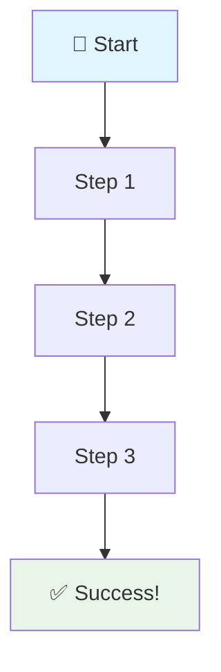

# 🚀 Challenge [NUMBER] - [TITLE]

**[🏠 Home](../README.md)** - [< Previous Challenge](./Challenge-[PREV].md) - [Next Challenge > 📋](./Challenge-[NEXT].md)

  
Challenge [NUMBER] - [PHASE]

---

## 👋 Introduction

<strong>🎯 Challenge Objective:</strong> 
[Describe what the user will accomplish in this challenge]

---

## 📋 Description

### 🎯 Challenge Overview

[Challenge description and context]

### 🎯 Tasks to Complete

- [📋 Task 1](#task-1)
- [📋 Task 2](#task-2)
- [📋 Task 3](#task-3)

---

### 📋 Task 1

1 **Task Title**

[Task description]

<strong>💡 Pro Tip:</strong> [Helpful tip]

🔧 Advanced Configuration (Optional)

[Advanced configuration details]

---

## ✅ Success Criteria

  
🎯 Challenge [NUMBER] - Validation Phase

<strong>🎯 Challenge Complete!</strong> 
To complete this challenge successfully, you should be able to accomplish the following:

### 🔧 Validation Checklist

| 1 | **Requirement** | **Status** | **Description** |
|:---:|:---|:---:|:---|
| ✅ | **Requirement 1** | ⏳ Pending | Description |
| ✅ | **Requirement 2** | ⏳ Pending | Description |
| ✅ | **Requirement 3** | ⏳ Pending | Description |

---

## 📚 Learning Resources

<strong>💡 Expand Your Knowledge</strong> 
Here are essential resources to deepen your understanding:

### 🔗 Documentation
- 📖 [Resource 1](https://link) - Description
- 📖 [Resource 2](https://link) - Description

### 🎥 Videos & Tutorials
- 🎬 [Video 1](https://link) - Description
- 🎬 [Video 2](https://link) - Description

---

🎉 **Ready for the next challenge?** [Continue to Challenge [NEXT] →](./Challenge-[NEXT].md)