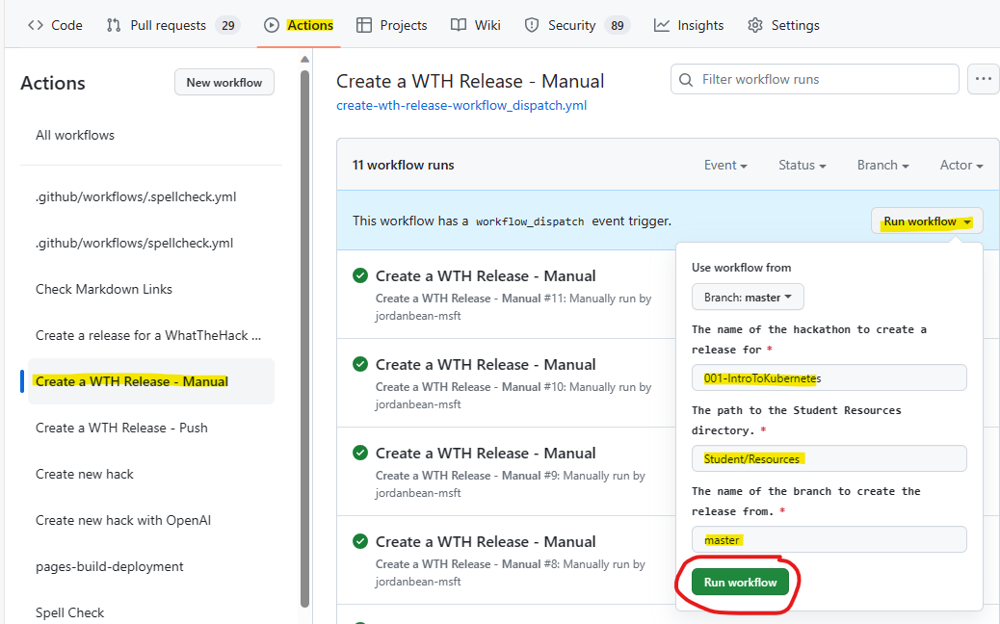
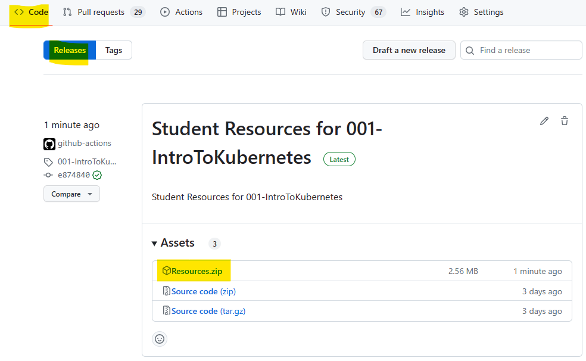
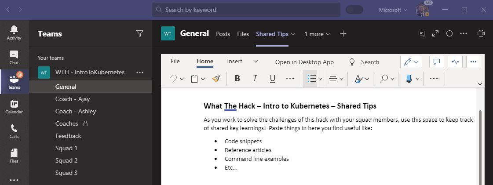

# How to Host a What The Hack

We've structured the What The Hack format to make it easy to deliver to students both in person and virtually. The following are instructions, tips and tricks to hosting your own What The Hack event and have it go off without a hitch. You may choose to adopt as much or little as you would like. This guidance has been cobbled together from experience based on what has worked before.

This document has the following sections:

- [WTH Planning Timeline](#suggested-planning-timeline)
- [WTH Event Requirements](#what-do-you-need-to-host-a-what-the-hack-event)
- [WTH Event Preparation](#event-preparation)
- [WTH Event Day](#event-day)

## Suggested Planning Timeline

| Start Date           | End Date      | Task                                                       | Notes |
| -------------------- | ------------- | ---------------------------------------------------------- | ----- |
| T-8 Weeks            |               | Identify coaches                                           |       |
| T-8 Weeks            | T-4 Weeks     | Confirm WTH content and augment as needed                  |       |
| T-2 Weeks            |               | Create Teams (or alternative) collaboration environment    |       |
| T-2 Weeks            |               | Coaches training                                           |       |
| T-1 Weeks            |               | Confirm hacking environment and perform any setup required |       |
| T-1 Weeks            |               | Cloud Skills Challenge (optional)                          |       |
| T                    | T + Hack Days | Track attendance and participation                         |       |
| T + Last Day of Hack |               | Send survey/solicit feedback                               |       |
| T + 1 Week           |               | Send readout to leadership                                 |       |
| T + 30 Days          |               | Tear down Teams environment                                |       |

## What do you need to run a What The Hack event?

At a minimum, three things:

1. [Hack Content](#hack-content)
1. [Microsoft Teams](#microsoft-teams)
1. [People](#people)

Optionally, consider doing a Cloud Skills Challenge leading up to the WhatTheHack event to help attendees prepare.

### Hack Content

First and most important is hack content. The What The Hack collection has many different hackathons that have been contributed.

Choose a hack from the [What The Hack Collection](../readme.md#what-the-hack-collection)

Or, create your own with the guidance we have on [How To Author A What The Hack](WTH-HowToAuthorAHack.md)

### Microsoft Teams

Next, you need Microsoft Teams. Specifically, you will need to create a team for your event that will be used as the dedicated event space that all the attendees will collaborate in.

**NOTE:** While you could host a What The Hack event using other collaboration tools, we strongly recommend using Microsoft Teams. When we stay "strongly recommend", it means we are writing this document based on using Teams. You're on your own if you don't want to use Teams!

During a What The Hack event, attendees work together in squads of 3 to 5 people to solve the hack's challenges. The attendees will need to share links, code snippets, or even screen share as they collaborate on the challenge solutions. Microsoft Teams makes this easy by having each squad assigned a Channel to work in.

At an in-person event, each squad will be sitting at the same table. During a virtual event, everyone will be sitting at home in their pajamas. The main difference is that during a virtual event, attendees will need to join a call in their squad's channel for the duration of the event. Most other aspects of the event are the same.

**NOTE:** Why are the groups of 3 to 5 attendees working together called "squads"? It is natural to call them "teams" or "hack teams". However, the word "teams" is overloaded when we talk about "Microsoft Teams" (the app) and the "team" within the app that is created for the event. So, "squads" it is!

### People

Finally, you need people to hack. There are a few different roles that will need to be played at your What The Hack event. They include:

- Lead Coach
  - The lead of the event both logistically and technically.
  - Responsible for the event preparation steps [outlined below](#event-preparation).
  - This person should be intimately familiar with the content and all of its solutions.
  - Delivers kick off meeting & challenge intro lecture presentations (if required)
- Coaches
  - The personal coach/facilitator/TA for a squad of 3 to 5 attendees. - It is recommended to have 1 coach for every 5 attendees. At a minimum, there should be 1 coach for every 10 attendees.
  - Provides guidance and direction for the squad but does **NOT** provide answers. Typically answering questions with more questions and things to "ponder".
  - In charge of determining whether a squad has finished a challenge based on the acceptance criteria in the challenge text. This review will determine if they move on to the next challenge.
- Attendees
  - The students in the event that participate in squads of 3 to 5.
  - Must join and participate in their squad's Teams channel
  - Must be joined to their Teams channel meeting AND have their webcam and microphone turned on at all times. This most accurately simulates an in person hack environment.

## Event Preparation

If you've gotten this far, then you have designated yourself as "Lead Coach" and are preparing to host a What The Hack event.

As the event leader, most of the preparation steps are focused on preparing Microsoft Teams for the event. The preparation checklist focuses on three key areas:

- [Know Your Audience](#know-your-audience)
- [Microsoft Team Creation](#microsoft-team-creation)
- [Getting People To Your Event](#getting-people-to-your-event)

### Know Your Audience

If you are inviting attendees that are outside of your organization, there are multiple things to think about with respect to using Azure and Microsoft Teams.

If you are hosting a hack with a single organization, it is a good practice to identify an event stakeholder in the external organization who can help you plan for your What The Hack event. The event stakeholder can help you address the following preparation concerns.

#### Guest Access

You will need to have “Guest” access enabled in your Microsoft Teams tenant to have the external individuals to be part of the event. External attendees are not required to have a user license in Microsoft Teams. You will be inviting them into your event's team as a guest. This is covered by your organization’s guest licenses which are included with its Office 365 license.

Adding external users as guests in Microsoft Teams requires you to add each user manually via the Teams admin UI.

For more information, see [Guest access in Microsoft Teams](https://docs.microsoft.com/en-us/MicrosoftTeams/guest-access)

**NOTE:** Guest access is an organization-wide setting in Microsoft Teams. Therefore, in most organizations, enabling Guest access is typically managed by someone in the IT department who is **NOT** you. If it is not enabled in your organization, you might want to consider using the external organization's tenant as described in the next section.

#### Reverse Guest Access

If your attendees are all from the same external organization and that organization has its own Microsoft Teams tenant, it is easier to host the hack event's team in the external organization's tenant. Then, have the event stakeholder invite you and/or the other coaches to join their team as a guest.

This provides the benefit of the external organization having full access and control of all resources, discussions, and knowledge shared in the event's team once the event has completed.

#### Audio Conferencing

Some individuals may not have a computer with speakers and a microphone or be equipped with a headset. In that case, you will need to provide a dial-in number for the event. This will require that you have the “Audio Conferencing” license within your Microsoft Teams account (included in the Office 365 E5 plan).

Individuals that join in over their computer or mobile device will leverage voice over IP and do not require the Audio Conferencing license. In all cases people will utilize the Microsoft Teams client or a web browser to join the video, screen sharing, and collaboration aspects within Microsoft Teams.

For more information, see: [Audio Conferencing in Microsoft 365](https://docs.microsoft.com/en-us/microsoftteams/audio-conferencing-in-office-365)

#### Privacy

When inviting external participants, make sure you follow your organization's privacy policies. At a minimum, make sure to disclose to the attendees that all members of the event will be able to see each others Name, Email Address, and anything they say and share within the various channels within the team.

#### Azure Subscription

Most of the hacks in the What The Hack collection require attendees to have "Contributor" access to an Azure subscription.

It is important to work with the event stakeholder to decide how attendees will access Azure. Some organizations may provide individuals with their own subscriptions. Other organizations may provide access to a shared subscription created specifically for attendees to use during the hack event.

If the organization provides the attendees with access to an Azure subscription, it is a good practice to share what the predicted cost of Azure resources used during the hack will be. No one wants a surprise bill at the end. It is also important to make sure the subscription is not tied to any Azure Policy definitions that may impact the creation of necessary resources.

If the organization is not providing access to an Azure subscription for the hack, attendees will need to provide there own.

If an attendee has a Visual Studio subscription, they can use the free Azure credits that come with it. Credit amounts vary by subscription level.

For more information, see: [Use Microsoft Azure in Visual Studio subscriptions](https://docs.microsoft.com/en-us/visualstudio/subscriptions/vs-azure)

Finally, attendees can create a free trial Azure account to participate in the hack event by [signing up for Azure HERE.](https://azure.microsoft.com/en-us/free/)

#### Workstation Security

Some organizations have tight security policies enforced on their employees' workstations. A common one is to not provide users with administrator privileges on their workstation. If this is the case, it may prevent them from installing tools or software needed to complete the hack.

One workaround is to use the Azure Cloud Shell. However, some organizations may disable access to the Azure Cloud Shell. Another workaround is to provision a workstation VM in Azure that attendees can RDP into to complete the hack.

Tight firewalls may make it challenging to access Azure itself from an organization's workstations. This is when you bang your head against the wall, give up, and be thankful you don't work for that organization! :)

All of these security concerns and their mitigation should be identified and addressed with the organization event stakeholder ahead of time.

### Microsoft Team Creation

Now that you've gotten all of the overhead out of the way, it's time to build your event's team in Teams.

Create a new team for your What The Hack event in Microsoft Teams that will be used as the dedicated event space. This space will host documents, multiple channels for presenting, screen sharing, and overall collaboration in real and near real-time.

We suggest naming your team with at minimum the hack name and date. You can also add the location or organization too. This will make it easy for attendees to remember what the team was for after the event.

For example: `"Intro To Kubernetes - London (May 2020)"`

#### Team Structure

We recommend creating the following Channels in the team:

- **General** – The General channel will be used as the central gathering place. All event challenges, documents, and supporting material will be hosted in this channel. Key event items can be pinned to individual Tabs. Within the general channel you will host the kickoff meeting to start the event and have various checkpoints throughout the event to communicate with the all the attendees at once.
- **Coaches ONLY (Private)** - Coaches should communicate with each other privately from attendees to share learnings/practices during the event. Coaches can work together to decide if/when to communicate issues broadly to all attendees during the event.
- **Feedback** - Encourage attendees to post feedback here during & after the event so coaches can improve it for future events. It's a great way to collect feedback in one place.
- **Squad Channels** – The Squad channels will be where teams of individuals will go to work and collaborate during the event. We find squads of 3 to 5 people work well. You should create an appropriate number of squad channels based on the number of individuals attending your event. Name each channel "Squad X" where X is the squad number.
- **Coach Channels (Optional)** – The Coach channels are optional dedicated spaces where a coach can meet 1:1 with a specific person to help work through some task or issue during the event that is not worthy of the rest of the squad following along with. You should create a dedicated coach channel for each coach that will be part of the event.

**Example Event Team**

#### Team Content

Most hacks in the [What The Hack Collection](../readme.md#what-the-hack-collection) have the solutions to the hack challenges included in the [WTH GitHub repo](http://aka.ms/wth). Therefore, you should avoid the attendees having any reason to access the What The Hack repo before or during the event. Instead, we recommend pre-loading any resources from the repo needed by the attendees for the hack into the event Team.

#### Challenge Guide

The challenges for each hack are published in the `/Student` folder of your What The Hack.

Some hacks have published their Challenges in a Word or PDF document. Other hacks have published their hacks in navigable Markdown files which can be viewed on the web via GitHub pages.

If the challenges are published in a Word or PDF document, copy the document from the What The Hack repo and upload it into the General Channel's Files tab. We recommend pinning the document as a Tab in the General Channel so it is easily accessible to attendees.

**Example of Challenges PDF Tab**

If the challenges are published in Markdown files, we recommend pinning the hack's "homepage" as a webpage Tab in the General Channel. Each hack's homepage is available via GitHub Pages at: `https://microsoft.github.io/WhatTheHack/nnn-HackName/`

**Example of Challenges Website Tab**

#### Student Resources

Many hacks in the [What The Hack Collection](../readme.md#what-the-hack-collection) have provided resources (code snippets, templates, etc) needed for the hack in their `/HackName/Student/Resources` folder.

The lead coach should copy the contents of this folder from the repo and then upload them into the General Channel's Files tab. This will provide the files to the attendees in Microsoft Teams without them needing to visit the What The Hack repo on GitHub.

Some hacks have provided a link to download these resources from the What The Hack repo within their Challenge instructions. If this is the case, you do not need to upload the resources into Microsoft Teams.

You should also upload both the Event Kickoff presentation and any lecture presentations into Microsoft Teams too so that they are available to attendees during the event.

**Example of Student Resources**

##### Student Resources export tool

You can use the **Create a release for a WhatTheHack hackathon** GitHub Action to make it easier to export just the `Student/Resources` directory as a ZIP file. This will create a release in the repo with the ZIP file as an asset. You can then download the ZIP file and upload it to the General channel's Files tab.

Here are the steps to use the tool to export the Student Resources:

1. Go to the [WhatTheHack repo](https://github.com/microsoft/WhatTheHack).
1. [Fork the repo](https://docs.github.com/en/get-started/quickstart/fork-a-repo) to your own GitHub account. This will allow you to run the GitHub Action (you can't run the action from the main repo unless you are a contributor).
1. Go to the **Actions** tab at the top of the page.
1. Click on the **Create a release for a WhatTheHack hackathon** workflow on the left-hand side.
1. Enter the name of the hack you want to export the Student Resources for.
   - The **name** of the hack is the name of the directory for the hack you want to export (such as `001-IntroToKubernetes`)
   - The **path** is the path to the directory you want to export (such as `Student/Resources`). This is the default path for most hacks. You may need to check the specific hack you want to export to ensure this is the right path.
   - The **name of the branch** is the name of the branch you want to export. This is usually **master** unless you are exporting from a branch that is not the **master** branch (such as if you made changes to the hack and want to export from your own branch).
1. Click the **Run workflow** button.

   

1. Wait for the workflow to complete.
1. Click on the **Code** tab at the top of the page.
1. Click on the **Releases** tab on the right-hand side.
1. Click on the release that was created by the workflow.
1. Expand the **Assets** section.
1. Click on the **Resources.zip** file to download it.

   

#### Shared Tips/Wiki (Optional)

During a What The Hack event, attendees are strongly encouraged to share knowledge and learn from each other. Knowledge sharing is encouraged across the entire event, including between squads.

One way to encourage that is to create a place for attendees to share tips, tricks, and solutions discovered with each other. The attendees could use the Channel chats or Wiki feature in Microsoft Teams for this purpose. However, we recommend creating a "Shared Tips" Word document and pinning it as a tab within the General channel. This makes the document portable and easier to download after the event.

The learnings gathered by the attendees here makes a nice parting gift after the event as a resource they can keep and use.

**Example of Shared Tips Tab**

#### Coach Resources (Optional)

The coaches should have access to the What The Hack repo and all coach resources, including the coach's guide for the hack. For ease of access, you may optionally copy the coach resources into the private Coaches Channel's file section.

### Getting People To Your Event

Now that you have taken care of creating and preparing a Microsoft Team for your hack, you need to get people to your hack.

#### Registration and Invites

It is up to you to decide how you will advertise your hack. You might send an invite to a larger group and let those interested RSVP by registering. There are many tools out there on the web to help you manage event registrations like `Eventbrite`, `Eventzilla`, or `RSVPify`.

**NOTE:** Be sure you understand the privacy implications of using online registration tools.

If you are inviting people from within your own organization, you can use [Microsoft Forms](https://forms.microsoft.com), which is a part of Office 365.

If you are hosting an hack for an external organization, you should coordinate with the event stakeholder how attendees will be invited. It is often best to let the event stakeholder manage the invite and registration process. That's one less job for you.

#### Add Registered Attendees To Teams

If you are hosting a virtual event, the event location <u>**_IS_**</u> the event team you created in Microsoft Teams. Therefore, it is important that the attendees be added to the event team <u>**_before_**</u> the event.

Whether you used an online registration service or worked with an external organization stakeholder, you should gather the list of registered attendees and add them to the event team in Microsoft Teams a couple of days before the event.

There are differences how you add people to a team in Microsoft Teams if they are part of your organization versus part of an external organization. Attendees from an external organization must be added to a team in Microsoft Teams manually, one-by-one, using their email addresses, via the team admin screen.

To add external guests, see: [Add guests to a team in Teams](https://support.office.com/en-us/article/Add-guests-to-a-team-in-Teams-fccb4fa6-f864-4508-bdde-256e7384a14f)

**Example of adding attendees to a team via the admin interface:**

We recommend creating a "join code" to share with internal organization attendees which they can use to add themselves to the event team. The join code can be shared in the event invite or calendar meeting you will put together in the next section.

For an in-person event, you can share the join code on the screen during the kick off meeting on event day.

To create a join code, see: [Create a link or code for joining a team](https://support.microsoft.com/en-us/office/create-a-link-or-a-code-for-joining-a-team-11b0de3b-9288-4cb4-bc49-795e7028296f?ui=en-us&rs=en-us&ad=us)

To use the join code, see: [Use a link or code to join a team](https://support.microsoft.com/en-us/office/use-a-link-or-code-to-join-a-team-c957af50-df15-46e3-b5c4-067547b64548?ui=en-us&rs=en-us&ad=us)

**Example of creating a join code for a team:**

Once your attendees have been added to the event team, you can communicate with them ahead of the event by posting in the General channel. Consider sharing any preparation materials or prerequisites or announcements to provide details and clarity of your event.

#### Calendar Invite

Calendar invites are always important so attendees don't forget about your event.
If someone is traveling to attend your event in person, they're not likely to forget to show up.

When it comes to hosting a virtual What The Hack event, a Calendar block is even MORE important. The key word is **BLOCK**! You need the attendees to clear their calendar so they are dedicated to participating in the hack for the full event. Attendees leaving part way through the hack are putting their squad's success at risk.

We recommend sending a calendar invite to all registered attendees as early as possible after they have registered. If you are hosting an external organization, coordinate with the event stakeholder to send the calendar invite.

When you create a calendar invite, you should include:

- A brief description of the event format
- Instructions to join the team via a "join code" if an internal audience
- A link to the General Channel with instructions to join the kick off meeting
- Instructions to make arrangements for others to cover their day jobs.
- Instructions to put on their OOF messages.

To help you get started, we have provided a template for a What The Hack calendar invite here:

- [Hack Calendar Invite Template](WTH-CalendarInvite-Template.md)

#### Automating Registration with Office 365 Tools

If you are inviting people from your own organization, we have had good experience using Microsoft Forms and Microsoft Power Automate (formerly known as "Microsoft Flow") to automate adding attendees to an Outlook calendar invite when they register.

For more information, see: [Automate Registration with Office 365](WTH-AutomateRegistrationWithO365.md)

## Event Day

The big day has arrived! It's showtime! Rest well and get a full night of sleep beforehand. You will need it to be fresh on hack day.

Below is the guidance on how to actually host and run a What The Hack event:

- [Kick-Off Meeting](#kick-off-meeting)
- [Hacking](#hacking)
- [Stand Ups](#stand-ups)
- [In-Person Event Tips](#tips-for-in-person)
- [Virtual Event Tips](#tips-for-virtual)

### Kick-Off Meeting

Every What The Hack event starts off with a Kick Off Meeting. _How_ you get to the kick off meeting depends on if it is a virtual or an in-person event.

#### Getting There: In Person

If you are hosting an in-person event, it is simple. Attendees show up at the venue you shared with them in your invite, take a seat, and give you their full attention to kick off.

The in-person attendees should be instructed to join the event team in Microsoft Teams using a join code as depicted in the image below. Put the code in the corner of each of the slides in you kickoff presentation to give the attendees time to type it in.

#### Getting There: Virtual Event

Getting to the kick off meeting can be a little tricky for virtual attendees. They will not join the kick off meeting the way they normally join meetings in Microsoft Teams. Instead they will join a Channel meeting in the General channel of the event team.

The reason we recommend hosting the kick off meeting as a Channel meeting in the General channel is so that the attendees are brought into the team and learn to collaborate there from the start. If you host the kick off meeting as a regular meeting in Microsoft Teams, it will be a private meeting that is not connected to the event team. Therefore, any chat conversations will not be captured in the team.

As covered in the [previous section](#wth-event-preparation), attendees should have been added to the MS Team before the event based on registration.

The lead coach should start the kick off meeting in the General channel 15-20 mins before the kick off by clicking the "Meet Now" button as depicted below.

The lead coach should set the name of the meeting **before** joining the meeting, as depicted below.

To join the kick off meeting, attendees will first click the link to the General Channel in their calendar invite. Then they will click either purple "Join" button in the General channel to join the kick off as depicted below.

This can be tricky as most Teams users are used to clicking the "Join Teams Meeting" button in their Outlook calendar invite. Congratulate all attendees when they join the meeting for completing their first challenge: Finding the kick off meeting.

**NOTE:** It is important for the Lead Coach to start the kick-off meeting ahead of the start time. It is technically possible to have multiple parallel meetings in a channel at the same time. If a meeting has not been started, arriving attendees may start their own meeting(s) in the General channel by clicking the "Meet Now" button. This can lead to confusion as to which one to join.

#### Welcomes & Intros

Now that you have everyone's attention, it is time to kick off by welcoming the attendees and introducing the coaches. If it is a virtual event, we recommend the coaches turn on their cameras during the kick off as it helps drive the collaboration and interaction with the group.

If the size of the group is small, it is a good idea to get to know your attendees by letting them introduce themselves. Ask them to state their experience with the technology and what a successful event will look like for them.

For a large group, skip the attendee intros (no one wants to be the 25th person to introduce themselves). Instead, the coaches should have the attendees introduce themselves later when they split into their smaller squads.

#### Logistics

Once everyone is acquainted, the lead coach should cover the logistics. Start off by communicating the format and flow of the event. You should assume that the attendees are not familiar with the What The Hack format.

Explain the format:

- There may be brief lecture presentations to the entire group at various points throughout the event to set up the hack's challenges.
- Attendees will spend most of the time working in squads of 3-5 people to solve technical challenges.
- Challenges are not labs with step-by-step instructions. Attendees will need to work together as a team to solve them by researching documentation and following guidance from the coaches.
- Squads will move at their own pace through the challenges and not be beholden to the clock.
- Break times will be set for lunch and the end of each hack day, however each squad can set additional break times as needed.
- The coaches will bring the squads together at the beginning and end of each day for stand-up meetings to review progress and what they learned during each challenge.

Next, review how everyone will interact using Microsoft Teams. The lead coach should provide a tour of of the event team, including where the resources for the hack are located, such as the Files Tab, Challenges, Shared Tips, and Feedback channel.

For a virtual event, the lead coach should explain how squads will use the "Meet Now" feature to start a meeting in their squad channels where they will do their work together. Attendees should be expected to be online and engaged in their squad meetings for the duration of the event.

At an in-person event, coaches may walk from table to table helping coach different squads. At a virtual event, they do the same by popping in and out of each squad's meeting throughout the event. When the coaches want all squads to come together, they will announce on each squad's call to rejoin the meeting in the General channel.

#### Squad Formation

Determine how you want to break the attendees up into the smaller groups to form the hack squads. There are several options to consider.

- At an in-person event, the squads can be set by the table the attendees sit at.
- Load balanced by skill level - This encourages a mix of experts and novices so that there is shared learning. Experts are encouraged to help novices.
- Segregated by skill level - This enables advanced participants to progress at a faster pace or take on additional challenges, while allowing novices to move at a less stressful pace as they work together to learn.
- Play dodgeball - The lead coach nominates a few attendees as squad leaders. Allow the squad leaders to pick their squad members like in gym class at school.
- At a virtual event, given various attendee locations, you may form squads by timezone. This enables squads to take break times that align to their timezone.
- Random

**TIP:** If hosting a hack at an external organization, it is a good idea to ask the event stakeholder to help decide.

Once squads have been formed, encourage them to each give their squad a fun name and rename their Teams channel to it as depicted in the image below. This will help break the ice and get the squad members collaborating out of the gate.

#### Event Kick Off Presentation Templates

To help you get started, we have provided PowerPoint templates for kicking off a What The Hack event here:

- [In-Person - Kick Off Presentation Template](WTH-EventKickoff-InPerson-Template.pptx?raw=true)
- [Virtual - Kick Off Presentation Template](WTH-EventKickoff-Virtual-Template.pptx?raw=true)

The kick off presentation templates contain most of the instructions above that you can present to the attendees before starting the What The Hack. The in-person template has additional slides instructing attendees to use a code to join the event team in Microsoft Teams.

### Hacking

With the logistics out of the way, it is time to crank up the tech intensity.

#### Hack Presentation Lectures (Optional)

While not required, many of the hacks in the [What The Hack collection](/./readme.md) have a PowerPoint deck with lecture presentations included the `/Host` folder of the hack. These optional lecture presentations typically contain:

- An overview of the technical scenario of the hack itself.
- A review of workstation pre-requisites needed for the hack.
- Overviews for each challenge including technology concepts needed to complete them.

Before the squads depart the kick-off meeting, the lead coach should cover the hack overview, prerequisites, and overview of technology concepts for the first challenge.

Later, throughout the event, the lead coach should work with the coaches to monitor progress of the squads on each challenge. When the majority of squads (or individuals in a squad) have completed a challenge, the lead coach should deliver the lecture for the next challenge. Ask those who are still working to pay attention to the short lecture, then return to completing the previous challenge.

At an in-person event, the lead coach calls everyone's attention to the front of the room to present. At a virtual event, the lead coach directs the squads to return to the General channel for the lecture.

Alternatively, if the squads are progressing at vastly different paces, the coaches may deliver the lecture for each challenge to the individual squad in their own squad meetings.

#### Hack Squads

Now it's time to get down to the business of solving the challenges as a squad. If you are hosting an in-person hack, attendees will start talking to each other and working together at their squad tables to solve the challenges.

If it is a virtual event, the attendees will leave the meeting in the General channel. They will then go to their squad's channel and participate in a meeting in that channel. Coaches should be prepared to assist folks and direct them where they need to go within Microsoft Teams.

Please be aware the first person enter the channel will hit the “Meet now” button within the channel (as indicated by the red arrow below) to start the channel meeting. All subsequent individuals will see a notice that there is an active meeting and can simply hit the “Join” button.

Once everyone is settled, the format and interactions are the same whether virtual or in-person:

- The individuals within the squads can now work together on their tasks, share screens, links, etc. to help complete the challenges.
- Squads must complete the challenges as a team. Individuals who complete a challenge before their squad-mates should not continue to the next challenge. Instead, they should help other members of their squad get over the finish line.
- While the squad works together solve the challenges, it is expected that each individual contributes meaningfully to the group and completes the challenge on their own workstation.
- To ensure each individual is contributing to the team effort, we recommend one person be the "designated driver" for each challenge and share their screen with the squad as they work through the challenge for all to observe. The rest of the squad may be doing research or implementing the solution in parallel on their own workstation.
- As people get stuck the coaches should encourage them to talk through the issues with the squad and share their screen to work through the challenge. Group collaboration is a very effective learning tool.
- If a person within the squad is having a problem that requires individual attention, the coach can ask the person to go to the coach’s dedicated channel where they can start a channel meeting and work together to resolve the issues.
- Sharing is caring. As individuals or squads find useful tips and tricks, or solve roadblocks, the coaches should encourage them to share those items in the General Channel as a Chat or within the Shared Tips document.
- Squads should not be beholden to the clock as they progress through the challenges. Therefore, they control their own schedule during the event and can decide to take breaks as needed outside of any scheduled meal breaks.

#### Hack Coaches

Coaches are essential to a What The Hack event and can make the difference between a good experience or a poor experience for the attendees. Ideally, there should be one coach per squad. However, a coach can reasonably manage two squads at the same time if there are not enough coaches available.

A coach's main over-arching role is to act as a technical advisor to the attendees in a squad. Coaches are not proctors who stand on the sideline and wait for attendees to raise their hands for help. They should be actively engaged with the squad(s) they are advising the majority of the time.

At an in-person event, the coaches should be sitting at the table with their squad. At a virtual event, they should be engaged in their squad's channel meeting for the duration of the event.

Coaches will need to move around to interact with the lead coach, other coaches, or multiple squads. For example, a coach may ask another coach for help if a squad runs into an issue that the coach does not know how to solve.

At a virtual event, the coaches can quickly jump in and out of the various Squad channels to check in on the squad and provide support as required by joining the various channel meetings.

During the hack, a coach's responsibilities include:

- Keep the squads working as teams
  - Encourage attendees to “learn from” and “share with” each other
  - If a coach observes individuals racing ahead, encourage them to help those who are behind.
  - Encourage attendees to use their squad’s channel to collaborate/share info
  - Encourage attendees to take turns "driving" for each challenge so each gets an opportunity to lead their squad
- Help unblock squads that get stuck
  - Always and repeatedly encourage squad members to unblock each other first
  - Provide hints, but not answers
  - Repeat and confirm the challenge goals if there is ambiguity
    - If a coach observes an individuals blocked for a while, help them get moving so they don’t lose interest and disengage.
- Be a technical advisor and subject matter expert
  - Provide hints/pointers to the squads on how to solve problems and where to find information.
    - Use the solutions in the Coach’s guide to provide guidance, but do not share with the attendees
    - The Coach’s guide will not be comprehensive. As subject matter experts, coaches should share their knowledge and explain key concepts to help the attendees
- Notify the lead coach of unexpected blockers that arise during the event so they can be communicated to all squads and recorded for future reference.
- Verify that a squad has completed each challenge by checking that they have met all of the success criteria.
- Solicit continuous feedback from the attendees on their experience, the content, and what can be done to improve it. Encourage them to use the Feedback channel to share with all of the coaches.

**NOTE:** Attendees should not be judged on how far they get. No trophies should be given for challenge completion. If event hosts want to gamify/incentivize attendees, they should focus on encouraging attendees to share with each other.

### Stand-Ups

Throughout the event, the coaches should have various checkpoints or stand-ups that require all the individuals to take a break from hacking to... stand up. This is a good thing to do before starting a scheduled meal break, at the end of each day, and start of each subsequent day of the hack.

Coaches may have stand ups with their individual squads, or the lead coach may call all attendees back to the General channel to address them as a group.

Things that coaches should facilitate during a stand up:

- Require the attendees to physically get up, stretch and take a minute away from their screens
- Ask for a quick status check of where the squad is on a given challenge
- Review next steps and plan going forward to solve the challenges
- Upon completion of a challenge, discuss the solution and re-cap lessons learned.
- Review a technical concept that the squad has struggled to understand

The lead coach should close out the What The Hack event with a final stand-up that acts as a wrap-up session.

- Attendees should be encouraged to share their parting thoughts and key learnings.
- Attendee feedback should be solicited for a final time and notes collected by the lead coach
- Thank the attendees for their time and dedication during the hack
- Finally, share the content by directing the attendees to visit the What The Hack repo on Github: <http://aka.ms/wth>

You have now survived a What The Hack!

### Tips for In Person

What The Hack is designed to be a casual tech event. There are no formal requirements for hosting it in person other than a decent Internet connection.

If you have budget, spend it on food, glorious food! Your attendees will appreciate you for that.

There are plenty of guides out there for hosting a great in-person event. There's not much more we can add here.

### Tips for Virtual

What The Hack was designed to be hosted as an in-person or virtual event. While most details of **_how_** to hack were covered earlier in this document, we wanted to share some tips and lessons learned for improving the virtual experience based on previous What The Hack events that have been hosted.

- Require attendees to keep an open mic and use cameras as often as possible. Noisy pets, kids, or spouses. It's all fine in the spirit of keeping remote attendees engaged and feeling as though they are together. Just remember to mute the toilet flushes!
- If a coach observes an individual on mute for long periods of time or not speaking up as the squad hacks, the coach should reach out in a private chat to ask the person if they need help. The goal is to keep the person engaged in the hack and away from their email, phone, social media, etc.
- If bandwidth is tight for an attendee, they can turn off their camera as well as the **_incoming_** video stream from other participants.
- Coaches should never turn their cameras off so that attendees know they are available, especially during any lectures or re-caps
- Stand-ups really need to be stand ups. Encourage attendees to take a break from their screen and headsets and walk around. Sitting at a desk for long periods is not healthy.

Remote attendees may be spread across timezones. There are multiple related learnings here:

- Attendees should be in a similar timezone region (+/- 3 hours) to optimize scheduling and collaboration.
- Coaches should also be in the same timezone region. However, coaches can adjust their schedule to support remote attendees in a different region if needed. For example, a North American coach can agree to wake up early (4am) to support a virtual event scheduled for the European region.
- Balance kick-off and end times across a time zone region with an early start for the western-most time zone and a later end time for the eastern-most time zone. For example, if hosting an event for North American attendees, start at 7am Pacific/10am Eastern. End at 6pm Eastern/3pm Pacific.
- When forming squads, encourage folks to group by time zone. This allows the members of each squad to take the same lunch or dinner break together.
- For a multi-day hack, after a shared kick-off meeting on day 1, coaches can designate the hours they will be available on the subsequent days. The squads can then decide to start earlier/finish later if all members are in the same time zone. For example, coaches can be available 10am-6pm Eastern. A squad in the eastern time zone can start 9am and finish at 4pm. The squad in the western time zone can work the same hours in their own time zone, resulting in them working the last hour without a coach.

It is possible to host a "hybrid" event that has some attendees and coaches in person, and others remote. Here are recommendations from experiences we have had with different permutations:

- Hosting an in-person event with remote attendees.
  - Group remote attendees into one or more squads consisting only of remote attendees. Don't mix and match.
  - Dedicate an in-person coach to support the remote squads
  - The dedicated in-person coach is responsible for making sure the A/V connections between the venue and the event team in Microsoft Teams is working
  - The dedicated in-person coach must represent the remote attendees to the lead coach & other in-person attendees. When questions come up online, the dedicated in-person coach can be the one to get the attention of the lead or other in-person coaches.
- Hosting an event where the attendees are in-person, but the coaches are remote
  - This is a great solution when you want to host an event for attendees in a different region
  - The coaches need to adjust their working hours to support the remote region. For example, to support an event in Australia, a coach in the eastern US time zone would need to agree to work from 5pm to 1am.
  - This does require volunteers to be designated as facilitators in the physical venue. The facilitators are responsible for the A/V connectivity to the remote coaches and raising questions from attendees in the venue to the online coaches.
- Hosting an event where individual squads work together in person, but distributed and remote from other squads.
  - For example, squads can work together in New York, Chicago, and Seattle. The lead coach may be in Chicago leading all three groups online.
