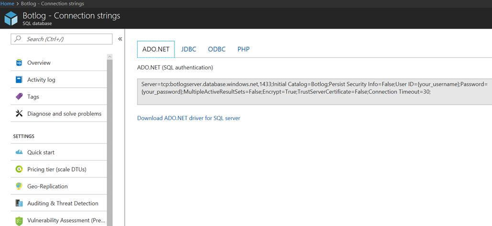

# SQL Logger

## 1.	Objectives

The aim of this lab is to log chat conversations to Azure SQL database. This lab is an extension of the previous File Logger lab where we used Global.asax events and LogAsync methods.

## 2.	Setup/Pre-requisites

2.1.   Import the project from code\sql-core-Middleware in Visual Studio.

2.2.   Since we will be writing to a SQL database. To create a new one, go to the azure portal and follow the [Create DB - Portal](https://docs.microsoft.com/en-us/azure/sql-database/sql-database-get-started-portal) steps. But create a database called Botlog, not "MySampleDatabase" as suggested in the link. At the end of the process, you should see the Overview tab, as you can see in the image below.


2.2.   Select "Show database connection strings" from the Overview tab and make a note (paste in a text document) of the connection string as we will be using it later in the lab.



2.3.   Change your firewall settings to capture your ip address. You may have already done this if you followed the steps from [Create DB - Portal](https://docs.microsoft.com/en-us/azure/sql-database/sql-database-get-started-portal) . Your ip address can be found here: https://whatismyipaddress.com/ 


2.4.   Create a new table called userChatLog with the below create table statement (or schema). We will use the same tool of the "Query the SQL database" section at the [Create DB - Portal](https://docs.microsoft.com/en-us/azure/sql-database/sql-database-get-started-portal) link. Within the Azure Portal, click "Data Explorer (preview)" on the left menu. To login, use the same account and password you specified when creating the database. Paste the script below and click "Run". The expected result is the message "Query succeeded: Affected rows: 0.". 

```
CREATE TABLE userChatLog(id int IDENTITY(1, 1),fromId varchar(25),toId varchar(25),message varchar(max),PRIMARY KEY(id));
```

2.5.   Import the code from sql-core-Middleware into Visual Studio. The easiest way to do this is by clicking on the solution sql-core-Middleware.sln.

## 3.  SQL Logging

The framework is very much the same as what was used in the previous labs. In short, we will use the Global.asax's global events to setup our logging. The ideal way of doing this is to initiate the connection to SQL server via Application_Start, pass the connection object to LogAsync method for storing chat messages and close the connection via Application_End.

````c#
public class WebApiApplication : System.Web.HttpApplication
    {
        SqlConnection connection = null;
        protected void Application_Start()
        {
            // Setting up sql string connection
            SqlConnectionStringBuilder sqlbuilder = new SqlConnectionStringBuilder();
            sqlbuilder.DataSource = "botlogserver.database.windows.net";
            sqlbuilder.UserID = "botlogadmin";
            sqlbuilder.Password = "�";
            sqlbuilder.InitialCatalog = "Botlog";

            connection = new SqlConnection(sqlbuilder.ConnectionString);
            connection.Open();
            Debug.WriteLine("Connection Success");

            Conversation.UpdateContainer(builder =>
            {
                builder.RegisterType<SqlActivityLogger>().AsImplementedInterfaces().InstancePerDependency().WithParameter("conn", connection);
            });

            GlobalConfiguration.Configure(WebApiConfig.Register);
        }

        protected void Application_End()
        {
            connection.Close();
            Debug.WriteLine("Connection to database closed");
        }
    }
````

It is worth noting that the connection object is passed as a parameter to SqlActivityLogger in the above code snippet. As a result, the LogAsync method is now ready to log any message from the bot or the user. The from/to ids along with the chat message can be obtained from the activity object (activity.From.Id, activity.Recipient.Id, activity.AsMessageActivity().Text).

````c#
public class SqlActivityLogger : IActivityLogger
    {
        SqlConnection connection;

        public SqlActivityLogger(SqlConnection conn)
        {
            this.connection = conn;
        }
        public async Task LogAsync(IActivity activity)
        {
                string fromId = activity.From.Id;
                string toId = activity.Recipient.Id;
                string message = activity.AsMessageActivity().Text;

                string insertQuery = "INSERT INTO userChatLog(fromId, toId, message) VALUES (@fromId,@toId,@message)";
                
                // Passing the fromId, toId, message to the the user chatlog table 
                SqlCommand command = new SqlCommand(insertQuery, connection);
                command.Parameters.AddWithValue("@fromId", fromId);
                command.Parameters.AddWithValue("@toId", toId);
                command.Parameters.AddWithValue("@message", message);
              
                // Insert to Azure sql database
                command.ExecuteNonQuery();
                Debug.WriteLine("Insertion successful of message: " + activity.AsMessageActivity().Text);   
        }
    }
````

### SQL Injection 

SQL Injection refers to an injection attack wherein an attacker can execute malicious SQL statements that control an application’s database server. SQL Injection can provide an attacker with unauthorized access to sensitive data. In the LogAsync method, parameters allow for defense against SQL injection. The prime benefit of parameterized queries is to prevent SQL injection.

## 4.  SQL Query Results

Run the project from visual studio and open the bot emulator. Begin to send messages to your bot to test the SQL logging functionality.


From the database page of the portal, select Tools -> Query editor (preview) to preview log messages stored in the table. Login to run any queries.
This is a quick way to see results but is not the only way of doing it. Feel free to use any SQL client to perform query operations. Run the query ````Select * from userChatLog```` to view chat inserts into the table userChatLog. In the below example, the message ````My Beautiful Los Angeles```` sent via the bot emulator is logged along with the ids.


### Continue to [0_README](../0_README.md) to review lab and attempt extra credit