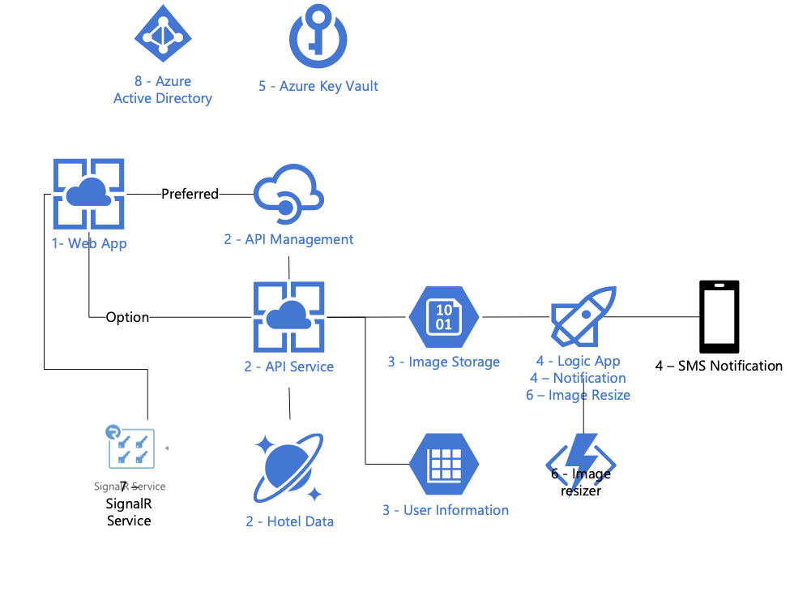

# What The Hack - Hotel CaliVegas Dev Hack

## Introduction
Welcome to the coach's guide for the Hotel CaliVegas Dev What The Hack. Here you will find links to specific guidance for coaches for each of the challenges.

Also remember that this hack includes a [kick-off presentation](Guides/Kickoff.pptx) that features a short presentation to introduce key topics for the hack and a walk-through getting your environment set up.

## Suggested Architecture

## Coach's Guides
- Challenge 1: **[Baseline App](Guides/ProctorGuide.docx)**
- Challenge 2: **[Search Service API](Guides/ProctorGuide.docx)**
- Challenge 3: **[Image Support](Guides/ProctorGuide.docx)**
- Challenge 4: **[Add Notifications](Guides/ProctorGuide.docx)**
- Challenge 5: **[Secure Application Configuration Secrets](Guides/ProctorGuide.docx)**
- Challenge 6: **[Create Thumbnails of Uploaded Images](Guides/ProctorGuide.docx)**
- Challenge 7: **[Add Realtime Image Updates](Guides/ProctorGuide.docx)**
- Challenge 8: **[Add authentication](Guides/ProctorGuide.docx)**
- Challenge 9: **[Add DevOps practices](Guides/ProctorGuide.docx)**
- Challenge 10: **[Add Infrastructure as Code](Guides/ProctorGuide.docx)**