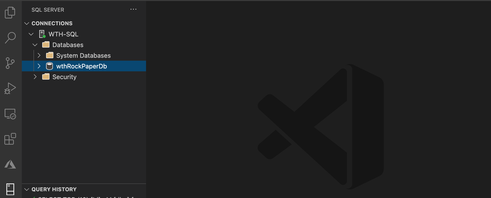
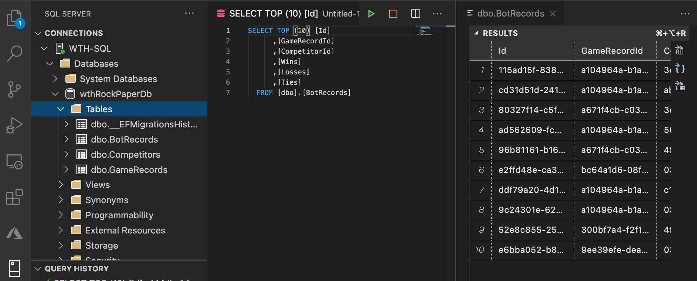

# Challenge 3 - Move to Azure SQL

[< Previous Challenge](02-RunTheApp.md) - **[Home](README.md)** - [Next Challenge >](04-RunOnAzure.md)

## Prerequisites

1. [Challenge 2](02-RunTheApp.md)

## Provision Azure SQL

1. Prepare and define environment by defining easy to re-use variables in Azure CLI

    ```bash
    # Set an admin login and password for your database
    adminlogin="<USERNAME>"
    password="Azure1234567!"

    # Set a server name that is unique to Azure DNS (<server_name>.database.windows.net)
    sqlServerName="<MY-SERVER-NAME-$randomId>"
    dbName="<My_DB-NAME>"

    # Set the ip address range that can access your database 
    startip="<MY-IP>"
    endip="<MY-IP>"
    ```

2. Create Azure SQL Server with [az sql server create](https://docs.microsoft.com/cli/azure/sql/server)

    ```bash
    az sql server create \
        -n $sqlServerName \
        -g $resourceGroupName \
        -l $location  \
        -u $adminlogin \
        -p $password
    ```

3. Configure Azure SQL Server firewall with [az sql server firewall-rule create](https://docs.microsoft.com/cli/azure/sql/server/firewall-rule)

    ```bash
    az sql server firewall-rule create \
        -g $resourceGroupName \
        -s $sqlServerName \
        -n AllowYourIp \
        --start-ip-address $startip \
        --end-ip-address $endip
    ```

4. Create Azure SQL database with [az sql db create](https://docs.microsoft.com/cli/azure/sql/db)

    ```bash
    az sql db create \
        -g $resourceGroupName \
        -s $sqlServerName \
        -n $dbName \
        -e GeneralPurpose \
        --compute-model Serverless \
        -f Gen5 \
        -c 2 \
        --max-size 5GB
    ```

## Configure the application to use Azure SQL

1. Obtain Azure SQL connection string

    ```bash
    az sql db show-connection-string -s $sqlServerName -n $dbName -c ado.net
    ```

2. Update `deploy-aci.yaml` to provide Azure SQL connection string

    ```yaml
    # Under rockpaperscissors-server service definition update Environment
    environment:
        "ConnectionStrings:DefaultConnection": "<Azure-SQL-ConnectionString>"
    ```

3. Re-deploy the application `az container create -g $resourceGroupName -f deploy-aci.yaml`

## Validate the application is using Azure SQL

1. Connect to Azure SQL via your preferred SQL client


1. Query the database to observe records

