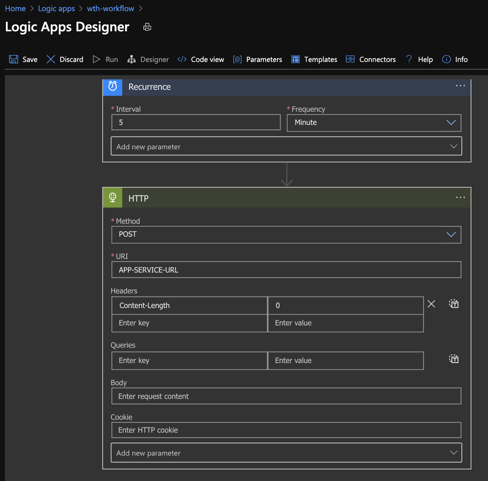

# Challenge 5 - Run the game continuously

[< Previous Challenge](04-RunOnAzure.md) - **[Home](README.md)** - [Next Challenge >](06-AddApplicationMonitoring.md)

## Prerequisites

1. [Challenge 4](04-RunOnAzure.md)

## Use Azure LogicApps to continuously run games

1. Create your workflow definition `httpRunner.json`

    ```json
    {
        "definition": {
            "$schema": "https://schema.management.azure.com/providers/Microsoft.Logic/schemas/2016-06-01/workflowdefinition.json#",
            "actions": {
                "HTTP": {
                    "inputs": {
                        "headers": {
                            "Content-Length": "0"
                        },
                        "method": "POST",
                        "uri": "<APP-API-ENDPOINT>"
                    },
                    "runAfter": {},
                    "type": "Http"
                }
            },
            "contentVersion": "1.0.0.0",
            "outputs": {},
            "parameters": {},
            "triggers": {
                "Recurrence": {
                    "recurrence": {
                        "frequency": "Minute",
                        "interval": 5
                    },
                    "type": "Recurrence"
                }
            }
        },
        "parameters": {}
    }
    ```

2. Create a LogicApps workflow with: [az logic workflow](https://docs.microsoft.com/cli/azure/ext/logic/logic/workflow?view=azure-cli-latest#ext-logic-az-logic-workflow-create) using the already created workflow definition

    ```bash
    #Set your env var
    workflowName="<MY-WORKFLOW-NAME>"

    # Create the workflow
    az logic workflow create \
        -g $resourceGroup \
        -l $location \
        -n $workflowName \
        --definition "httpRunner.json"
    ```

    Alternatively

3. Use the designer view in the portal to create the workflow: [Create logic apps via - Portal](https://docs.microsoft.com/azure/logic-apps/quickstart-create-first-logic-app-workflow)

    

### Use Azure Functions to continuously run games

1. Create a local function with [Azure Functions Core Tools](https://docs.microsoft.com/azure/azure-functions/functions-run-local?tabs=macos%2Ccsharp%2Cbash)

    ```bash
    # Set your vars
    funcApp="<FUNCTION-APP>"
    funcName="<FUNCTION-NAME>"
    apiEndPoint="<APPSERVICE-URL/api/rungame>"

    # Create a new function app
    func init $funcApp

    # Create a new function
    func new -l c# -n $funcName -t TimerTrigger
    ```

2. Code the function

    ```c#
    public static class runGameHttp
    {
        private static HttpClient httpClient = new HttpClient();
        private static string apiEndpoint = Environment.GetEnvironmentVariable("API_ENDPOINT");

        [FunctionName("runGameHttp")]
        public async static void Run([TimerTrigger("0 */1 * * * *")]TimerInfo myTimer, ILogger log)
        {
            log.LogInformation($"C# Timer trigger function executed at: {DateTime.Now}");

            var content = new StringContent("", Encoding.UTF8, "application/json");
            
            HttpResponseMessage response = await httpClient.PostAsync(apiEndpoint, content);
            string result = await response.Content.ReadAsStringAsync();

            log.LogInformation(result);
        }
    }
    ```

3. Deploy function to Azure Functions App

    ```bash
    # Create Azure Function App
    az functionapp create \
        -g $resourceGroup \
        -n $funcApp \
        --consumption-plan-location $location \
        --functions-version 3 \
        --storage-account $storageAccount
    
    # Publish your function
    func azure functionapp publish $funcApp

    # Configure appsettings
    az functionapp config appsettings set \
        -n $funcName \
        -g $resourceGroup \
        --settings "API_ENDPOINT=$apiEndPoint"
    ```
