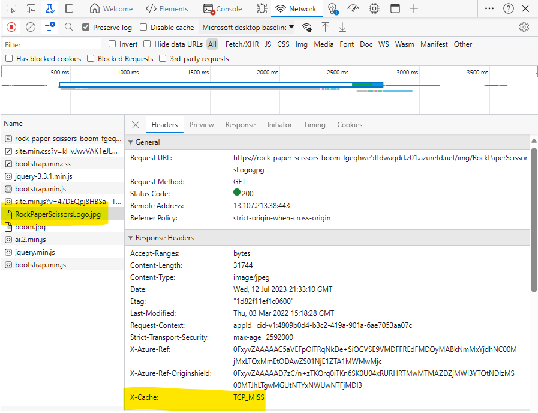
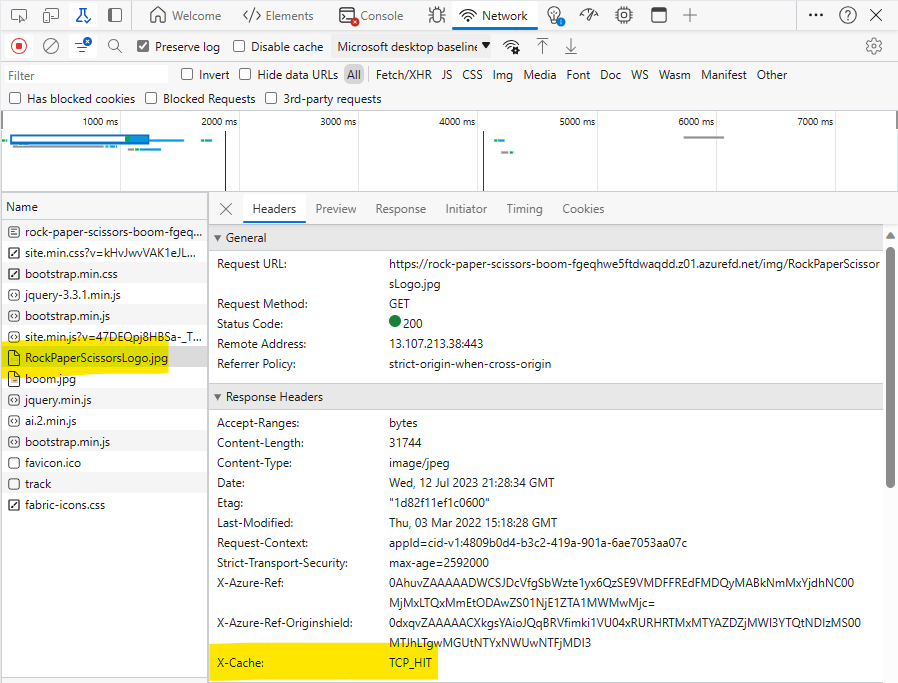

# Challenge 08 - Azure CDN - Coach's Guide

[< Previous Solution](./Solution-07.md) - **[Home](./README.md)** - [Next Solution >](./Solution-09.md)

## Notes & Guidance

### Create Azure FrontDoor

1.  Run the following Azure CLI command to create an Azure Front Door profile.

    ```shell
    az afd profile create --profile-name <profile-name> --resource-group <resource-group-name> --sku Standard_AzureFrontDoor
    ```

1.  Run the following Azure CLI command to create the Azure Front Door endpoint.

    ```shell
    az afd endpoint create --resource-group <resource-group-name> --endpoint-name rock-paper-scissors-boom --profile-name <profile-name> --enabled-state Enabled
    ```

1.  Run the following Azure CLI command to create the Azure Front Door origin group.

    ```shell
    az afd origin-group create --resource-group <resource-group-name> --origin-group-name rock-paper-scissors-boom --profile-name <profile-name> --probe-request-type GET --probe-protocol Http --probe-interval-in-seconds 60 --probe-path / --sample-size 4 --successful-samples-required 3 --additional-latency-in-milliseconds 50
    ```

1.  Run the following Azure CLI command to create the Azure Front Door origin.

    ```shell
    az afd origin create --resource-group <resource-group-name> --host-name <web-app-name>.azurewebsites.net --profile-name <profile-name> --origin-group-name rock-paper-scissors-boom --origin-name rock-paper-scissors-boom --origin-host-header <web-app-name>.azurewebsites.net --priority 1 --weight 1000 --enabled-state Enabled --http-port 80 --https-port 443
    ```

1.  Run the following Azure CLI command to create the Azure Front Door routing rule for the non-cached routes.

    ```shell
    az afd route create --resource-group <resource-group-name> --profile-name <profile-name> --endpoint-name rock-paper-scissors-boom --forwarding-protocol MatchRequest --route-name route-non-cached --https-redirect Enabled --origin-group rock-paper-scissors-boom --supported-protocols Http Https --link-to-default-domain Enabled --enable-caching false --query-string-caching-behavior IgnoreQueryString
    ```

1.  Run the following Azure CLI command to create the Azure Front Door routing rule for the cached routes.

    ```shell
    az afd route create --resource-group <resource-group-name> --profile-name <profile-name> --endpoint-name rock-paper-scissors-boom --forwarding-protocol MatchRequest --route-name route-cached --https-redirect Enabled --origin-group rock-paper-scissors-boom --supported-protocols Http Https --link-to-default-domain Enabled --enable-caching true --query-string-caching-behavior IgnoreQueryString --patterns-to-match "/img/*" "/css/*" "/lib/*" "/js/*"
    ```

### Test the new CDN

1.  Open a browser and turn on **Developer Tools** (F12). Navigate to the **Network** tab.

1.  Navigate to the Azure Front Door endpoint URL in a browser (look in the Azure portal for this URL)

1.  You should see the Rock Paper Scissors Boom game.

1.  In the **Network** tab, you should see the request for the images (such as the `RockPaperScissorsBoom.jpg` image). If you click the request for this image, you will see that Front Door added the `X-Cache` response header and indicated that it was a cache miss (`TCP_MISS`), so the image was retrieved from the origin (the App Service).



1.  Refresh the page and you should see the `X-Cache` response header indicate that the image was retrieved from the cache (`TCP_HIT`). Note that it may take a few refreshes over a few minutes to see this.



1.  You can purge the Front Door cache (from the Azure portal) and then refresh the page again. You should see the `X-Cache` response header (`TCP_MISS`) indicate that the image was retrieved from the origin (the App Service).
