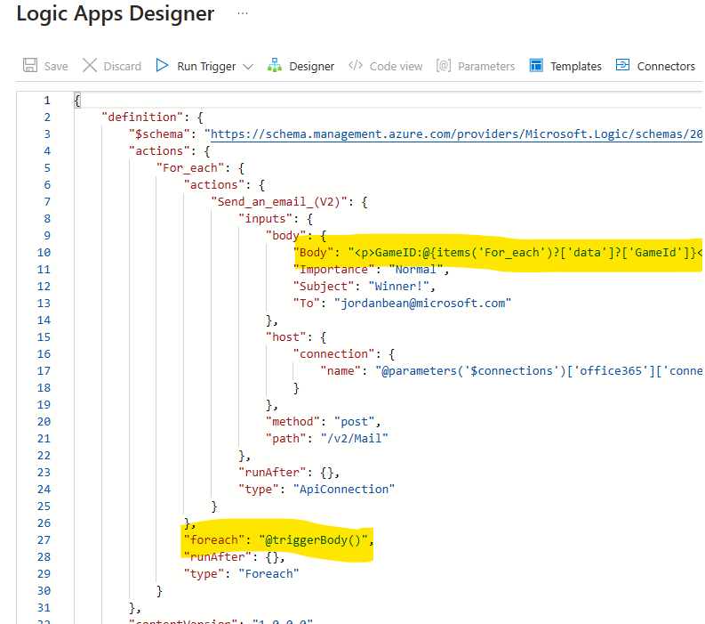

# Challenge 09 - Send a Winner Notification - Coach's Guide

[< Previous Solution](./Solution-08.md) - **[Home](./README.md)** - [Next Solution >](./Solution-10.md)

## Notes & Guidance

### Create Logic App

1.  Run the following Azure CLI to create the Logic App (note that the `workflow.json` file path is inside the `Student/Resources` directory)

    ```shell
    az logic workflow create --name <logicapp-name> --resource-group <resource-group-name> --location <location> --definition workflow.json
    ```

    > Note: You can also use the Azure Portal to create the Logic App.

1.  Open the Logic App in the Azure Portal and click on the **When an Event Grid resource event occurs** trigger.

1.  In the trigger dialog box, click the **Use sample payload to generate schema** link.

1.  Copy the contents of the `RockPaperScissorsBoom.Server/EventGridPayload.json` file and paste it into the dialog box. Click **Done**.

1.  Add a `Office 365 Outlook - Send an email (V2)` action and populate it with values from the event. Use the `Data` values to compose your email. Something like this:

    

    > NOTE: You may have to use the **Code view** to correctly parse the data values since they come in from the trigger as an array with no name.

    

1.  Save the Logic App and copy the URL from the trigger.

### Create Event Grid topic & subscription

1.  Run the following Azure CLI command to create the Event Grid topic.

    ```shell
    az eventgrid topic create --name rockpaperscissorsboom-winner-notification-topic --resource-group <resource-group-name> --location <location>
    ```

1.  Run the following Azure CLI command to create the Event Grid subscription. Use the endpoint URL copied above.

    ```shell
    az eventgrid topic event-subscription create --name rockpaperscissors-winner-notification-subscription --resource-group <resource-group-name> --topic-name rockpaperscissorsboom-winner-notification-topic --endpoint <logicapp-url>
    ```

    > NOTE: If the student's are using a PowerShell command window & executing Azure CLI, they will need to escape the `&` character or use the extra `--%` argument to prevent double parsing. [Quoting issues with PowerShell](https://github.com/Azure/azure-cli/blob/dev/doc/quoting-issues-with-powershell.md)

    ```powershell
    az --% eventgrid topic event-subscription create --name rockpaperscissors-winner-notification-subscription --resource-group <resource-group-name> --topic-name rockpaperscissorsboom-winner-notification-topic --endpoint <logicapp-url>
    ```

### Update local app settings

1.  Open the `RockPaperScissorsBoom.Server/appsettings.json` file. Note the Event Grid settings. These will need to be set.

1.  In your `docker-compose.yaml` file, set the Event Grid parameters (get these values from the Azure portal).

    ```yaml
    environment:
      ...
      "EventGridOn": "true"
      "EventGrid__TopicEndpoint": "https://rockpaperscissorsboom-winner-notification-topic.southcentralus-1.eventgrid.azure.net/api/events"
      "EventGrid__TopicKey": ""
      "EventGrid__TopicHostName": "rockpaperscissorsboom-winner-notification-topic.southcentralus-1.eventgrid.azure.net"
      "EventGrid__DataVersion": "2.0"
    ```

1.  Run the application and play a game. You should receive an email.

    ```shell
    docker compose up
    ```

### Update Azure app settings

1.  Use the following command to export all the existing App Service settings into a JSON file to make it easier to bulk upload new values.

    ```shell
    az webapp config appsettings list --name <app-name> --resource-group <resource-group-name> > settings.json
    ```

1.  Modify the `settings.json` file to add all the Event Grid values (note the double underscore between all the nested values).

    ```json
    ...
    {
      "name": "EventGridOn",
      "slotSetting": false,
      "value": "true"
    },
    {
      "name": "EventGrid__TopicEndpoint",
      "slotSetting": false,
      "value": "https://rockpaperscissorsboom-winner-notification-topic.southcentralus-1.eventgrid.azure.net/api/events"
    },
    {
      "name": "EventGrid__TopicKey",
      "slotSetting": false,
      "value": ""
    },
    {
      "name": "EventGrid__TopicHostName",
      "slotSetting": false,
      "value": "rockpaperscissorsboom-winner-notification-topic.southcentralus-1.eventgrid.azure.net"
    },
    {
      "name": "EventGrid__DataVersion",
      "slotSetting": false,
      "value": "2.0"
    }
    ...
    ```

1.  Use the following command to bulk upload the new settings.

    ```shell
    az webapp config appsettings set --name <app-name> --resource-group <resource-group-name> --settings "@settings.json"
    ```

1.  Open the web app in the browser and play a game. You should receive an email.
