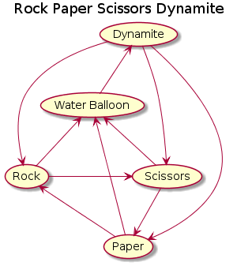

# What The Hack - Rock, Paper, Scissors, BOOM!

## Introduction

This is a challenge-based hack. It's NOT step-by-step. Don't worry, you will do great whatever your level of experience! You will be guided through different labs to implement the  "Rock Paper Scissors Boom" app by leveraging Azure technology like PaaS and Serverless. The intent is to have you practice the tools, technologies and services our partners are asking you about. Let's try to go out of your comfort zone, try and learn something new. And let's have fun!

You could do this on your own or by being part of a team, it's up to you. We would like to see a lot of collaboration and creativity!

And don't forget there are coaches around you, just raise your hand at any time!

## Learning Objectives

In this hack, we are going to take a web app called "Rock Paper Scissors Boom" and deploy it on Azure! This app is game server that allows bots to play the classic Rock/Paper/Scissors game. The web app is built on .NET core - it runs on Linux and Windows! The web app is open source and built by [DevChatter](https://www.twitch.tv/devchatter). This hack repo was forked from DevChatter's [original repo](https://github.com/DevChatter/RockPaperScissorsBoom).

Through progressive challenges we will build the web app, deploy it to Azure, monitor it, protect it, enhance and extend it.

At the end, each team will be able to build their own bot and compete with each other. We'll have a tournament with fabulous gifts and prizes!

## Technologies

Here are the technologies and services you will leverage:
- GitHub
- Git
- Linux
- ASP.NET Core
- SQL Server on Linux
- Docker
- Azure SQL Database
- Azure DevOps (formerly known as VSTS)
- Azure App Service on Linux
- Azure Container Registry
- Azure AD B2C
- Azure CDN
- Azure Application Insights
- Logic Apps
- Azure Functions
- Azure Event Grid

## Challenges

1. [Setup](./Student/Guides/challenges/Setup.md)
1. [Run the app](./Student/Guides/challenges/RunTheApp.md)
1. [Move to Azure SQL Database](./Student/Guides/challenges/MoveToAzureSql.md)
1. [Run the app on Azure](./Student/Guides/challenges/RunOnAzure.md)
1. [Run the Game Continuously](./Student/Guides/challenges/RunTheGameContinuously.md)
1. [Add Application Monitoring](./Student/Guides/challenges/AddApplicationMonitoring.md)
1. [Build a CI/CD pipeline with Azure DevOps](./Student/Guides/challenges/BuildCICDPipelineWithAzureDevOps.md)
1. [Implement AAD B2C](./Student/Guides/challenges/ImplementAADB2C.md)
1. [Leverage SignalR](./Student/Guides/challenges/LeverageSignalR.md)
1. [Leverage CDN](./Student/Guides/challenges/LeverageCDN.md)
1. [Send a Winner Notification](./Student/Guides/challenges/SendWinnerNotification.md)
1. [Run a Load Test](./Student/Guides/challenges/RunALoadTest.md)

### Tournament

* Towards the end of the workshop we'll ask you to deploy your own Rock Paper Scissors Boom bot so we can have a tournament challenge. 

**[Tournament Instructions](./Student/Guides/challenges/Tournament.md)**

## About the Rock Paper Scissors Boom app

Rock Paper Scissors Boom is a collaborative competition among developers. It's based on a project idea from a Microsoft Developer Evangelist that was called "Rock Paper Azure".

This server project provides an API that developers can use to develop bots that play the Rock Paper Scissors Boom game.

Rules of the Game:
 * A match is played between two bots and will consist of 100 rounds of Rock-Paper-Scissors
 * Rock beats Scissors
 * Scissors beats Paper
 * Paper beats Rock
 * A dynamite will defeat Rock, Paper, or Scissors played by the opponent.
 * A water balloon will defeat a dynamite.
 * Rock, Paper, and Scissors all beat water balloon.
 * Each bot receives 10 sticks of dynamite to use during a match.
 * All matching choices will be a tie with the same choice by opponent.
 * Each bot may also throw a water balloon whenever it likes.

## Contributors

- Mike Richter
