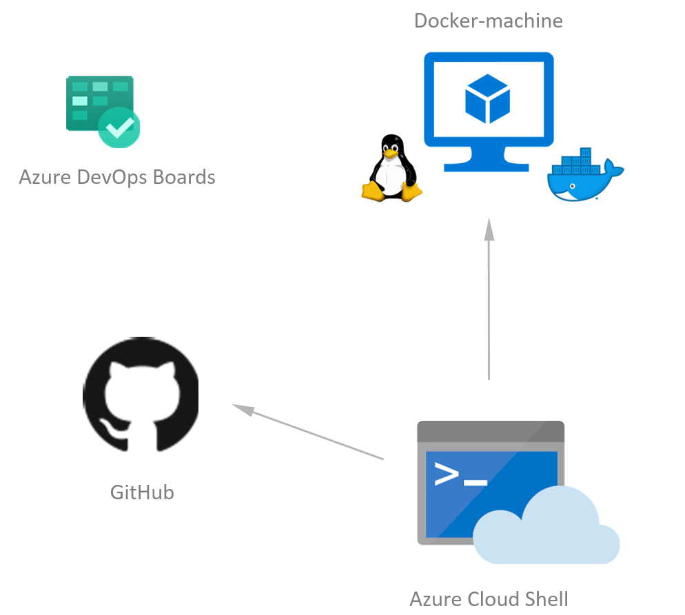

# Challenge 01 - Run the app

[< Previous Challenge](./Challenge-00.md) - **[Home](../README.md)** - [Next Challenge >](./Challenge-02.md)

## Introduction

With this second challenge you will be able to run the "Rock Paper Scissors Boom" app locally.



## Description

- Leveraging Docker & Docker Compose, build and run the app locally. You can use the `docker-compose.yaml` file in the `Resources.zip` file.
- Test the app as an end-user and play a game. You can reach the app via http://localhost

## Success Criteria

To complete this challenge successfully, you should be able to:

- Make sure `docker ps` is showing you 2 Docker containers running successfully.
- In your web browser, navigate to the app and play a game, make sure it's working without any error.

## Learning Resources

- [SQL Server on Linux](https://docs.microsoft.com/en-us/sql/linux/sql-server-linux-overview)
- [ASP.NET Core](https://docs.microsoft.com/en-us/aspnet/core)
- [Why Docker?](https://www.docker.com/)
- [Docker Compose](https://docs.docker.com/compose/)

## Tips

- Look at the `docker-compose.yaml` file and set a password for the SQL Server container (it is referenced 3 times in the file)
- Run `docker compose up --build` from the folder where the `docker-compose.yaml` file is to build & run the Docker images locally.
- You can use the following command to login to the local SQL Server database running in Docker to see the rows inserted by the application after clicking **Run the game**.
  ```shell
  docker exec rockpaperscissors-sql /opt/mssql-tools/bin/sqlcmd -S localhost -U SA -P "<password>" -d RockPaperScissorsBoom -q "SELECT * FROM [dbo].[GameRecords]
  ```
- If you get errors in your ASP.NET application, add the following environment variable to your `docker-compose.yaml` file.
  `"ASPNETCORE_ENVIRONMENT": "Development"`
