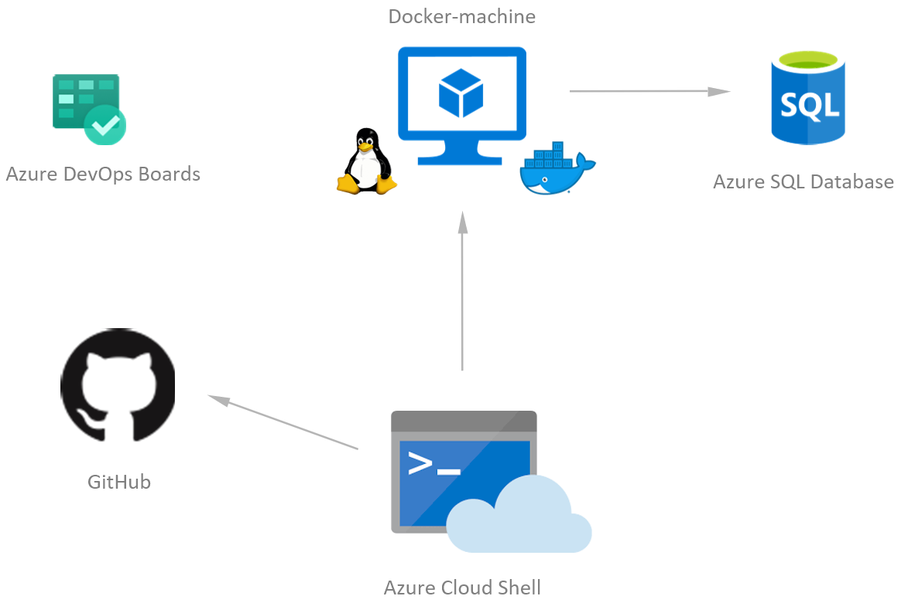

# Challenge 02 - Move to Azure SQL Database

[< Previous Challenge](./Challenge-01.md) - **[Home](../README.md)** - [Next Challenge >](./Challenge-03.md)

## Introduction

So far we have deployed a SQL Server on Linux containers which was really convenient for dev/test scenarios, especially locally. But now with this challenge we would like to leverage Azure SQL Database as a Platform-as-a-Service (PaaS) which offers out-of-the-box features for Production: security patching, SQL Server upgrades, auto-tuning, geo-replication, scaling up or down the size of the server, etc. that we don't want to do by ourselves.

## Description

- Provision your Azure SQL Database via Infrastructure-as-Code (you can use the Azure Cloud Shell if you don't have the tools installed locally). The approach here is to leverage an Infrastructure-as-Code language like Azure CLI/Bicep/PowerShell/Terraform/etc (not the Azure portal). _Friends don't let friends use the UI to provision Azure services, right? ;)_
- Update your app (re-build and re-deploy the Docker image) with the new connection string (as an environment variable), test the app as an end-user and play a game once deployed there.

## Success Criteria

To complete this challenge successfully, you should be able to:

- Validate that you have an Azure SQL Database deployed & running
  - Make sure `az sql server list` and `az sql db list` are showing your Azure services properly.
- In your web browser, navigate to the app and play a game, make sure it's still working without any error and that it is using the Azure SQL Database as its backend datastore.

## Learning Resources

- [Choose between SQL Server (IaaS) or Azure SQL Database (PaaS)](https://docs.microsoft.com/en-us/azure/sql-database/sql-database-paas-vs-sql-server-iaas)
- [Why switch to SQL Server on Linux?](https://learn.microsoft.com/en-us/sql/linux/sql-server-linux-overview?view=sql-server-ver16)
- [Azure CLI](https://docs.microsoft.com/en-us/cli/azure)
- [Bicep](https://learn.microsoft.com/en-us/azure/azure-resource-manager/bicep/overview?tabs=bicep)
- [PowerShell](https://learn.microsoft.com/en-us/powershell/azure/?view=azps-10.1.0)
- [Terraform](https://registry.terraform.io/providers/hashicorp/azurerm/latest/docs)

## Tips

- You can get the Azure SQL Database connection string by several different ways
  - Azure CLI: `az sql db show-connection-string -s <sql-server-name> -n <sql-db-name> -c ado.net`
  - Azure Portal: Go to the Azure SQL Database resource, click on **Show database connection strings** and copy the **ADO.NET (SQL Authentication)** connection string
- Add SQL IP firewall rules to restrict access to just your local IP & Azure trusted services
- Use `docker compose up --build --remove-orphans` to re-build & re-deploy the Docker images locally
  - The `--remove-orphans` flag removes the old SQL Server image you used in the previous challenge
