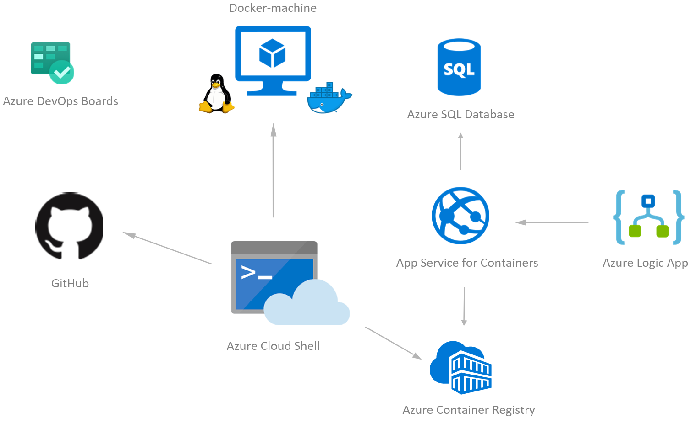

# Challenge 04 - Run the Game Continuously

[< Previous Challenge](./Challenge-03.md) - **[Home](../README.md)** - [Next Challenge >](./Challenge-05.md)

## Introduction

This is a simple challenge to get your Rock Papers Scissors Boom Server app to play the game continuously. This will help you generate telemetry for your application. As you develop your own bots to play the game, you can use this feature to have the bots automatically play each other and see how your bot compares to the others.

## Description

- Find the API URL that you can hit to start a game.
- Use an Azure resource like Logic Apps to automate hitting this URL on a timer.

## Success Criteria

To complete this challenge successfully, you should be able to:

- Validate that the game is playing on a continuous interval. (e.g. every 5 minutes)

## Learning Resources

- [Recurring Tasks with Logic Apps](https://docs.microsoft.com/en-us/azure/connectors/connectors-native-recurrence)

## Tips

- The path will be `https://<app-service-name>.azurewebsites.net/api/rungame`
- Make sure you use the right HTTP Method (**POST**).
- Try testing with [Postman](https://www.getpostman.com/) before setting your automation.
