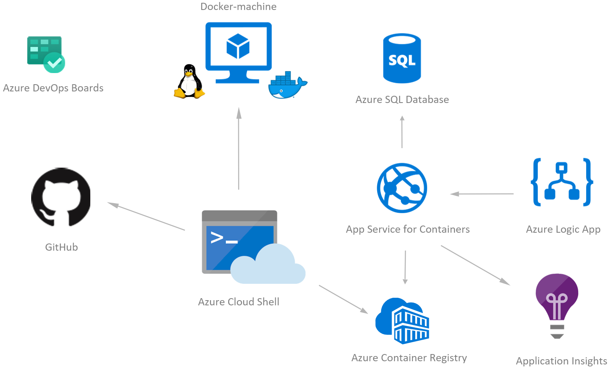

# Challenge 05 - Add Application Monitoring

[< Previous Challenge](./Challenge-04.md) - **[Home](../README.md)** - [Next Challenge >](./Challenge-06.md)

## Introduction

We've got our app running, but how do we know how well it's performing? Let's instrument `Application Insights` so you can see what's happening inside the app.

## Description

- You'll find the app is already wired up for Application Insights, you just need to populate app settings configuration with your own Application Insights connection string. Once you have the connection string, start using the app to see metrics.

## Success Criteria

To complete this challenge successfully, you should be able to:

- Validate that your app is sending data to Application Insights while running your application both locally and in Azure App Service. Make sure you are leveraging the proper way to set the `ConnectionString` (i.e. in `docker-compose.yaml` file for local and in Azure App Service's `AppSettings`) via environment variables.
- Build a dashboard in the Azure Portal for viewing performance of the app.

## Learning Resources

- [What is Application Insights?](https://docs.microsoft.com/en-us/azure/application-insights/app-insights-overview)
- [Application Insights for ASP.NET Core applications](https://learn.microsoft.com/en-us/azure/azure-monitor/app/asp-net-core?tabs=netcorenew,netcore6)

## Tips

- `GameLength` is a Custom Metric, you should see it populate in the **Metrics** after you run a game.
