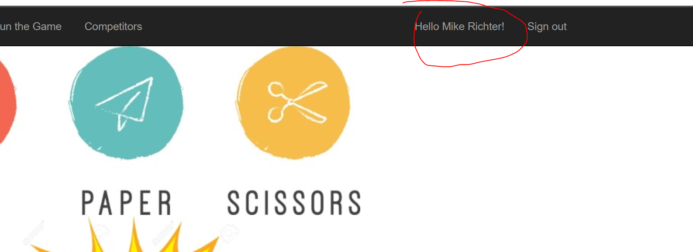

# Challenge 06 - Implement Azure AD B2C

[< Previous Challenge](./Challenge-05.md) - **[Home](../README.md)** - [Next Challenge >](./Challenge-07.md)

## Introduction

Right now your application on Azure is wide open for anyone to use. Your application allows you to add, edit and delete competitors. Let's make sure only authenticated users can do this. If you try to perform one of these actions in your application, you'll get some errors; you need to complete the feature!

The application has the code in place to authenticate users against Azure AD B2C, you just need to create an Azure AD B2C application, build the user journeys and policy and then set the right configuration values.

## Description

- Create an `Azure AD B2C` application in the Azure portal.
- Optional: Allow users to authenticate with an SSO ID via an `OpenIDConnect Account` (requires an AzureAD app registration in your AzureAD tenant).
- Update your application with the B2C configuration values.
  - **DO NOT** store credentials in your code or appsettings file.

## Success Criteria

To complete this challenge successfully, you should be able to:

- Validate that when a user hits the **Sign In** link, they are redirected to login.
- Validate that a user can successfully authenticate, get redirected back to your application and see a personalized greeting.



- Validate that a user can successfully add or edit a bot in the Competitor views.

## Learning Resources

- [Set up AAD B2C](https://learn.microsoft.com/en-us/azure/active-directory-b2c/identity-provider-local?pivots=b2c-user-flow)
- [Working with Azure App Service Application Settings](https://blogs.msdn.microsoft.com/cjaliaga/2016/08/10/working-with-azure-app-services-application-settings-and-connection-strings-in-asp-net-core/)
- [Cloud authentication with Azure Active Directory B2C in ASP.NET Core](https://learn.microsoft.com/en-us/aspnet/core/security/authentication/azure-ad-b2c?view=aspnetcore-6.0)
- [Bulk set App Service configuration values](https://learn.microsoft.com/en-us/azure/app-service/configure-common?tabs%253Dcli#edit-app-settings-in-bulk)
- [How to create a self-signed certificate locally for use in your ASP.NET application](https://github.com/dotnet/dotnet-docker/blob/main/samples/run-aspnetcore-https-development.md)

## Tips

- Make sure you are calling the application with `https` for the authentication redirects to work.
- Remember to keep your configuration secrets **OUT** of your code or config files.
- Don't forget `/signin-oidc` in your redirect URL
- Configuring https locally can be difficult to setup.
  - [How to create a self-signed certificate locally for use in your ASP.NET application](https://github.com/dotnet/dotnet-docker/blob/main/samples/run-aspnetcore-https-development.md)
  - Look at the following Docker Compose YAML snippet to see how to configure a self-signed certificate for your local development environment.
    ```yaml
    version: "3"
    services:
      rockpaperscissors-server:
        build:
          context: .
          dockerfile: Dockerfile-Server
        container_name: rockpaperscissors-server
        environment:
          ...
          "AzureAdB2C__Instance": "https://aadb2c-tenantname.b2clogin.com"
          "AzureAdB2C__TenantId": "AADB2C-TENANTID-ID(A Guid)"
          "AzureAdB2C__ClientId": "AADB2C-CLIENT-ID(A Guid)"
          "AzureAdB2C__ClientSecret": "AADB2C-CLIENT-SECRET"
          "AzureAdB2C__Domain": "AADB2C-TENANT(tenantname.onmicrosoft.com)"
          "AzureAdB2C__SignUpSignInPolicyId": "AADB2C-policyname"
          "ASPNETCORE_URLS": "https://+;http://+"
          "ASPNETCORE_Kestrel__Certificates__Default__Password": ""
          "ASPNETCORE_Kestrel__Certificates__Default__Path": "/https/aspnetapp.pfx"
        ports:
          - "80:80"
          - "443:443"
        volumes:
          - ~/.aspnet/https:/https
      ...
    ```
