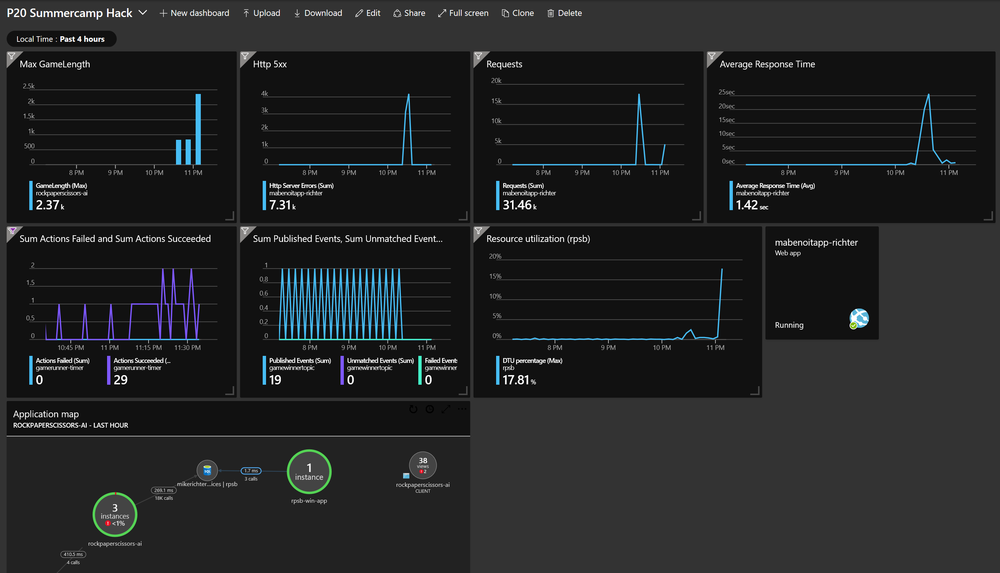

# Challenge 10 - Run a Load Test

[< Previous Challenge](./Challenge-09.md) - **[Home](../README.md)** - [Next Challenge >](./Challenge-11.md)

## Introduction

Once you deploy your app to Azure, how do you know how well it performs under load? Take advantage of the Load Testing features in Azure.

## Description

- Use the Azure Load Testing service to run a load test against your app.
- Run a Load Test against the app homepage using the default configuration.
- Run a Load Test against the Competitors homepage (it requires a SQL Server call). Use the default configuration again.
- Run a Load Test against the API endpoint for running the game.

## Success Criteria

To complete this challenge successfully, you should be able to:

- Run the load and review the results in Azure Load Testing.
  - If you were running a free or basic SKU of web apps, you may notice that your performance got worse as more load was added to the system. There may even have been a large number of errors as the demand on your app grew.
- Scale up the web app. You may need to move to the Standard SKU. Add 2 or 3 instances. Run the Competitor load test again. Notice if the numbers were better this time.
- Review the Application Insights chart you built for measuring how long the games take to run. If you successfully automated the game runs, did they take longer when you were performing your tests?
- Review the Compute utilization chart on the `Overview->Monitoring` blade for your SQL DB in the Azure portal. Did you see a spike on the DTUs during the load test?
- Play with the "Diagnose and solve problems" blade for your Azure Web App in the Azure portal. Let's know more about usage, CPU, memory, etc. and the info and recommendation you could get.

## Learning Resources

- [Azure Load Testing](https://learn.microsoft.com/en-us/azure/load-testing/overview-what-is-azure-load-testing)
- [Autoscale Azure App Services](https://docs.microsoft.com/en-us/azure/monitoring-and-diagnostics/monitoring-autoscale-get-started)
- [Create Azure Dashboards](https://docs.microsoft.com/en-us/azure/azure-portal/azure-portal-dashboards)
- [Azure App Service diagnostics overview](https://docs.microsoft.com/en-us/azure/app-service/app-service-diagnostics)

## Tips

- Use the Apache JMeter test script `quick_test.jmx` to set up the Load Test to call your test plan
- Set the following Load Test environment variables
  - domain: `<web-app-name>.azurewebsites.net`
  - protocol: https
  - throughput_per_engine: 100
  - max_response_type: 500
  - ramp_up_time: 0
  - duration_in_sec: 120
  - path: `api/rungame`
- You may want to disable to Notification Logic App so you don't get a bunch of emails while you are running your load tests.
- You may want to build a dashboard in the Azure portal that collects some telemetry data from across your solution into one place. Can you build a dashboard that includes
  - Web app # of requests
  - Web app average response times
  - Game run duration, SQL DTUs
  - Logic Apps Actions Completed
  - Event Grid Published Events
- Check out this sample dashboard

