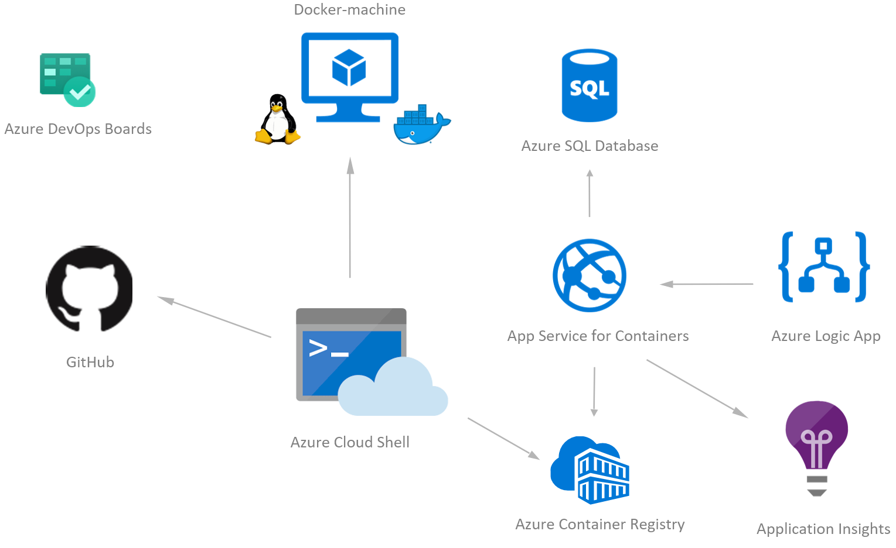

# Challenge 6 - Add Application Monitoring

## Prerequisities

1. [Challenge 2 - Run the App](./RunTheApp.md) should be done successfully.

## Introduction

We've got our app running, but how do we know how well it's performing? Let's instrument `Application Insights` so you can see what's happening inside the app.

## Challenges

1. You'll find the app is already wired up for Application Insights, you just need to populate app settings configuration with your own Application Insights key. Once you have the key, start using the app to see metrics.

## Success criteria

1. Make sure you got some data in Application Insights while running your application in both places locally (Azure Cloud Shell) and in Azure App Service. Make sure you are leveraging the proper way for both to set the `InstrumentationKey` (i.e. in docker-compose.yaml file for local and in Azure App Service's AppSettings).
1. Build a dashboard in the Azure Portal for viewing performance of the app.
1. In Azure DevOps (Boards), from the Boards view, you could now drag and drop the user story associated to this Challenge to the `Resolved` or `Closed` column, congrats! ;)

## Tips

1. Game Duration is a Custom Metric, you should see it populate in the Visualization builder after you run a game.

## Advanced challenges

Too comfortable? Eager to do more? Try this:

1. Find places throughout the application to track more telemetry.
1. Create an alert based on App Insights telemetry.
1. Generate an Application Map

## Learning resources

1. [What is Application Insights?](https://docs.microsoft.com/en-us/azure/application-insights/app-insights-overview)

[Next challenge (Build a CI/CD pipeline with Azure DevOps) >](./BuildCICDPipelineWithAzureDevOps.md)