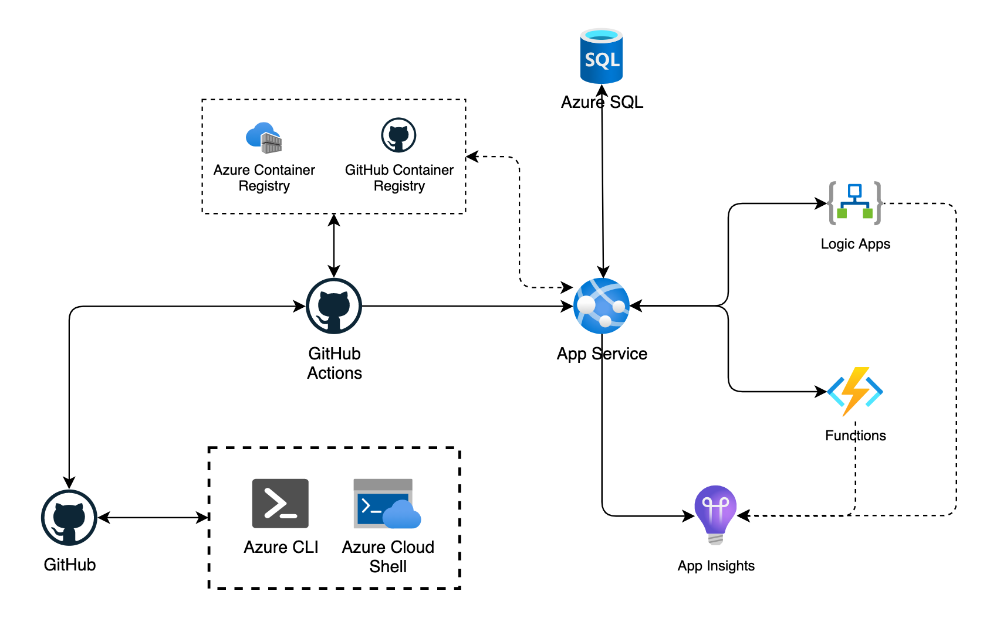

# Challenge 7 - Build a CI/CD workflow with GitHub Actions

## Prerequisites

1. [Challenge 4 - Run the app on Azure](./RunOnAzure.md) should be done successfully.

## Introduction

In a previous challenge we manually deployed the app on Azure. Now with this challenge you will be able to build an entire CI/CD workflow with GitHub actions.

## Challenges

1. Create a Build workflow with GitHub actions to build your Docker images and push it to your Azure Container Registry (ACR). Your workflow should use `Continuous Integration` to build and push a new image with every relevant commit.
2. Create a Release workflow with GitHub actions to deploy your images to the Azure Web App Service for Containers previously provisioned. Your workflow should implement `Continuous Delivery` approach to deploying the new image.
3. Update one file on your `master` branch and commit this change, it should trigger automatically the Build and the Release definitions to deploy the new version of your app.
4. Once deployed, test the app as an end-user, and play a game once deployed there.

## Success criteria

1. In Azure Cloud Shell, make sure `az webapp list` is showing your Azure services properly.
1. In Azure Cloud Shell, make sure `az acr repository show-tags` is showing your new container image properly.
1. In your web browser, navigate to the app and play a game, make sure it's working without any error and that your update is here.
1. In Azure DevOps (Boards), from the Boards view, you could now drag and drop the user story associated to this Challenge to the `Resolved` or `Closed` column, congrats! ;)

## Tips

1. [GitHub Actions CI/CD](https://docs.github.com/actions/guides/about-continuous-integration)
2. [Deploy a custom container to App Service using GitHub Actions](https://docs.microsoft.com/azure/app-service/deploy-container-github-action?tabs=publish-profile)

## Advanced challenges

Too comfortable? Eager to do more? Try this:

1. Instead of deploying the app on every, you could only deploy when a release event is executed [Events that trigger workflows](https://docs.github.com/actions/guides/about-continuous-integration).
2. Instead of pushing your containers images ACR, you could use [GitHub Container Registry](https://docs.github.com/packages/guides/about-github-container-registry).
3. Deploying the image is a disruptive operation, consider using [App Service Deployment Slots](https://docs.microsoft.com/azure/app-service/deploy-best-practices#use-deployment-slots) to have a Blue/Green deployment strategy

## Learning resources

- [GitHub Actions](https://docs.github.com/actions)
- [ACR Build task](https://docs.microsoft.com/azure/container-registry/container-registry-tasks-overview)

[Next challenge (Implement Azure AD B2C) >](./ImplementAADB2C.md)