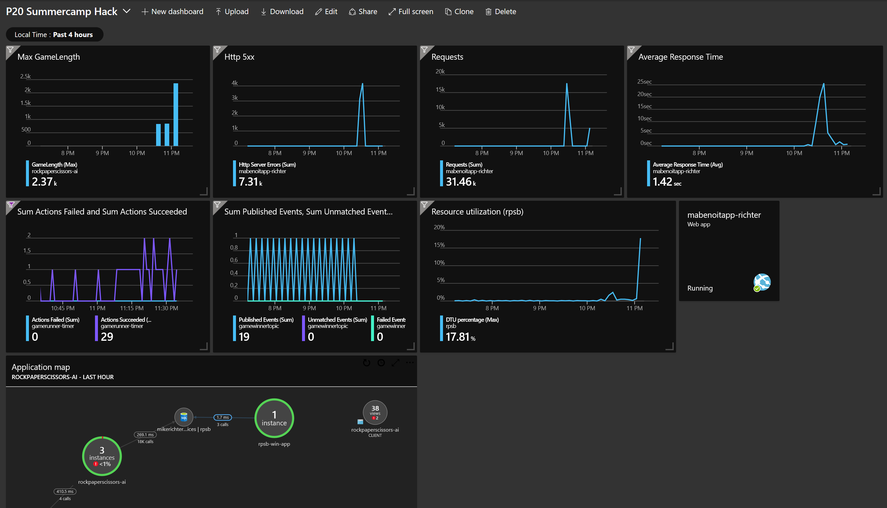

# Challenge 12 - Run a Load Test

## Prerequisities

1. [Challenge 4 - Run the app on Azure](./RunOnAzure.md) should be done successfully.

## Introduction

Once you deploy your app to Azure, how do you know how well it performs under load? Take advantage of the Load Testing features in Azure and Azure Devops.

## Challenges

1. In the portal blade for your web app: Associate the Performance Test tab with your Azure Devops account
1. Run a Load Test against the app homepage using the default configuration.
1. Run a Load Test aganinst the Competitors homepage (it requires a SQL Server call). Use the default configuration again.

## Success criteria

1. Run the load and review the results in Azure Devops
    * If you were running a free or basic sku of web apps, you may notice that your performance got worse as more load was added to the system. There may even have been a large number of errors as the demand on your app grew.
1. Scale up the web app. You may need to move to the Standard SKU. Add 2 or 3 instances. Run the Competitor load test again. Notice if the numbers were better this time.
1. Review the detailed charts and diagnostics for the test run in Azure Devops.
1. Review the application insights chart you built for measuring how long the games take to run. If you successfully automated the game runs, did they take longer when you were performing your tests?
1. Review the DTU chart on the Overview blade for your SQL DB in the Azure portal. Did you see a spike on the DTUs during the load test? 
1. Play with the "Diagnose and solve problems" bload for your Azure Web App in the Azure portal. Let's know more about usage, CPU, memory, etc. and the info and recommendation you could get.
1. In Azure DevOps (Boards), from the Boards view, you could now drag and drop the user story associated to this Challenge to the `Resolved` or `Closed` column, congrats! ;)

## Tips

* You may want to build a dashboard in the Azure portal that collects some telemetry data from across your solution into one place. Can you build a dashboard that includes 
    * Web app # of requests, 
    * Web app average response times, 
    * game run duration, SQL DTUs, 
    * Logic Apps Actions Completed, 
    * Event Grid Published Events
* Check out this sample dashboard

## Advanced challenges

Too comfortable? Eager to do more? Try this:

* Set up autoscale in your azure web app and adjust your load test configuration to make the app scale as you add load to it.
* Use Visual Studio's Load Test recorder to do a more organic test, including running the game. You can use the generated recording file in Azure Devops for running the test.

## Learning resources

* [Load Testing with Azure Devops](https://docs.microsoft.com/en-us/azure/devops/test/load-test/getting-started-with-performance-testing?view=vsts)
* [Autoscaling Azure App Services](https://docs.microsoft.com/en-us/azure/monitoring-and-diagnostics/monitoring-autoscale-get-started)
* [Create Azure Dashboards](https://docs.microsoft.com/en-us/azure/azure-portal/azure-portal-dashboards)
* [Azure App Service diagnostics overview](https://docs.microsoft.com/en-us/azure/app-service/app-service-diagnostics)

End of the Hack! Congrats! Have you done [all the challenges](../README.md)?