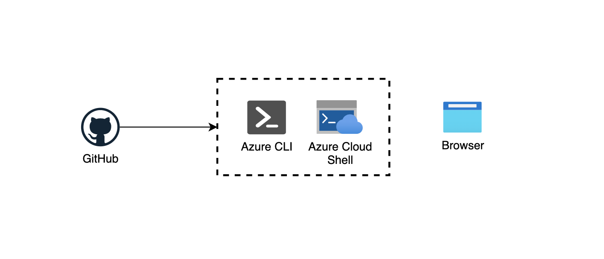

# Challenge 1 - Setup

## Prerequisities

1. Your laptop: Win, MacOS or Linux
1. Your GitHub account, if not yet it's time to create one! ;)
1. Your Azure Subscription

## Introduction

### Set up your *local* environment

The first challenge is to setup an environment that will help you build the Rock Paper Scissors Boom! Game Server and deploy it locally. We need to make sure everything is working before bringing it to Azure.

Traditionally, to *really* do this locally, you would need the app platform (.NET Core, SQL Server, IIS, etc) running locally. Nobody has time for that. Wouldn't be nice to have a cloud-based container image building for platforms including Linux, Windows, and ARM?. Enter Azure! We can leverage on demand services to extend your "inner-loop" development cycle to provide container image build, push and runs!

By leveraging the Azure CLI, Azure PowerShell, or Azure Cloud Shell, we have all the tools we need.  All we really need is a browser and an Azure subscription.

> The use of Azure Cloud Shell is our recommendation to simplify your experience. But if you prefer using your local machine to do the lab, feel free to do it. You would need either the [Azure CLI](https://docs.microsoft.com/cli/azure/install-azure-cli) or [Azure PowerShell](https://docs.microsoft.com/powershell/azure/install-az-ps?view=azps-5.4.0).

 **Setting up this mock *local* environment is important. We will be using this environment for future challenges.**

## Challenges

1. The resources you need for completing the challenges can be found under the [WhatTheHack's Releases](https://github.com/microsoft/WhatTheHack/releases) and grouped by the WhatTheHack event date. If the event is taking place in September 2049, then the resources will be in the release: **microsoft/WhatTheHack-204909**
2. Download the resources using `curl` or `wget` via Azure CLI, Azure PowerShell, or Azure Cloud Shell
3. Leverage Azure to build your container image and run it in the cloud to validate all is working before deploying it.

### Optional Challenges

1. Create a new repo in [Githubs](https://github.com) and push the downloaded resources
2. Populate Github issues with the challenges for this WhatTheHack. One issue per challenge. ([List of challenges in the ReadMe](../README.md))

## Success criteria

1. In Azure CLI, PowerShell, or Cloud Shell, make sure `ls` is showing your resources for the WhatTheHack
2. In Azure CLI, PowerShell, or Cloud Shell, make sure `docker images` command runs successfully (without error).
3. In Azure CLI, PowerShell, or Cloud Shell, let's play with the following commands: `ls -la`, `git version`, `az --version`, `docker images`, `code .`, etc.

## Tips

1. In Azure Cloud Shell, you will leverage the `Bash (Linux)` mode, we all love Linux! <3
1. To build and run your conternarized application in the cloud, consider using [Azure Container Registry Tasks](https://docs.microsoft.com/azure/container-registry/container-registry-tasks-overview).

## Advanced challenges

Too comfortable? Eager to do more? Here you are:

1. Instead of leveraging Azure Cloud Shell, you could download [Windows Terminal](https://github.com/microsoft/terminal) and use the Azure Cloud Shell locally, or alternatively you could setup a local environment using Azure PowerShell or Azure CLI.
2. Instead of using Azure Container Instance, you cloud install Docker CE and Docker-compose.

## Learning resources

* [Visual Studio Code embedded in Azure Cloud Shell](https://azure.microsoft.com/blog/cloudshelleditor/)
* [Visual Studio Team Services (VSTS) became Azure DevOps](https://azure.microsoft.com/blog/introducing-azure-devops/)
* [Microsoft acquired GitHub](https://news.microsoft.com/2018/06/04/microsoft-to-acquire-github-for-7-5-billion/)
* [Microsoft Azure + Open Source (OSS)](https://open.microsoft.com/)

[Next challenge (Run the App) >](./RunTheApp.md)
