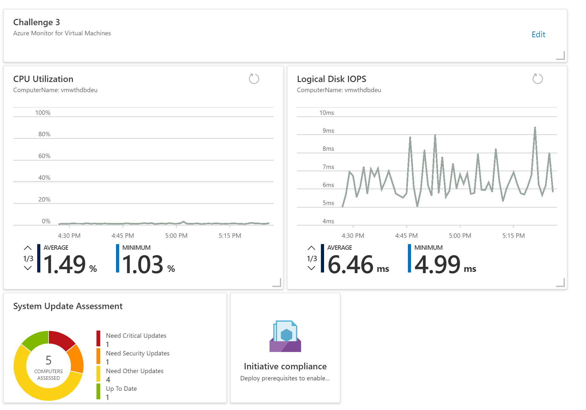

# Challenge 3: Azure Monitor for Virtual Machines

[Previous Challenge](./02-Monitoring-Basics-And-Dashboards.md) - **[Home](../README.md)** - [Next Challenge>](./04-Azure-Monitor-For-Applications.md)

## Notes & Guidance

Use these instructions to assist students in completing the following VM management tasks:

- Configure VM Insights for all virtual machines
  - Add VM Insights solution to workspace
    - To configure a single workspace, go the **Virtual Machines** option in the **Azure Monitor** menu, select the **Other onboarding options**, and then **Configure a workspace**. Select a subscription and a workspace and then click **Configure**.
  

  - Use Azure Policy to Enable VM Insights for all VMs
    - To access **VM insights Policy Coverage**, go the **Virtual machines** in the **Azure Monitor** menu in the Azure portal. Select **Other onboarding options** and then **Enable** under **Enable using policy**.
  
    - Create a new policy assignment by clicking **Assign Policy**.
  
    - Change the **Assignment name** and add a **Description**. Select **Exclusions** if you want to provide an exclusion to the scope.
  
    - Select the **Log Analytics workspace** to be used by all virtual machines in the assignment.
  
    - Click **Review + Create** to review the details of the assignment before clicking **Create** to create it.

  - Pin Performace graphs from the VM Insights workbook to the dashboard
    - Text, query, and metrics steps in a workbook can be pinned by using the pin button on those items while the workbook is in pin mode. To access pin mode, select **Edit** to enter editing mode, and select the blue pin icon in the top bar. An individual pin icon will then appear above each corresponding workbook part's Edit box on the right-hand side of your screen.
    

- Configure Update Management for all virtual machines
  - Create Azure Automation Account and link it to Log Analytics workspace
    - Update Management is an Azure Automation feature, and therefore requires an Automation account. You can use an existing Automation account in your subscription, or create a new account dedicated only for Update Management.
    
  - Enable VM Update Management solution
    - In your Automation account, select **Update management** under Update management. Choose the **Log Analytics workspace** and Automation account and select **Enable** to enable Update Management. The setup takes up to 15 minutes to complete.
    
  - Enable Automatic OS image upgrades for VM Scaleset
    - Automatic OS image upgrades on your scale set helps ease update management by safely and automatically upgrading the OS disk for all instances in the scale set. Use the Update-AzVmss cmdlet to configure automatic OS image upgrades for your scale set. The following example configures automatic upgrades for the scale set named myScaleSet in the resource group named myResourceGroup:

        ```powershell
        Update-AzVmss -ResourceGroupName "myResourceGroup" -VMScaleSetName "myScaleSet" -AutomaticOSUpgrade $true
        ```

  - Pin Update Management summary to dashboard
    - Navigate to **Workspace Summary** in Log Analytics workspace and pin the **System Update Management** tile to dashboard.
  

- Monitor in-guest VM configuration drift
  - Enable guest configuration audit through Azure policy
    - To manage settings inside a machine, a virtual machine extension is enabled and the machine must have a system-managed identity. The extension downloads applicable guest configuration assignment and the corresponding dependencies. To deploy the extension at scale across many machines, assign the policy initiative **Deploy prerequisites to enable guest configuration policies on virtual machines**.
    
  - Pin policy compliance summary to dashboard

- Review the dashboards and compare to the following image:


## Learning Resources

- [Cloud Adoption Framework - Management and Monitoring](https://docs.microsoft.com/en-us/azure/cloud-adoption-framework/ready/enterprise-scale/management-and-monitoring)
- [Configure Log Analytics workspace for VM Insights](https://docs.microsoft.com/en-us/azure/azure-monitor/vm/vminsights-configure-workspace?tabs=CLI#add-vminsights-solution-to-workspace)
- [Enable VM insights by using Azure Policy](https://docs.microsoft.com/en-us/azure/azure-monitor/vm/vminsights-enable-policy)
- [Azure Monitor Workbooks - Pinning Visualizations](https://docs.microsoft.com/en-us/azure/azure-monitor/visualize/workbooks-overview#pinning-visualizations)
- [Update Management overview](https://docs.microsoft.com/en-us/azure/automation/update-management/overview)
- [Operating systems supported by Update Management](https://docs.microsoft.com/en-Us/azure/automation/update-management/operating-system-requirements#:~:text=Update%20Management%20does%20not%20support%20safely%20automating%20update,managing%20OS%20image%20upgrades%20on%20your%20scale%20set)
- [Enable Update Management from the Azure portal](https://docs.microsoft.com/en-us/azure/automation/update-management/enable-from-portal#enable-update-management)
- [Configure automatic OS image upgrade for VMSS](https://docs.microsoft.com/en-us/azure/virtual-machine-scale-sets/virtual-machine-scale-sets-automatic-upgrade)
- [Understand the guest configuration feature of Azure Policy](https://docs.microsoft.com/en-us/azure/governance/policy/concepts/guest-configuration)
- [Preview: Automatic VM guest patching for Azure VMs](https://docs.microsoft.com/en-us/azure/virtual-machines/automatic-vm-guest-patching)
