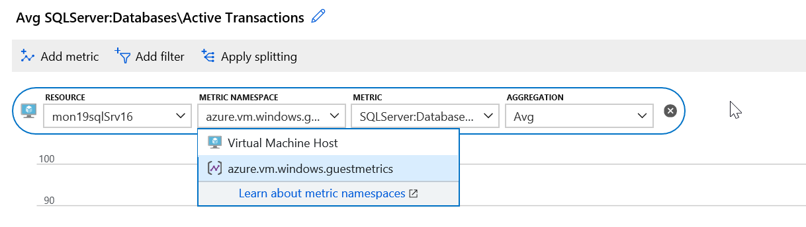
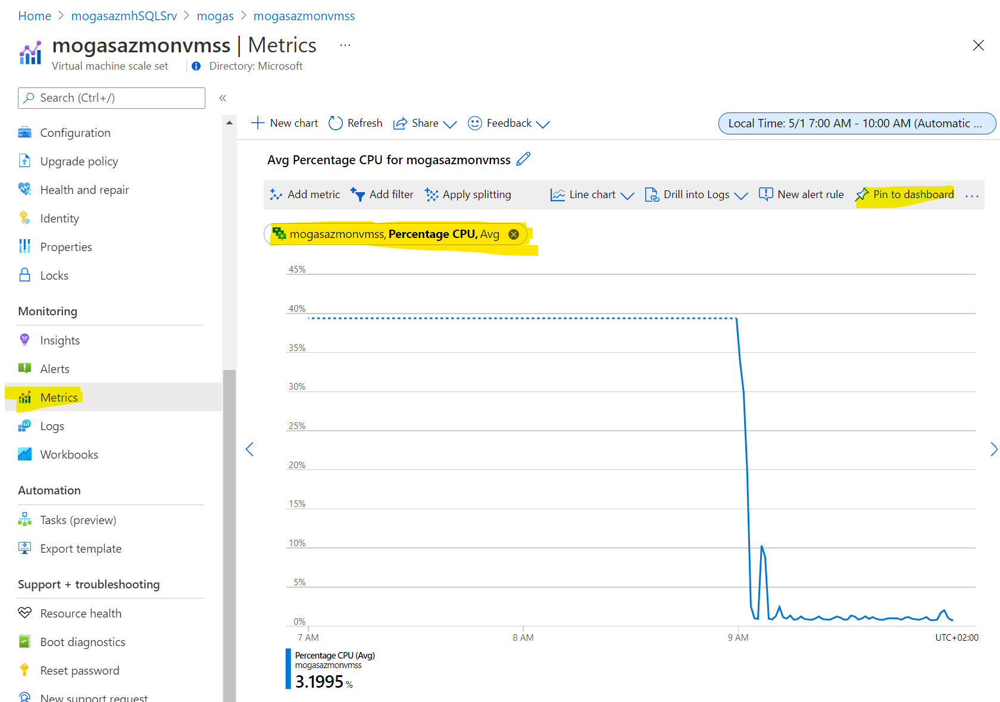
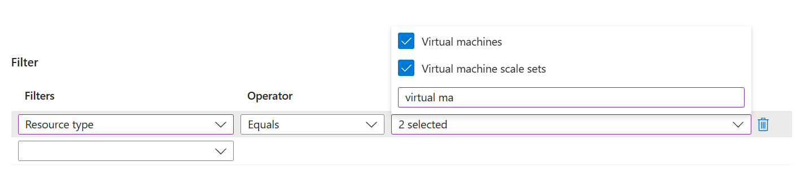
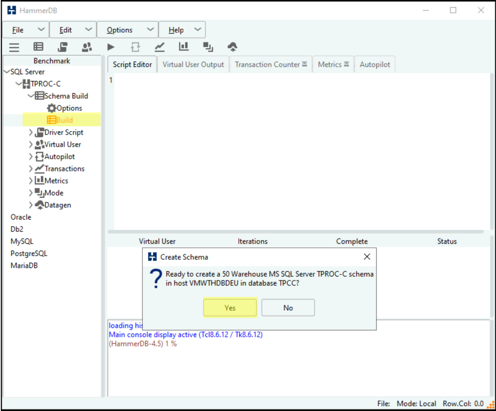
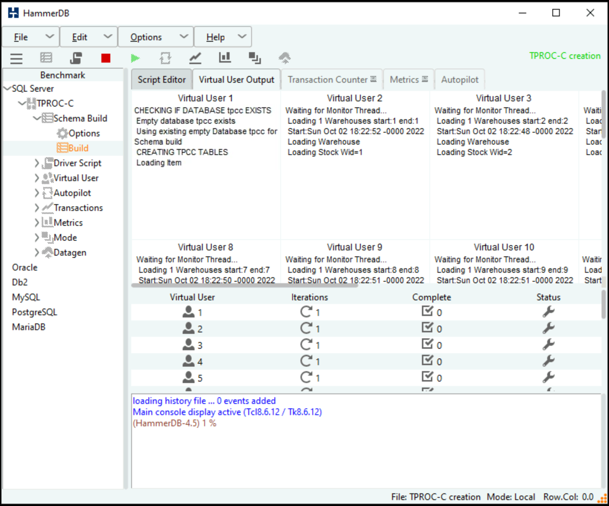

# Challenge 01 - Monitoring Basics: Metrics, Logs, Alerts and Dashboards - Coach's Guide 

[< Previous Solution](./Solution-00.md) - **[Home](./README.md)** - [Next Solution >](./Solution-02.md)

## Notes & Guidance

>**Note** Azure Monitor Agent (AMA) replaces several legacy monitoring agents, like the Log Analytics Agent (Microsoft Monitoring Agent, MMA, OMS), Diagnostics agent and Telegraf agent. The legacy Log Analytics agent will not be supported after August 2024. For this reason, we will be using **only the Azure Monitor Agent (AMA)** in this Hackathon. We won't be using any of the legacy agents.

### Create an empty database called `tpcc` on the SQL Server

Some students may struggle with this particular task if they do not have previous experience with SQL Server. If that is the case, please make sure you guide them on how to create an empty database (as the key goal of the challenge is to learn Azure Monitor, not SQL Server).

>**Note** Use SQL Authentication with the username being `sqladmin` and password being whatever you used during deployment

>**Note** The `XX` in each resource name will vary based on the Azure region the eShopOnWeb Azure environment has been deployed to.

You can use SQL Management Studio on either the SQL Server VM or the Visual Studio VM, or SQL Server Object Explorer view in Visual Studio to create the database. Below you can find the steps for the SQL Server Object Explorer.

- Use Azure Bastion to connect to the Visual Studio Server VM (`vmwthvsdXX`) and open Visual Studio.

- Visual Studio has a view called SQL Server Object Explorer that can be used to create and delete SQL databases on the SQL server.


- Connect to the database server VM (`vmwthvsdXX`), make sure to use SQL Server Authentication with username `sqladmin` and the password you set during deployment.


- Once connected create a new database called `tpcc`


### Send the SQL Server VM performance counters to Azure Monitor

>**Note** This task may be quite challenging for some students. Provide hints early on if you notice that the students are getting stuck.
  
To find the correct name of the SQL DB counter, go to your Azure Portal, open the VM, then open Run Command as shown in the screen below. 
  


Run the command - ```PowerShell(Get-Counter -ListSet SQLServer:Databases).Paths```
  
Once its finished, review the results (scroll up) and copy the output for the 
  
`\SQLServer:Databases(*)\Active Transactions` counter.
  


Now replace the "*" with the target database to be:
`\SQLServer:Databases(tpcc)\Active Transactions`

If you navigate to the Metrics blade for both VMs, you should only be able to see Virtual Machine host metrics. To add guest-level monitoring, create a Data Collection Rule. 
- On the Monitor menu, select Data Collection Rules.
- Select Create to create a new data collection rule and associations.


- Enter a Rule name and specify a Subscription, Resource Group, Region, and Platform Type (Windows):


- On the Resources tab select + Add resources and associate SQL Server VM to the data collection rule.
- On the Collect and deliver tab, select Add data source to add a data source and set a destination.
- Select Data source type "Performance Counters" and then select "Basic". Make sure that all Performance Counters are selected.


- On the Destination tab, add Azure Monitor Metrics and Azure Monitor Logs (select existing Log Analytics workspace).


- Select Add data source.
- Click on the newly created Data Source called Performance Counters to open it.
- Select Custom, add the SQL DB performance counter (`\SQLServer:Databases(tpcc)\Active Transactions`) to the list, make sure it is selected by the tick and click Save.


- Select Review + create to review the details of the data collection rule and association with the set of virtual machines.
- Select Create to create the data collection rule.


### Check your metrics 
  
Now go to the VM Metric, you should see the SQL one we added above, add it and pin it to any of your Dashboards (It may take several minutes for the guest metrics to start flowing into the Azure Metrics store).
    
 

Can you see the new Metric?
    


### Pin charts to your dashboard

You can click on Pin to dashboard, then customize it to show the last 1 hour (see below)
  


Do this for both the SQL Server Active Transactions and the Percent CPU of the VM Scale Set

- SQL Server Active Transactions
 
  

 
 
- VM Scale Set Percentage CPU
  


In the end after you run all the stress tests the dashboards, should look like this:


### Send the SQL Server VM Event Logs to Azure Monitor

Follow the same steps that you used previously to create another data collection rule. The only difference will be on the Add data source step:
- Instead of selecting Performance Counters, select Windows Event Logs and choose basic System and Application logs (Critical, Error, Warning, Informational)


- On the Destination tab the only available option will be Azure Monitor Logs (select existing Log Analytics workspace).


### Create an Alert rule to be notified in case the SQL active transactions went above 40.
  
- From Azure Monitor, create an Action group to send email to your address
  


- Create an Alert if Active Transactions goes over 40 on the SQL Server `tpcc` database.
    
 
  
- Make sure to add the correct counter  
    


- Now set the logic to greater than 40
  


- Now define the action group to be the one you have created above


  
- Give the Alert a Name, Description and Severity


  
- If you check your Alert Rules you should see it now enabled.
  

  
- Similarly create an Alert Rule for CPU over 75% on the Virtual Scale Set that emails you when you go over the threshold.

### Create an Alert processing rule to suppress the alerts over the weekends

- To suppress the Alerts over the weekends, in Azure Monitor under Alerts open your **Alert processing rules**


- Click Create
- Under Scope, click on Select a resource and make sure you have your subscription selected. Then search for the name of the resource group that was created in the deployment of the workshop. 
- Select your resource group when it comes up. 
- Click Apply      
- Under Filter, select Resource type under Filters, Equals under Operator, and select "Virtual Machines" and "Virtual Machine scales sets" under Value    

 

- Go to Rule settings and select Suppress Notifications.
- Go to Scheduling, select Recurring, Weekly, Sat & Sun, All day.

 

- On the Details tab select a Subscription, resource group and type the name of the new rule.
- Click Review and Create and then Create.


 ### Stress the Database using HammerDB 
 
- Download and Install HammerDB tool on the Visual Studio VM. 
-  [www.hammerdb.com](http://www.hammerdb.com/)
  
>**Note:** HammerDB does not have native support for Windows Display Scaling. This may result in a smaller than usual UI that is difficult to read over high resolution RDP sessions. If you run into this issue later, close and re-open your RDP session to the VS Server with a lower display resolution. After the RDP session connects, you can zoom into to adjust the size.


- set it to 125% or more.


- From the Visual Studio Server, download the latest version of HammerDB  

  

>**Tip:** If you get this Security Warning, go to Internet Options Security \\ Security Settings \\ Downloads \\ File download \\ Enable.  


- Click enable
  


- Click ok, and try again
- If you got the below warning message, click Actions and accept the warnings  
  


>**Tip:** If you end up closing HammerDB you have to go to C:\\Program Files\\HammerDB-3.1 and run the batch file
  


- Use HammerDB to create transaction load 
- Double click on SQL Server and click OK, and OK on the confirm popup

  

- Drill into SQL Server \\ TPC-C \\ Schema Build and double click on **Options**
- Modify the Build Options for the following:
	- SQL Server: Name of your SQL Server
	- Encrypt Connection: No
	- SQL Server ODBC Driver: SQL Server
	- Authentication: SQL Server Authentication
	- SQL Server User ID: `sqladmin`
	- SQL Server User Password: \<password  you  used during the deployment\>
	- SQL Server Database: `tpcc`
	- Number of Warehouses: 50
	- Virtual Users to Build Schema: 50  
>**Note: **Setting the last two at 50 should generate enough load to trip a threshold and run long enough for you to graph to show a spike
  

  
- Double click on Build. Click Yes to kick off a load test.


  
When the test is running it should look like the screenshot below:
>**TIP:** If you would like to run a second test you **must** first delete the database you created and recreate it. HammerDB will not run a test against a database that has data in it. When you run a test it fills the database with a bunch of sample data.
 
 

- In a few minutes you should get an alert similar to this one.


If you re-run the stress test, keep in mind you will need to delete the `tpcc` DB and re-create it.

### Generate load on the Virtual Machine Scale Set

Now you need to generate load on your VMSS. To do this, in the repo you cloned navigate to the `Student/Resources/Challenge-01` folder and copy the **`cpuGenLoadwithPS.ps1`** script to both instances running in the Scale Set and run them.

> **Tip:** This may be a bit of a challenge to those not used to working with a scale set. If you just grabbed the public IP address and then RDP to it. You will end up on one of the instances but because you are going through the Load Balancer, you cannot control which one. Or can you?
  
If you look at the configuration of the LB in the bicep code, it is configured with an inbound NAT rule that will map starting at port 50000 to each instance in the Scale Set. So if you should RDP using the Public_IP:5000x for instance 1 and PIP:5000y for instance 2.
  
Just to make sure, you can check it in the portal:
   


- Now RDP to each one and Hammer them ;-)
  


- Jump on to both VMs in the Scale Set, Open the PowerShell ISE, Copy the script in the window and run it. You may need to run it more than once to really add the pressure. This script will pin each core on the VM no matter how many you have.


Check the CPU load on the VM you are on just to make sure:    

 

- You metric should jump as well.    


>**Note:** The trick to getting the alert to fire is to pin both instances at the same time as the CPU metric is an aggregate of the scale set. If you just max the CPU on one server to 100% the Scale Set is only at 50% and will not trip the alert threshold of 75%. Also, if you run the script and then setup the Alert Rule then go back to run another test to trip the alert.    

Did you notice? You may have scaled out to a third instance and not realized it.  
You may need to jump on that box and max it out as well.    


You should get an Alert similar to the one below  


First team to send both alerts wins the challenge!! :)  
Good luck!

