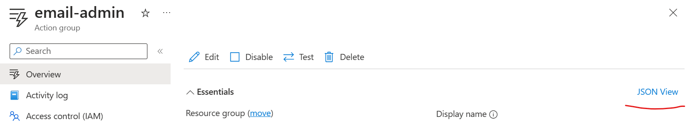
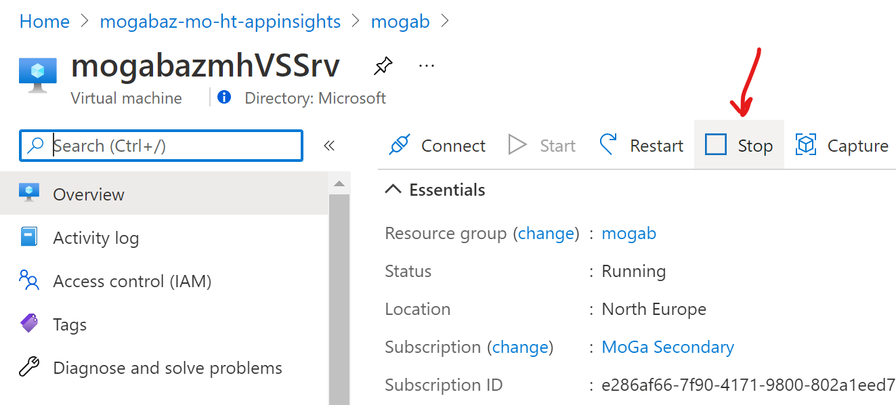
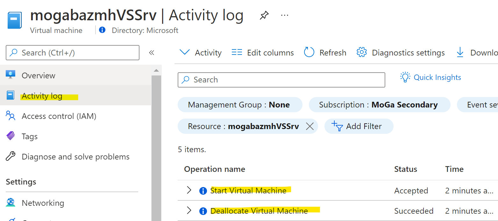
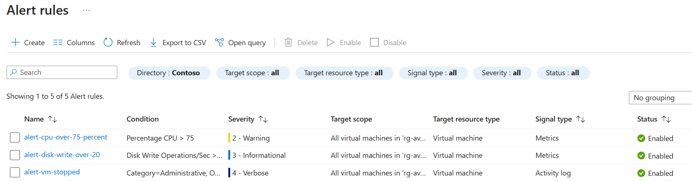
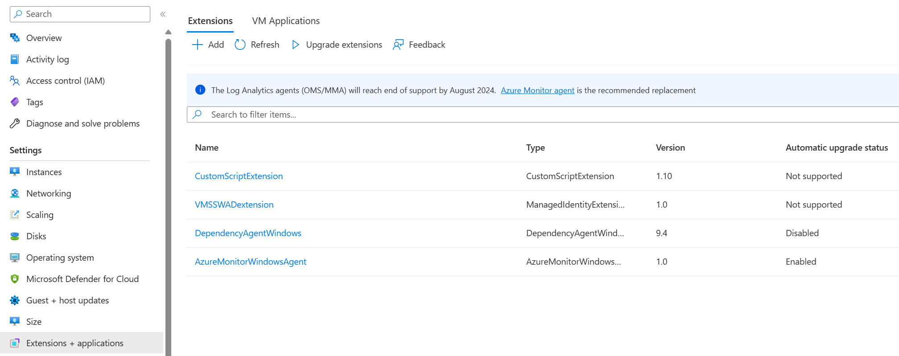
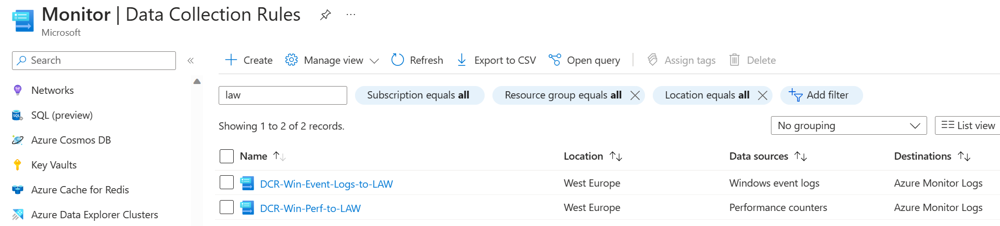

# Challenge 02 - Setting up Monitoring via Automation - Coach's Guide 

[< Previous Solution](./Solution-01.md) - **[Home](./README.md)** - [Next Solution >](./Solution-03.md)

## Notes & Guidance

### Deploy alerts with Bicep

The Action group Resource Id can be found in the Azure Portal:
- In Azure Monitor navigate to Alerts, then Action groups.
- Select the Action group to open its properties.
- Click on JSON View.

- At the top you will see the Resource ID that will have the following structure:  
`/subscriptions/<sub-id>/resourceGroups/<rg-name>/providers/microsoft.insights/actionGroups/<action-group-name> `
  

### Test Activity log alert

- Login to Azure portal and stop your Visual Studio VM by clicking the "Stop" button.  

- Check the Activity Log and see the new events of type **Deallocate Virtual Machine** (may take a min or two to show up)

- If the alert is configured correctly, it should fire and an email will be sent.

### Create an alert for "Disk Write Operations/Sec" 

The key steps that the students should perform are the following: copy the code used to deploy `Percentage CPU` alert, change the alert name and the threshold and set the `metricName` property to `Disk Write Operations/Sec`.

Point the students to these articles in the Learning Resources section of the Challenge: 

- [Supported metrics in Azure Monitor by resource type](https://learn.microsoft.com/en-us/azure/azure-monitor/essentials/metrics-supported#microsoftcomputevirtualmachines)
- [Bicep documentation for Metric alerts](https://learn.microsoft.com/en-us/azure/templates/microsoft.insights/metricalerts?pivots=deployment-language-bicep)
>**Note** You can also find a fully configured Bicep file [`alert-full-solution.bicep`](./Solutions/Challenge-02/alert-full-solution.bicep) in the [`Coach/Solutions/Challenge-02`](./Solutions/Challenge-02) folder. Use this file to help the students if they get stuck.

At the end of the Challenge the students should present 3 new alerts that will look similar to this:

### Deploy Azure Monitor Agent and DCRs with Bicep
  
In the file, the students should update the names of the Log Analytics workspace law-wth-monitor-d-XX and the Virtual Machine Scale Set vmss-wth-monitor-d-XX. Otherwise, they will get an error message during deployment.
  
If everything is configured correctly, you should be able to see the `AzureMonitorWindowsAgent` extension if you navigate to the VMSS and select Extensions+applications.

You should also be able to see the 2 new DCRs created in Azure Monitor.
  

  
**The Bonus part (Optional)**

**Will the Alert get fired if the VM was turned off from the OS? Or if the VM was not available? Why?**
No, as opposed to deallocation, powering off a Microsoft Azure virtual machine (VM) will release the hardware but it will preserve the network resources (internal and public IPs) provisioned for it. Even if the VM`s network components are preserved, once the virtual machine is powered off, the cloud application(s) installed on it will become unavailable. The only scenario in which you should ever choose the stopped state instead of the deallocated state for a VM in Azure is if you are only briefly stopping the server and would like to keep the dynamic IP address for your testing. If that doesn’t perfectly describe your use case or you don’t have an opinion one way or the other, then you’ll want to deallocate instead so you aren’t being charged for the VM.

**How many emails did you receive when the Activity Log alert fired? Why? How can you change this behaviour?**
You will get multiple notifications because for each event multiple entries with different status ("Accepted", "Succeeded", "Failed", etc.) will be created. You can change this behaviour by adding the "Status" condition to the alert rule.

First team to show a screenshot of the new Alert Rules and DCRs wins the challenge!

Good luck!
