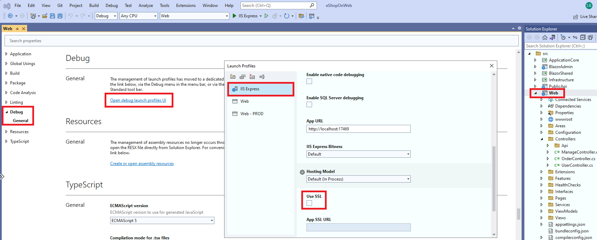
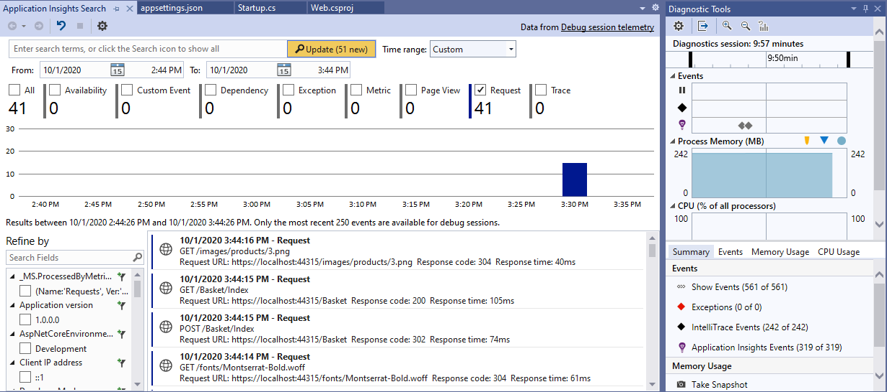
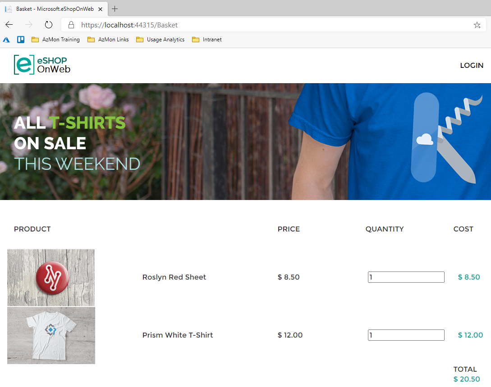

# Challenge 04 - Azure Monitor for Applications - Coach's Guide 

[< Previous Solution](./Solution-03.md) - **[Home](./README.md)** - [Next Solution >](./Solution-05.md)

## Notes & Guidance

Let's create a URL Ping for the public URL of our shop
- Open your Azure Portal
- Go to the Public IP for your load balancer
- Note the DNS Name for it
- Open your Application Insights instance
- Go to availability on the left side
- Click add Test then create as shown below  


Check the availability of your site and let's move on.

From the Visual Studio Server, navigate to
`C:\eshoponweb\eShopOnWeb-main` and double-click on **eShopOnWeb.sln**  
  
 
- If this is the first time you are opening Visual Studio, please log in or create an account and log in.
- Select Web  


- Right-click on Web in Solutions Explorer and select properties. 
- Under Debug deselect the checkbox for Enable SSL.
  

- Click Save.
- Click on IIS Express to test the eShopOnWeb application.  


You should see the eShop app open locally. 
- Close it and let's Enable Application Insights server-side telemetry collection.
- Install the Application Insights SDK NuGet package for ASP .NET Core. 

>**Tip:** I recommend that you always use the latest stable version ([click here](https://www.nuget.org/packages/Microsoft.ApplicationInsights.AspNetCore)).   

- Open Web.csproj you can do that by right clicking on **Web** and click on **Edit Project File**
- Add the following line:
```
<PackageReference  Include="Microsoft.ApplicationInsights.AspNetCore" Version="2.17.0"/>
```    

- Add `services.AddApplicationInsightsTelemetry();` to the `ConfigureServices()` method in your **Startup.cs** file as shown below.    


- Specify an instrumentation key in **appsettings.json**  

>**Tip:** You can find your App Insights Instrumentation key in the Overview blade of your Application Insights resource in the Portal.    


- Add the following line to the **appsettings.json**
```
"ApplicationInsights": {  
	"InstrumentationKey": "putinstrumentationkeyhere"  
},  
```  


- Run the eShopOnWeb Web project and check out the App Insights tooling. Test the application by running it and verify it's working.
- While its running you can navigate to Application Insights and view the telemetry while you are interacting with eShop running on the local machine. 
- Add something to the shopping cart, log in and check out.  


>**Tip:** if you can't find this button Application Insights, probably it's hidden behind some other menu item, move the menus around till you find it. This may happen depending on your resolution.    
  

- Generate some load and check out the results
- Now you have the app running locally instrumented with Application Insights

To trip an exception in the app, login with the demo account provided and try to change your password.
- Open your eShop site in your browser if you closed it (local run)   


- Login to the site running locally. 
  

- Click on **My account**


 

- Try to change your password  


- Find the exception in App Insights  


- Check for more details


- Create Alerts based on Availability and exceptions - you should be an expert in Alert now ;-)


 

**Client Telemetry**

Enable client-side telemetry collection for your eShopOnWeb application.  
- Inject the App Insights .NET Core JavaScript snippet
- Add the following line of code to `Web\Views\_ViewImports.cshtml`
```
@inject Microsoft.ApplicationInsights.AspNetCore.JavaScriptSnippet JavaScriptSnippet
```   
   

- Insert `**HtmlHelper**` at the end of the `**< head >**` section in `**_Layout.cshtml**`
- Add the following line of code to `**Web\Views\Shared\_Layout.cshtml**`
```
@Html.Raw(JavaScriptSnippet.FullScript)
```
  

- Run the app locally and explore a few pages to generate page views.
- After a few minutes, verify that page views are being collected by App Insights.
- In the Portal, navigate to the Performance blade of your App Insights resource and switch the toggle from Server to Browser. There you should see what you have done showing up

  
- Stop the app running locally and save a copy of your updated Solution in a new location.

**Autoscale**

Your app is also hosted on the VMSS deployed as part of the workshop environment. 

Generate test load on the VMSS app url to cause a scale out event.

- Use the code in the `/Student/Resources/Challenge-04` folder and modify it to your VMSS app URL, pick one of the 2 files below depending on your environment:
	- `UrlGenLoadwithCurl.sh`
	- `UrlGenLoadwithPS.ps1`
 
```
for (\$i = 0 ; \$i -lt 100; \$i++)
{
Invoke-WebRequest -uri http://YOUR LOADBALANCER URL HERE/
}
```

- Run the code to generate some load on your eShopOnWeb site running on the VMSS. 
- If the load is high enough, it may cause a scale out operation.  
