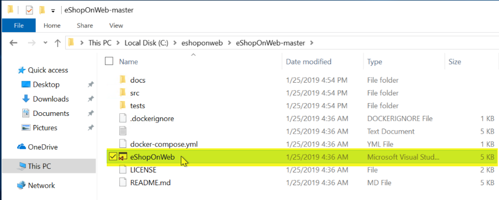
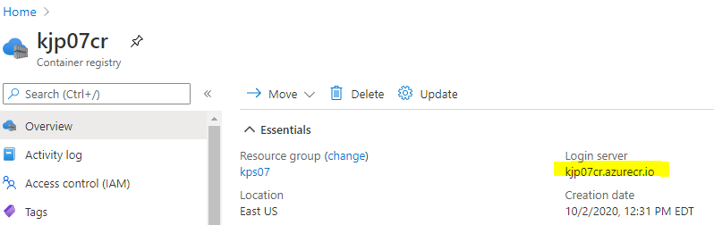

# Challenge 05 - Azure Monitor for Containers - Coach's Guide 

[< Previous Solution](./Solution-04.md) - **[Home](./README.md)** - [Next Solution >](./Solution-06.md)

## Notes & Guidance

An earlier version of this hack had students containerize the eShopOnWeb application on the Visual Studio VM and deploy it to the AKS cluster in the hack environment themselves. 

A containerized version of eShopOnWeb has been published to Docker Hub. The initial automation in Challenge 00 will deploy this containerized version to the AKS cluster in the hack environment using a Helm chart.

- Containerized eShopOnWeb: [`whatthehackmsft/eshoponweb-kubernetes`](https://hub.docker.com/r/whatthehackmsft/eshoponweb-kubernetes)
- eShopOnWeb Helm Chart: [`whatthehackmsft/eshopaks`](https://hub.docker.com/r/whatthehackmsft/eshopaks)

The containerized version hosted on Docker Hub was created from the most recent version of eShopOnWeb in August 2023. If the eShopOnWeb application is updated, it is possible the containerized version may stop working, or not match the version deployed on the IIS VM Scale Set.

While we hope this is rare, if the version of eShopOnWeb hosted on Docker Hub does not work, a coach could create an updated containerized version from the latest eShopOnWeb source code that is deployed onto the Visual Studio VM using the archived instructions in the collapsed section below.

**NOTE:** This coach guide contains many screenshots. Due to the rapid changing nature of the Azure Portal, you may find some things have changed and/or do not appear as depicted here. Please report these by filing a GitHub issue on this repo: [WTH Issue](https://aka.ms/wthproposal) 

<details>
<summary>Click to expand/collapse eShopOnWeb Container Creation Steps</summary>

From your Visual Studio Server, deploy the eShopOnWeb application to AKS
- Install Docker Desktop and restart your Visual Studio VM. 
- This step is required before you can add Docker support to your eShopOnWeb app in Visual Studio.    

  
- Click the link  

 
 - Follow the instructions to complete the WSL 2 installation and restart Docker Desktop  
 
  
  
- Navigate to `c:\eshoponweb\eShopOnWeb-master`
    


- Double-click on **eShopOnWeb.sln** solution file and select Visual Studio 2019 when prompted.
- Sign into Visual Studio if you have not already done so.
- Once Visual Studio opens and settles down.
- Update your DB connection strings in **appsettings.json** to use the SQL server IP address instead of hostname.  

>**Tip:** You can get the SQL private IP from the VM in Azure Portal. 

  
- Right-click on **Web** the **Add** then **Add Docker Support**. 
  
   
- Leave the default option of Linux selected and click OK. 
- Regenerate a new Dockerfile and wait for task to complete.  
- When prompted click **Allow access** to your docker back-end to communicate with Private Networks.  

 
When Docker support has been added, you should see a Docker option to run/debug your app.

  

- Click to run your app. Wait a few minutes for your app to build and load. 
- When its complete Visual Studio will open the URL in the default browser. 
- Your app is now running in a local container, click **Stop** or close the Browser.
 


#### From Azure Monitor, locate the container running the eShopOnWeb application

Now, let's move on to publishing the app to AKS.
- Go to the Azure Portal and create an Azure Container registry with a Standard SKU in your workshop resource group.

   
- Once your Container Registry is created, return to Visual Studio and right click on Web to publish.

   

- Choose Azure, Azure Container Registry as your Publish target and select the Container Registry that you just created. 
- Click Finish.  

     

- Next, navigate to the Connected Services for Web.
- Configure Application Insights to Azure Application Insights, select
- Your App Insights resource and **Save connection string value in None**
- Configure SQL DB `CatalogConnection` to point to SQL Server Database
- Update connection string(s) using the Catalog string found in **appsettings.json** and **Save connection string in None**.
- Configure SQL DB `IdentityConnection` to point to SQL Server Database  
- Update connection string using the Identity string found in **appsettings.json** and **Save connection value string in None**  
- Update Secrets.json(Local)
  
   

- Return to Publish and click on Publish to push your app up to the Container Registry. This step will take several minutes. The final Visual Studio output should indicate successful push.

  

- Open the provided **deployment.yml** file in **sources\aks** and update the image name to point to your Container Registry Login server and image.   

  
- Update the server name as shown below 

  

- Upload the `**LogReaderRBAC.yml**`, `**deployment.yml**` and `**service.yml**` files to your cloud shell or browse to the sources/aks folder

</details>

## Solution Guide

Students will start this challenge by accessing the eShopOnWeb application hosted on the AKS cluster in their hack environment.

- Run the following commands:
```
az aks get-credentials --resource-group YOUR_RESOURCE_GROUP --name YOUR_AKS_NAME
```
>**Tip:** If you don't have **kubectl** installed run the command below:
>`az aks install-cli`

- Check connectivity to and the state of your AKS nodes, run: `kubectl get nodes`  

   

You may not see all nodes, as this is also hosted on a VMSS.

In previous versions of this hack, when students created the eShopOnWeb container, they would host it in their own Azure Container Registry where it could be loaded into the AKS cluster.

These steps are no longer needed as the eShopOnWeb container is loaded from Docker Hub. However, if you want to host your own eShopOnWeb container in ACR, you will need to follow the steps in the collapsed section below.

<details>
<summary>Click to expand/collapse eShopOnWeb ACR Deployment Steps</summary>

>**Important:** You will need to give access to your AKS cluster on the Container Registry (ACR) to be able to pull the image and deploy it. To do so and for learning purposes give both the AKS and the Agent Pool Contributor rights on the ACR.
>The AKS and the Agent Pool Managed Identities are called after the AKS name.  


- Run the following command to deploy the cluster role bindings:
`kubectl create -f LogReaderRBAC.yml`
- Run the following command to deploy your app
`kubectl apply -f deployment.yml`  

- Run the following command after few mints to check the status of the pods:
`kubectl get pods`


- Run the following command to expose your app front-end on port 8080
`kubectl apply -f service.yml`  

</details>

##### Get Service Details

- To access the eShopOnWeb app on your AKS cluster, find the location where the eShopOnWeb service is running:

`kubectl get services`  

  

- Use the external IP of the web-service and port 8080 to access your app deployed on AKS.

   

- Return to the Azure Portal. 
- Navigate to Azure Monitor, click on Containers, and select your cluster.  

  

 - Alternatively, you can go to your AKS and click Insights 
 - Click on Containers and then search for web
  
  

- Or go to Controllers and search for web

  

- Generate an exception in the eShopOnWeb application  
>**Tip:** Try to change your password, similar to the exception generated in the Application Insights challenge

- Login  
   

- Enter the user and password provided on the page.  
   

- Click on My account  
 
  

- Click on Password
Notice an exception is thrown  

 

- Click on the Web container and View container **live data**.  

  

- Trip the password exception again once the Status has gone from `Unk` to `Ok`.  
  

You can search for Rob. You should find it in the logs!  


First person to post a screenshot of the live log with the exception message wins the challenge :-)  
  


