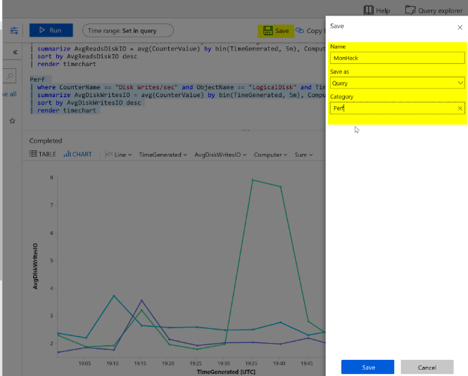
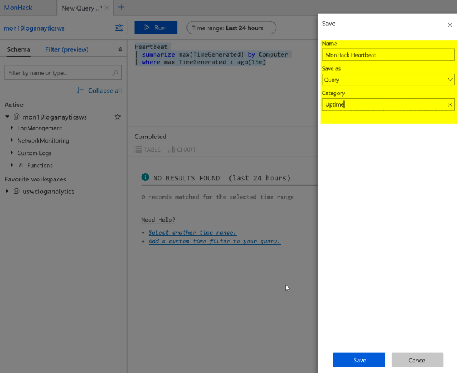

# Challenge 06 - Log Queries with KQL and Grafana - Coach's Guide 

[< Previous Solution](./Solution-05.md) - **[Home](./README.md)** - [Next Solution >](./Solution-07.md)

## Notes & Guidance


### KQL

We will write a performance query that renders a time chart for the last 4 hours for both of the Web Servers and the SQL Server for the following performance metrics, and we will save each query to our favorites.
- Processor Utilization: Processor / % Processor Time
```
Perf  
| where ObjectName == "Processor" and CounterName == "% Processor Time" and TimeGenerated > ago(4h) 
| summarize AVGPROCESSOR = avg(CounterValue) by bin(TimeGenerated, 5m), Computer
| sort by AVGPROCESSOR desc
| render timechart 
```
  
- Memory Utilization: Memory / % Committed Bytes In Use
```
Perf  
| where ObjectName == "Memory" and CounterName == "% Committed Bytes In Use" and TimeGenerated > ago(4h) 
| summarize AVGMEMORY = avg(CounterValue) by bin(TimeGenerated, 5m), Computer
| sort by AVGMEMORY desc
| render timechart
```
  
- Disk Utilization (IO): Disk Reads/sec and Disk Writes/sec
```
Perf 
| where CounterName == "Disk Reads/sec" and ObjectName == "LogicalDisk" and TimeGenerated > ago(4h) 
| summarize AvgReadsDiskIO = avg(CounterValue) by bin(TimeGenerated, 5m), Computer
| sort by AvgReadsDiskIO desc
| render timechart 
```
  
```
Perf 
| where CounterName == "Disk Writes/sec" and ObjectName == "LogicalDisk" and TimeGenerated > ago(4h) 
| summarize AvgDiskWritesIO = avg(CounterValue) by bin(TimeGenerated, 5m), Computer
| sort by AvgDiskWritesIO desc
| render timechart 
```
  
  

- Create a heartbeat query for Web and SQL Server
```
Heartbeat
| summarize max(TimeGenerated) by Computer
| where max_TimeGenerated < ago(15m)
| count 
```

 

We will now write a performance query that renders a time chart for the last hour of the max percentage CPU usage of the AKS Cluster nodes

- Solution 1 using `maxif`
```
// Declare time range variable
let timerange = 1h;
Perf
| where Computer startswith "aks" 
| where TimeGenerated > ago(timerange)
//Aggregate maximum values of usage and capacity in 1 minute intervals for each node  
| summarize CPUUsage = maxif(CounterValue, CounterName =="cpuUsageNanoCores"), 
            CPUCapacity = maxif(CounterValue,CounterName == "cpuCapacityNanoCores")  
            by bin(TimeGenerated, 1m), Computer
//Calculate Percent Usage
| extend PercentUsage = (CPUUsage / CPUCapacity) *100.0
| project TimeGenerated, PercentUsage, Computer 
| render timechart 
```
  
- Solution 2 using let and join
```
//Store last 1hr snapshot of Perf table
let myPerf = materialize (Perf
| where Computer startswith "aks"
| where TimeGenerated > ago(1h));
//Store max CPU Usaqe per min values from Perf snapshot in usage table
let myUsage = myPerf 
| where CounterName == "cpuUsageNanoCores" 
| summarize CPUUsage = max(CounterValue) by bin(TimeGenerated, 1m), Computer;
//Store max CPU capacity per min values from Perf snapshot in capacity table
let myCapacity = myPerf 
| where CounterName == "cpuCapacityNanoCores" 
| summarize CPUCapacity = max(CounterValue) by bin(TimeGenerated, 1m), Computer;
//Join usage and capacity tables
myUsage
| join myCapacity on TimeGenerated, Computer
//Calculate percent usage
| extend PercentUsage = (CPUUsage / CPUCapacity) *100.0
| project TimeGenerated, PercentUsage, Computer 
| render timechart 
```
  
- Combine infrastructure and application logs to create a single timeseries chart that includes: 
	- CPU usage from the node in your AKS cluster hosting the eshoponweb app
	- Duration of page views on your eshoponweb app hosted on the cluster

Solution 1
```
// Declare time range variable
let timerange = 5h;
//Find the node running your eshoponweb app container
let myNode = ContainerInventory
| where Image == "web"
| distinct Computer;
let PercentTable = Perf
| where Computer in (myNode)
| where TimeGenerated > ago(timerange)
//Aggregate maximum values of usage and capacity in 1 minute intervals for each node  
| summarize CPUUsage = maxif(CounterValue, CounterName =="cpuUsageNanoCores"), 
            CPUCapacity = maxif(CounterValue,CounterName == "cpuCapacityNanoCores")  
            by bin(TimeGenerated, 1m)
//Calculate Percent Usage and rename TimeGenerated
| extend PercentUsage = (CPUUsage / CPUCapacity) *100.0, timestamp = TimeGenerated 
| project timestamp, PercentUsage; 
//Add AppInsights Data
let AppInsights = app("mogabaz-mo-ht-appinsights").pageViews
| where timestamp > ago(timerange)
| summarize responsetime = avg(duration) by bin(timestamp, 1m)
| extend responsetimeseconds = responsetime / 1000.0
| project timestamp, responsetimeseconds;
// Join Percent Usage and AppInsights
PercentTable 
| join AppInsights on timestamp
| project timestamp, PercentUsage, responsetimeseconds
| render timechart 
```
  
Solution 2 with hard-coding node name and using let and join statements
```
// Declare time range variable
let timerange = 5h;
//Store snapshot of Perf table for the node where the app container is running
let myPerf = materialize ( Perf
                         | where TimeGenerated > ago(timerange)
                         | where Computer == "aks-agentpool01-26482217-vmss000000"
                         );
//Store Usage Values
let myUsage = myPerf 
| where CounterName == "cpuUsageNanoCores" 
| summarize CPUUsage = max(CounterValue) by bin(TimeGenerated, 1m);
//Store Capacity Values
let myCapacity = myPerf 
| where CounterName == "cpuCapacityNanoCores" 
| summarize CPUCapacity = max(CounterValue) by bin(TimeGenerated, 1m);
//Calculate Percentage and rename TimeGenerated to timestamp
let Percent = myUsage
| join myCapacity on TimeGenerated
| extend PercentUsage = (CPUUsage / CPUCapacity) *100.0, timestamp = TimeGenerated
| project timestamp, PercentUsage;
//Add AppInsights Data
let AppInsights = app("mogabaz-mo-ht-appinsights").pageViews
| where timestamp > ago(timerange)
| summarize responsetime = avg(duration) by bin(timestamp, 1m)
| extend responsetimeseconds = responsetime/1000.0
| project timestamp, responsetimeseconds
| sort by timestamp asc;
// Join Percent Usage and AppInsights
Percent 
| join AppInsights on timestamp
| project timestamp, PercentUsage, responsetimeseconds
| sort by timestamp asc
| render timechart 
```
  
First person to post a screenshot of the charts wins the challenge :-)  

### Bonus challenge

Save your queries in a query pack.

A query pack acts as a container for log queries in Azure Monitor and provides a way to save log queries and share them across multiple workspaces and other contexts in Log Analytics.   
You can view them in the portal, but the only way to create or update a query pack is currently via REST API.
  


## Learning Resources
* [Log queries in Azure Monitor](https://learn.microsoft.com/en-us/azure/azure-monitor/logs/log-query-overview)
* [Overview of queries](https://learn.microsoft.com/en-us/azure/data-explorer/kusto/query/)
* [Query best practises](https://learn.microsoft.com/en-us/azure/data-explorer/kusto/query/best-practices)
* [Query operators](https://learn.microsoft.com/en-us/azure/data-explorer/kusto/query/queries)
* [Telemetry correlation in Application Insights](https://learn.microsoft.com/en-us/azure/azure-monitor/app/correlation)
* [Log queries in Azure Monitor](https://learn.microsoft.com/en-us/azure/azure-monitor/logs/log-query-overview)
* [Overview of queries](https://learn.microsoft.com/en-us/azure/data-explorer/kusto/query/)
* [Query best practises](https://learn.microsoft.com/en-us/azure/data-explorer/kusto/query/best-practices)
* [Query operators](https://learn.microsoft.com/en-us/azure/data-explorer/kusto/query/queries)
* [Query packs](https://learn.microsoft.com/en-us/azure/azure-monitor/logs/query-packs)


