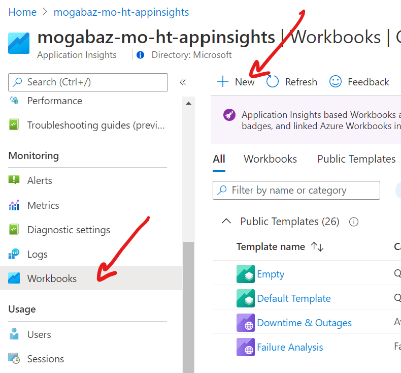
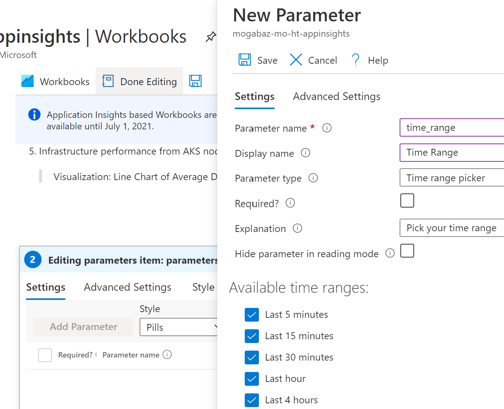
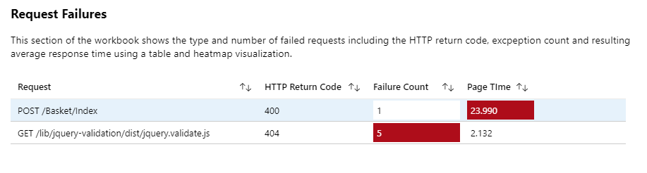
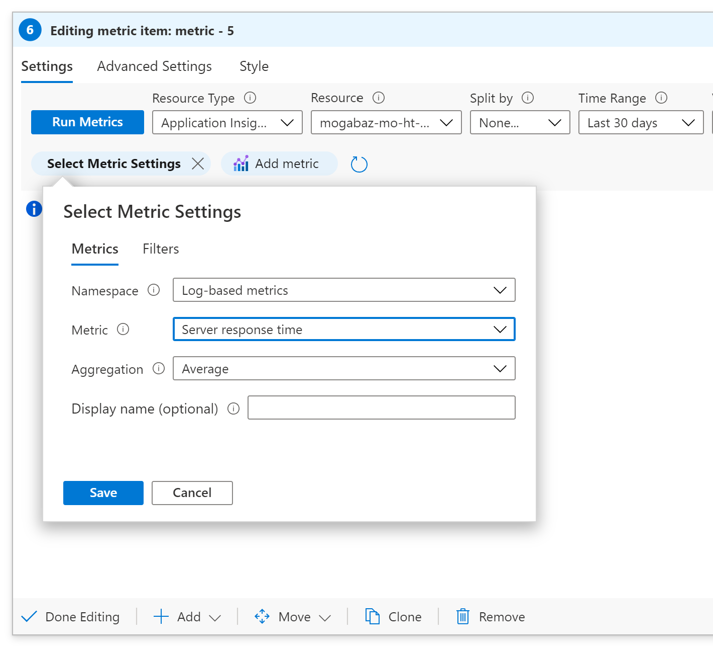
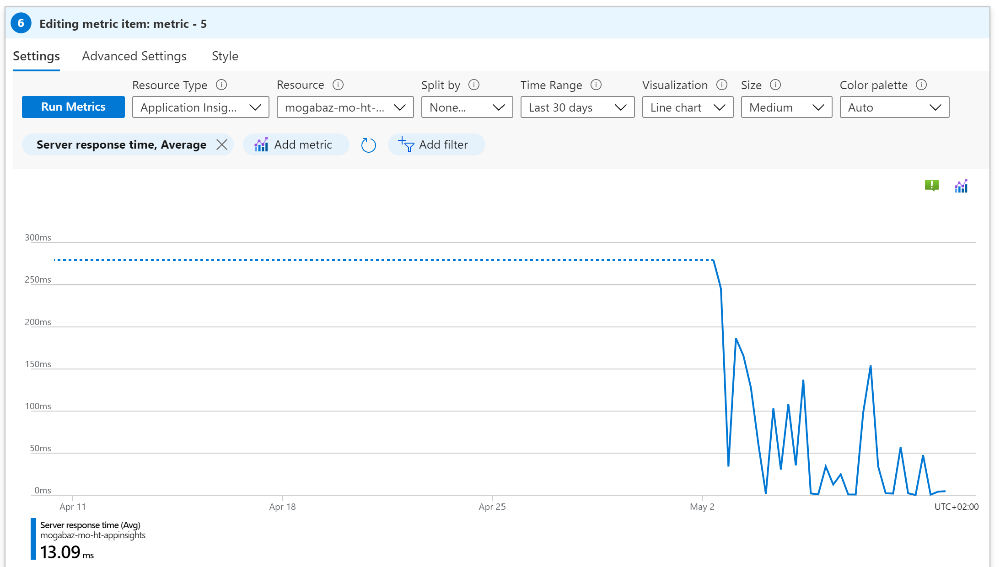
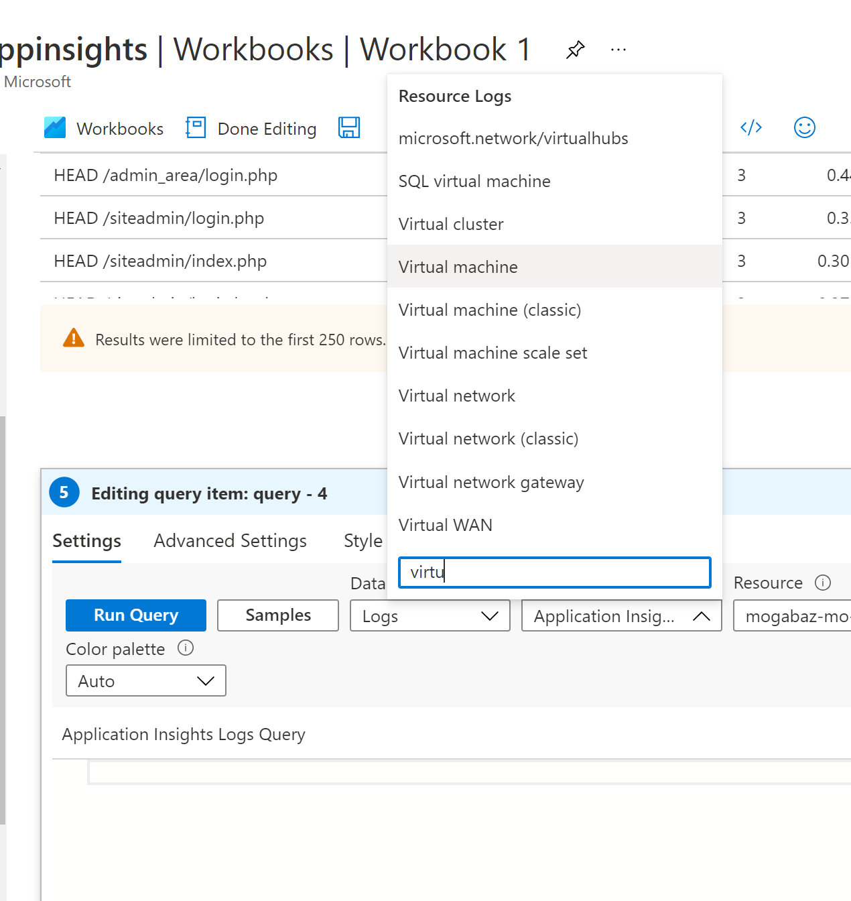
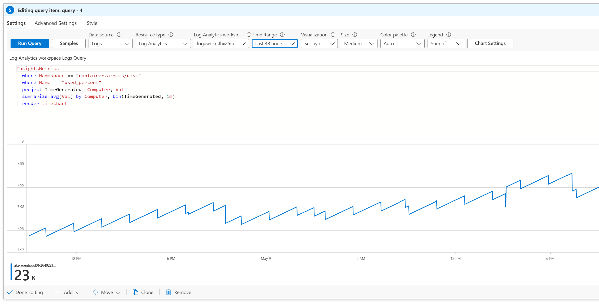

# Challenge 07 - Visualizations - Coach's Guide 

[< Previous Solution](./Solution-06.md) - **[Home](./README.md)**

## Notes & Guidance

### Create the basic workbook
- Navigate to your Application Insights resource in the Portal
- Click on "Workbooks", then on "+New"



- Click "Empty" then click "+Add" in the New Workbook section to add text describing the upcoming content in the workbook. Text is edited using Markdown syntax.

>**Tip:** You can add here the text of our Challenge (Objectives, Tasks ..etc). If you're not familiar with the markdown syntax, you can use an online Text to Markdown converter.
  
- Click "Done Editing".
  
### Add parameters to your workbook
>**Tips:**
> * Use **Add text** to describe the upcoming table.
> * Use **Add parameters** to create the time selector.
> * Use **Add query** to retrieve data from `pageViews`.
> * Use **Column Settings** to change labels of column headers and use Bar and Threshold visualizations.

- Add the following time parameter:
  
- And the following Queries:
  - Browser Statistics
    ```
    pageViews
    | summarize pageSamples = count(itemCount), pageTimeAvg = avg(duration), pageTimeMax = max(duration) by name
    | sort by pageSamples desc
    ```
  - Request Failures  
    ```
    requests
    | where success == false
    | summarize total_count=sum(itemCount), pageDurationAvg=avg(duration) by name, resultCode
    ```
    

- You can also add a Metric to create a metric chart, add the server response time.

    
    
    In the end, it should look something like that:
    
    

- Add another query to show the CPU Usage but change your Resource Type to Virtual Machines  

    >**Tip:** Make use of the sample queries in the Log Analytics Workspace
    

- Add another query, change the Resource Type to Log Analytics and your workspace to the LA workspace with your AKS container logs. Then add this query which is used for section Disk Used Percentage
    ```
    InsightsMetrics
    | where Namespace == "container.azm.ms/disk" 
    | where Name == "used_percent"
    | project TimeGenerated, Computer, Val 
    | summarize avg(Val) by Computer, bin(TimeGenerated, 1m)
    | render timechart
    ```
  
    It should look like that:

    
 

- Save your workbook.

Great work, you made it! ;-)


## Learning Resources
* [Azure Monitor Workbooks](https://learn.microsoft.com/en-us/azure/azure-monitor/app/usage-workbooks)
* [Azure Community Workbook Repo](https://github.com/microsoft/AzureMonitorCommunity)

