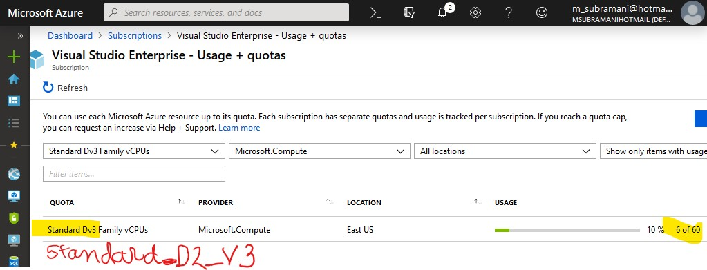

# Azure Monitor - Pre-day workshop, one step deployment guide.
<!-- Author: Subramani Ananthapadmanabhan https://github.com/asubmani -->
This is a one step deployment guide using the `singleStepDeploy.sh` script.

Use this version of the script if you want to deploy the setup shown [here](https://raw.githubusercontent.com/rkuehfus/pre-ready-2019-H1/master/monitoringhackdiagram.png)

## Features

- Only 2 modifications to be done to `singleStepDeploy.sh` script.
    - Replace `"yourinitialshere"` in line 8, with  a unique 4 letter **lowercase** alpha-numeric value. (e.g. rtl76)
    - Replace `"sshkeypath"` in line 9, with the actual path in your cloud shell (e.g.`/home/subramani/clouddrive/pre-ready-2019-H1/Student/Resources/`)
## Before you Deploy

The AKS cluster uses the "Standard_D2_v3" SKU. A 3 node cluster will need 6vCPU's in your subscription/region. Please check your subscription settings-->Usage +quotas to see if you have capacity.
Optionally you can change the SKU to "Standard_B2ms"



## Setup

### High level setup instructions are :

- Download the deployment scripts from github.
- Edit (2 values) in the `singleStepDeploy.sh` script.
- Execute the script, and wait for deployment to complete.

**NOTE**: If for some reason, your setup fails and you need to re-run the `singleStepDeploy.sh` script; please retore the `azuredeploy.parameters.json` and  `terraform.tfvars` file. here are the direct links to the 2 files:
- Download the original [azuredeploy.parameters.json](https://raw.githubusercontent.com/rkuehfus/pre-ready-2019-H1/master/Student/Resources/azuredeploy.parameters.json)
- Download the original [terraform.tfvars](https://raw.githubusercontent.com/rkuehfus/pre-ready-2019-H1/master/Student/Resources/terraform/terraform.tfvars)

### Detailed setup instructions

- Login to the Azure portal and then the cloudshell
- change directory to your `clouddrive` and download source files.

```
cd ~/clouddrive  \
git clone https://github.com/rkuehfus/pre-ready-2019-H1.git  \
cd pre-ready-2019-H1/Student/Resources
```


- Open this directory in vscode in the cloudshell

    ` code . `

- select and edit the `singleStepDeploy.sh` file
    - Replace `"yourinitialshere"` in line 8, with  a unique 4 letter **lowercase** alpha-numeric value. (e.g. rtl76)
    - Replace `"sshkeypath"` in line 9, with the actual path in your cloud shell (e.g.`/home/subramani/clouddrive/pre-ready-2019-H1/Student/Resources/`)
    - Save the file and exit.
    - execute the script by typing the below command:
         `./singleStepDeploy.sh`
     - when prompted for a password, choose a complex password. Password generators like lastpass,[passwordgenerator](https://passwordsgenerator.net) are recommended.
     - The following passwords are not allowed:
     -
| Bad Password   | Bad Password 2   |  Bad Password 3   | Good passwords          |
| ---------------|------------------| ----------------- |-------------------------|
| ~~abc@123~~    | ~~iloveyou!~~    | ~~P@$$w0rd~~      | 5r#2Z*6Tm*!pA*eEs       |
| ~~P@ssword123~~| ~~Pa$$word~~     | ~~P@ssword123~~   | hU1!0fL30$mmNY%e        |
| ~~pass@word1~~ | ~~Password!~~    | ~~Password1~~     | ^Uq4U6wB#59%r#6z        |
| ~~Pa$$word~~   | ~~Password22~~   | ~~Pa$$word~~      | 3C5!PprmFY67DG%K        |

  - Copy your password and paste it in the cloud shell by right clicking next to `Password for your VMs:` and hit `enter`
  - Hit enter twice when prompted for entering a password for the ssh-key

  - Download minecraft.yaml
`curl -sSLO https://raw.githubusercontent.com/rkuehfus/pre-ready-2019-H1/master/Student/Resources/terraform/minecraft.yaml`

   - Deploy the minecraft service.
```
kubectl create -f minecraft.yaml --namespace minecraft
kubectl get pods --namespace minecraft
```
Now go to "container Insights" for your Kubernetes cluster and click
