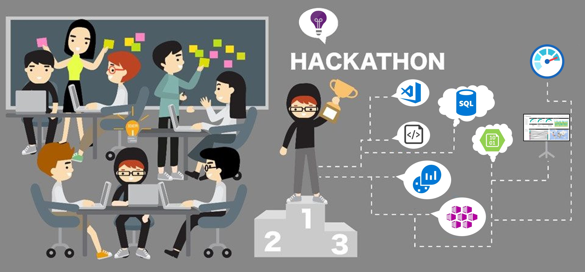

# What The Hack - Azure Monitoring

## Introduction

The Azure Monitoring v2.0 What the Hack provides hands on experience on how to monitor Azure workloads using Azure Monitor, Log Analytics, Application Insights, and Azure Monitor Workbooks. This hack was designed specifically for infrastructure engineers, DevOps engineers, administrators and IT architects who want to build their knowledge on Azure Monitor. However, anyone with a passion for Monitoring is welcome!  

 

## Learning Objectives

In this hack, you will be getting hands on experience with monitoring resources (VMs, applications and containers) using Azure Monitor capabilities such as log analytics, dashboards and Kusto Query Language (KQL).

## Challenges

- Challenge 00: **[Prerequisites - Ready, Set, GO!](Student/Challenge-00.md)**
	 - Prepare your Azure environment and deploy your eShopOnWeb application.
- Challenge 01: **[Monitoring Basics: Metrics, Logs, Alerts and Dashboards](Student/Challenge-01.md)**
	 - Configure basic monitoring and alerting
- Challenge 02: **[Setting up Monitoring via Automation](Student/Challenge-02.md)**
	 - Automate deployment of Azure Monitor at scale
- Challenge 03: **[Azure Monitor for Virtual Machines](Student/Challenge-03.md)**
	 - Configure VM Insights and monitoring of virtual machine performance
- Challenge 04: **[Azure Monitor for Applications](Student/Challenge-04.md)**
	 - Monitoring applications for issues
- Challenge 05: **[Azure Monitor for Containers](Student/Challenge-05.md)**
	 - Monitoring containers performance and exceptions
- Challenge 06: **[Log Queries with Kusto Query Language (KQL)](Student/Challenge-06.md)**
	 - Use the Kusto Query Language (KQL) to write and save queries
- Challenge 07: **[Visualizations](Student/Challenge-07.md)**
	 - Create visualizations to build insights from the data collected in the previous challenges

## Prerequisites

- Access to an Azure subscription with "contributor" access
    - If you don't have one, [Sign Up for Azure HERE](https://azure.microsoft.com/en-us/free/)
    - Students will deploy an ARM Bicep template that a set of Azure resources to monitor
        - This includes a VNet, subnets, NSG(s), LB(s), NAT rules, VM scale set, AKS cluster, and a fully functional .NET Core Application (eShopOnWeb) to monitor.
- Attendees should have a level 200-300 understanding of the Azure platform.  
    - Including concepts like PowerShell, Azure CLI, ARM, resource groups, RBAC, network, storage, compute, scale sets, virtual machines and security.  
    - Previous experience working with ARM templates is recommended.
- Access to a machine with Visual Studio Code, and the Azure CLI or Azure PowerShell Modules installed.
- Alternatively, students can use the [**Azure Cloud Shell**](https://shell.azure.com/)

For more details on the prerequisites for this hack, see [Challenge 00](Student/Challenge-00.md). 

## Contributors

- [Robert Kuehfus](https://github.com/rkuehfus)
- [Kayode Prince](https://github.com/kayodeprinceMS)
- [Mohamed Ghaleb](https://github.com/msghaleb)
- [Jason Masten](https://github.com/jamasten)
- [Vanessa Bruwer](https://github.com/vanessabruwer)
- [Martina Lang](https://github.com/martinalang)
- [Sherri Babylon](https://github.com/shbabylo)
- [Peter Laudati](https://github.com/jrzyshr)
- [Maria Botova](https://github.com/MariaBTV)
- [Warren Kahn](https://github.com/WKahnZA)

