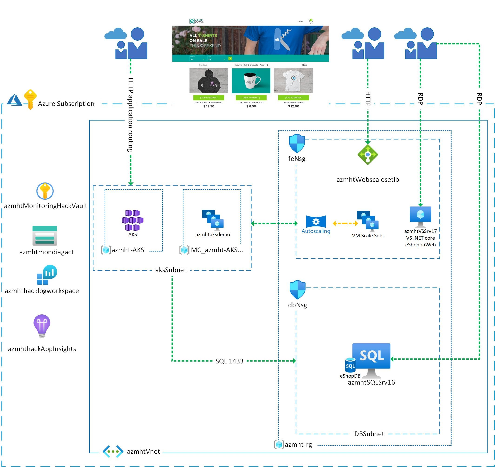

# Challenge 0: Getting started

**[Home](../README.md)** - [Next Challenge>](./01-Alerts-Activity-Logs-And-Service-Health.md)

## Introduction

You have been contracted to deploy, monitor and manage an online shopping website in Azure for a start-up company called "eshoponweb".  After evaluating the requirements, you develop and test deployment templates before presenting the below diagram for approval. The company's management is excited about how quickly you are able to deploy the solution, and give you the green light to proceed with the deployment.



## Description

For Challenge 0, you will deploy an environment in Azure that consists of two Azure Resource Groups containing many different resources. These include the VNet, subnets, NSG(s), LB(s), NAT rules, scale set and a fully functional .NET Core Application (eShopOnWeb) to monitor.

### Requirements

You will need ONE of the following tools to deploy the prerequisites for this hack:
- [AZ Module for PowerShell](https://docs.microsoft.com/en-us/powershell/azure/install-az-ps?view=azps-6.3.0) installed on your workstation.
- [Azure CLI](https://docs.microsoft.com/en-us/cli/azure/) installed on your workstation.
- [Azure Cloud Shell]() deployed in your Azure subscription.

### Deploy

#### Azure CLI

1. Copy the code below and paste it in your desired tool: PowerShell, Terminal, VSCode, or CloudShell.

```azurecli
az login --tenant "<Tenant ID>"
```

2. Replace `<Tenant ID>` with your Azure Tenant ID.  This can be found on the Overview blade of Azure AD in the Azure Portal.
3. Press the ENTER key and login to Azure using the prompt.
4. Copy the code below and paste it in your desired tool:

```azurecli
az account set --subscription "<Subscription ID>"
```

5. Replace `<Subscription ID>` with your Azure Subscription ID.  This can be round on the Overview blade of your Subscription in the Azure Portal.
6. Press the ENTER key to set your default Azure subscription.
7. Copy the Azure CLI code below:

```azurecli
az deployment sub create --name "<Username>" --location "eastus" --template-uri "https://raw.githubusercontent.com/jamasten/WhatTheHack/master/007-AzureMonitoring/Student/Resources/challenge-00_Template.json"
```

8. Paste the code in your desired tool.
9. Replace `<Username>` with your username, not your UPN (e.g., jamasten, **NOT** jamasten@microsoft.com).
10. You will be prompted to enter values for the local admin Username and Password for the Azure virtual machines and scale set instances.  Enter a username and password that adheres to Azure's requirements. [Azure VM Username Requirements](https://docs.microsoft.com/en-us/azure/virtual-machines/windows/faq#what-are-the-username-requirements-when-creating-a-vm-) | [Azure VM Password Requirements](https://docs.microsoft.com/en-us/azure/virtual-machines/windows/faq#what-are-the-password-requirements-when-creating-a-vm-)

#### PowerShell with the AZ Module

1. Copy the PowerShell code below and paste it in your desired tool: PowerShell, Terminal, VSCode, or CloudShell.

```powershell
Connect-AzAccount -Tenant '<Tenant ID>' -Environment 'AzureCloud' -Subscription '<Subscription ID>' 
```

2. Replace `<Tenant ID>` with your Azure Tenant ID.  This can be found on the Overview blade of Azure AD in the Azure Portal.  
3. Replace `<Subscription ID>` with your Azure Subscription ID.  This can be round on the Overview blade of your Subscription in the Azure Portal.
4. Press the ENTER key and login to Azure using the prompt.
5. Copy the PowerShell code below:

```powershell
New-AzDeployment -Name "<Username>" -Location "eastus" -TemplateUri "https://raw.githubusercontent.com/jamasten/WhatTheHack/master/007-AzureMonitoring/Student/Resources/challenge-00_Template.json"
```

6. Paste the code in your desired tool.
7. Replace `<Username>` with your username, not your UPN (e.g., jamasten, **NOT** jamasten@microsoft.com).
8. Press ENTER to start the deployment.
9. You will be prompted to enter values for the local admin Username and Password for the Azure virtual machines and scale set instances.  Enter a username and password that adheres to Azure's requirements. [Azure VM Username Requirements](https://docs.microsoft.com/en-us/azure/virtual-machines/windows/faq#what-are-the-username-requirements-when-creating-a-vm-) | [Azure VM Password Requirements](https://docs.microsoft.com/en-us/azure/virtual-machines/windows/faq#what-are-the-password-requirements-when-creating-a-vm-)

### Validation

Once the deployment has completed, navigate to the Public IP Address resource, **pip-wth-monitor-web-d-eu** , in the Azure Portal.  In the Overview blade, copy the DNS name to your clipboard.  Open a web browser, paste your DNS name in the address bar and press ENTER.  Your browser should render the eShopOnWeb site:


### Troubleshooting

- Make sure the Admin password adheres to the Azure password policy
- Make sure you are logged into the correct subscription and you have the at least contributors role access.  
- Make sure you have the compute capacity in the region you are deploying to and request an increase to the limit if needed.
- Make sure you are using a region that supports the public preview for Azure Monitor for VMs

## Success Criteria

## Learning Resources
