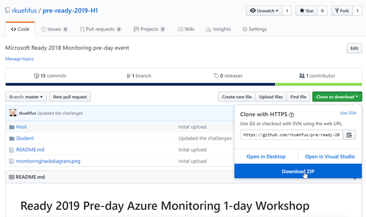
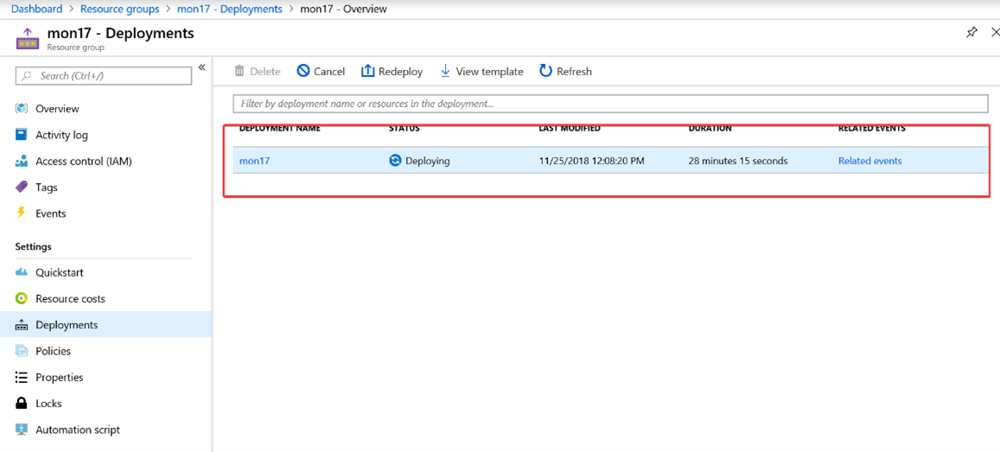

# Challenge 0: Getting started

**[Home](../README.md)** - [Next Challenge>](./01-Alerts-Activity-Logs-And-Service-Health.md)

## Introduction

You have been contracted to deploy, monitor and manage an online shoping website in Azure for a start-up company "eshoponweb".  Luckily, you already have deployment scripts that will deploy just what they need! You present the below diagram for approval to the management as a solution, and have been given approval to deploy.


## Description

### Required Tools

The following tools are required to deploy Azure infrastructure using Azure CLI with an ARM Template.

- [Azure CLI](https://docs.microsoft.com/en-us/cli/azure/install-azure-cli?view=azure-cli-latest)
- [Azure CLI Tools](https://marketplace.visualstudio.com/items?itemName=ms-vscode.azurecli)
- [Visual Studio Code](https://code.visualstudio.com/)
- Visual Studio Code Extensions:
    - [Azure Resource Manager Tools](https://marketplace.visualstudio.com/items?itemName=msazurermtools.azurerm-vscode-tools)
    - [Azure Account](https://marketplace.visualstudio.com/items?itemName=ms-vscode.azure-account)

### Required Assets

- Open this [GitHub repository](https://github.com/rkuehfus/pre-ready-2019-H1) and download the repo as a zip file to your local disk.



- Unzip the contents to a local folder on your machine.
- Open Visual Studio Code, click on the File menu and select the "Open Folder…" option.


- Navigate to the location where you unzipped the files and open the ".\pre-ready-2019-H1-master-master\Student\Resources folder".


- Open the "DeployMonWorkshopEnv.sh" file and update following variable: `declare monitoringWorkShopName="yourinitials-here"`
- Do not execute the script yet. We need to edit the "azuredeploy.parameters.json" file.

### eShopOnWeb Deployment Steps

This is intended to be run one section at a time as you work through each step.  From your machine you can run Visual Studio Code and Bash in Cloud Shell (Ctrl-Shift-P, then select Azure: Open Bash in Cloud Shell, It will prompt you to connect to Azure)


Tip: To run a single line of CLI/shell code in the VS Code Terminal, Ctrl-Shift-P, then select "Terminal: Run selected text in Active Terminal" The first time you will need to scroll down the drop down until you see this option. After that, it should be on top as the most recent choice and just work!

#### Step 1

Update with your initials.  Make sure to keep this to 5 characters and lowercase.  The automation uses this in a few places including generating a storage account, so we need this to be consistent and to follow the rules.  Update the other variables (we will be using throughout the remainder of the deployment).  Make sure the path you set for the sshkey exists.  

**Tip:** If you run into a deployment failure delete the resource group and change this to a different 5 characters as its possible someone else that deployed this hack used the same ones you did and left it running.

**Example:**

```bash
declare monitoringWorkShopName="rjk99"
```

#### Step 2

If you are not yet connected to Azure from your bash session run az login where you will be prompted for your credentials to connect to Azure.  Make sure you are connecting to a subscription you have contributor access.  If you are already connected skip this line and run the next line to create the resource group.

```bash
az group create --name $monitoringWorkShopName -l $location
```

**Sample Output:**


#### Step 3

Run the two lines to create the Key Vault separately (or you will not get the password prompt).  This is used to store the password used for creating each of the VMs and to access the database that is deployed.  Remember we never hardcode passwords in ARM templates or PowerShell Scripts.  Do not use a $ in your password as it messes up our open source HammerDB software.

```bash
declare monitoringWorkShopVaultName=$(echo $monitoringWorkShopName"MonWorkshopVault")

az keyvault create --name $monitoringWorkShopVaultName -g $monitoringWorkShopName -l $location --enabled-for-template-deployment true
```

**Sample Output:**


#### Step 4

Run this line and you will be prompted for a password.  Make sure your password adheres to the Azure password policy.  Needs to be 16 characters or more.  Note: do not use a $ in your password.

`read -s -p "Password for your VMs: " PASSWORD`

**Note:** the above command works only in bash shell. It does not work in zsh. If you are using zsh or similar, please.

Passwords must be 12 - 123 characters in length and meet 3 out of the following 4 complexity requirements:

- Have lower characters
- Have upper characters
- Have a digit
- Have a special character (Regex match [\W_])

The following passwords are not allowed:

- abc@123
- iloveyou!
- P@$$w0rd
- P@ssw0rd
- P@ssword123
- Pa$$word
- pass@word1
- Password!
- Password1
- Password22

Then run the command that creates the secret in the Azure KeyVault:

```bash
az keyvault secret set --vault-name $monitoringWorkShopVaultName --name 'VMPassword' --value $PASSWORD
```

#### Step 5

Run these lines to create an Azure AD Service Principal uses later for AKS.

```bash
#Step 5:create Azure AD service principal for AKS, this will return your password for the Service Principal account
declare scope=$(az group show -n $monitoringWorkShopName --query id -o tsv)

az ad sp create-for-rbac -n "ready-$monitoringWorkShopName-aks-preday" --role owner --scopes=$(echo $scope) --query password --output tsv

#Add your password for the Service Principal to the vault
az keyvault secret set --vault-name $monitoringWorkShopVaultName --name 'SPPassword' --value '<paste password here>'
```

Sample Output:


#### Step 6

Run this line and copy the output results.  Then paste this in the azuredeploy.parameters.json file under password.reference.keyVault.id.  

```bash
az keyvault show --name $monitoringWorkShopVaultName -o json 
```

Copy the Key Vault Resource ID from here:


Paste here:


Also, make sure to update the envPrefixName to match what you specified in the DeployMonWorkshopEnv file (yes, I know I could feed this in from the deployment script)


**WARNING:** MAKE SURE TO SAVE THIS FILE BEFORE CONTINUING ON!!!

#### Step 7

Make sure you copy the following files to your Cloud Shell before running the last line:

- VMSSazuredeploy.json
- Azuredeploy.parameters.json

In Visual Studio code, right click on each file and select "Upload to Cloud Shell" option.


Verify the two json files are present.

```bash
ls -l *.json
```


Run this line and away you go!

```bash
az group deployment create --name monitoringWorkShopDeployment -g $monitoringWorkShopName --template-file VMSSazuredeploy.json --parameters @azuredeploy.parameters.json
```

Deployment takes around 42-45 mins due to dependencies.  


You can check on the status of your deployment from the Azure Portal, by navigating to the resource group that was created and clicking on the Deployments blade.



Click on the deployment name and check out the status.


#### Step 8

Once the first deployment has completed its time to kick off the AKS deployment.

**Note:** User Access Administrator role is required to complete the Container Insights Challenge
Navigate back to your deployment script and open the Bash Cloud Shell (there is a good chance it timed out after 30 mins during your initial deployment)

Rerun the Step 1 declare lines for monitoringWorkshopName and location.


Create your resource group for your AKS Service

```bash
az group create --name $monitoringWorkShopName"-AKS" -l $location
```

Find your AppId. You can find your AppId in the Azure Portal under "Azure Active Directory > App Registrations".

Find the ObjectId for your AppId:

```bash
#Find your Service Principal Object ID
az ad sp show --id '<Service Principal ClientId>' --query objectId
```

Update the aksdeploy.parameters.json file


Save your aksdeploy.parameters.json file and upload both the aksdeploy.json and aksdeploy.parameters.json to your Cloud Shell


Run the deployment.

```bash
az group deployment create --name aksmonitoringWorkShopDeployment -g $monitoringWorkShopName"-AKS" --template-file aksdeploy.json --parameters aksdeploy.parameters.json
```

Verify the deployment was successful.


Once the deployment has completed, we need to do one more thing.  When you have enabled Kubernetes RBAC authorization, you will need to [apply cluster role binding for live logs to work](https://docs.microsoft.com/en-us/azure/azure-monitor/insights/container-insights-live-logs).

Upload LogReaderRBAC.yaml to your cloud shell and from your deployment script (DeployMonWorkshopEnv.sh), run the following lines:

```bash
#Once the AKS cluster is deployed and because we enabled Kubernetes 
#RBAC authorization, you will need to apply cluster role binding to use Live Logs

#Connect to your cluster
az aks get-credentials --resource-group $monitoringWorkShopName"-AKS" –name $monitoringWorkShopName"aksdemo"
#use this to test your connection
kubectl get nodes
#deploy the cluster role bindings
kubectl create -f LogReaderRBAC.yaml
```

### Deploy from the Azure Cloud Shell in Azure Portal

**Note:** These are the steps used to deploy the lab using just the browser and bash cli.

```bash
mkdir ~/clouddrive/source/ReadyAzureMonitoringWorkshop -p
cd ~/clouddrive/source/ReadyAzureMonitoringWorkshop
git clone https://github.com/rkuehfus/pre-ready-2019-H1.git 
code .
```

**Tip:** To run a single line of CLI/shell code in the VS Code Terminal, Ctrl-Shift-P, then select "Terminal: Run selected text in Active Terminal" The first time you will need to scroll down the drop down until you see this option. After that, it should be on top as the most recent choice and just work!


#### Validation

Once both ARM deployments are completed, navigate to the Outputs section of the VMSS deployment and copy the scaleSetPIPDNSname and paste it in your browser.


OR

Copy the DNS Name from the <5-char initials>webscalePIP resource in the Azure Portal


You should render the eShopOnWeb site


### Troubleshooting

- Make sure the 5-character name does not contain any uppercase letters
- Make sure the password used adheres to the Azure password policy
- Make sure you are logged into the correct subscription and you have the at least contributors role access.  
- Make sure you have the compute compacity in the region you are deploying to and request an increase to the limit if needed.
- Make sure you are using a region that supports the public preview for Azure Monitor for VMs - link
- If you notice the deployment taking a long time (over 60 mins).  Note: this issue has been fixed but I’m leaving it in hear in case it ever surfaces again.
    - Look at the deployment details to figure out where it’s stuck
    - If you are stuck on the Visual Studio Custom Script extension (CSE)this is because the Microsoft Image was created with an older version of the CSE and has a bug.  
        - Workaround 1: The workaround has been to log on to the Visual Studio Server and navigate to “C:\Packages\Plugins\Microsoft.Compute.CustomScriptExtension\1.9.2” and double click on “enable” this will kick off the extension and the deployment should continue from here.  If the script times out just rerun after you manually kick off the extension and it should finish
        - Workaround 2: From the Azure Portal uninstall the CustomScriptExtension (which will fail your deployment).
 
        - Then rerun the ARM template and it will pick up where it left off.

## Success Criteria

## Learning Resources
