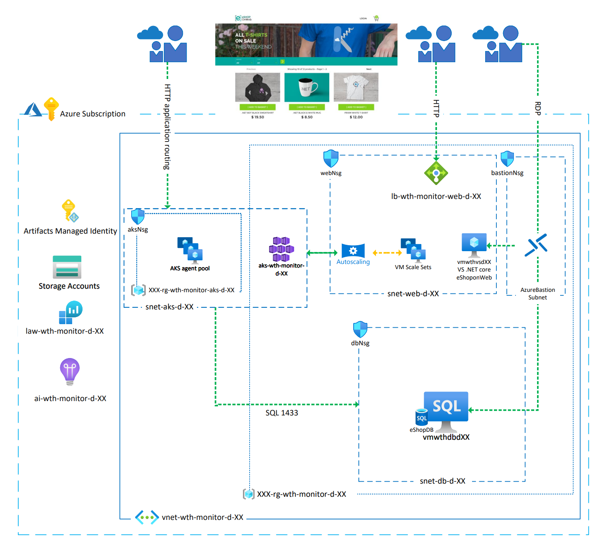

# Challenge 00 - Prerequisites - Ready, Set, GO!

**[Home](../README.md)** - [Next Challenge >](./Challenge-01.md)

## Introduction

You have been contracted to deploy, monitor and manage an online shopping website in Azure for a start-up company called "eShopOnWeb".  

After evaluating the requirements, your team has provided you with a set of Azure Bicep templates and scripts that will deploy the "eShopOnWeb" application and its underlying infrastructure resources into Azure. The Azure environment consists of a VNet, subnets, NSG(s), LoadBalancer(s), NAT rules, a SQL Server VM, a Visual Studio VM, a VM scale set, and an AKS cluster.

Upon successful testing, you present your deployment solution to the company's leadership for approval along with Azure CLI, PowerShell, and Azure Cloud Shell options for quick deployment. 

They were very excited about how quickly your team was able to create a deployment solution, and give you the green light to proceed.

Your job will be to use Azure Monitoring to configure the eShopOnWeb solution to be monitored so you can demonstrate to the company's leadership team that you can effectively manage it.

## Prerequisites

You will need an Azure Subscription with the "Contributor" role assigned to deploy the eShopOnWeb Azure environment at the subscription scope.

You can complete this entire hack in a web browser using the [Azure Portal](https://portal.azure.com) and [Azure Cloud Shell](https://shell.azure.com). 

However, if you work with Azure and on a regular basis, these are tools you should consider having installed on your local workstation:

- [Azure Subscription](../../000-HowToHack/WTH-Common-Prerequisites.md#azure-subscription)
- [Windows Subsystem for Linux](../../000-HowToHack/WTH-Common-Prerequisites.md#windows-subsystem-for-linux)
- [Managing Cloud Resources](../../000-HowToHack/WTH-Common-Prerequisites.md#managing-cloud-resources)
  - [Azure Portal](../../000-HowToHack/WTH-Common-Prerequisites.md#azure-portal)
  - [Azure CLI](../../000-HowToHack/WTH-Common-Prerequisites.md#azure-cli)
    - [Note for Windows Users](../../000-HowToHack/WTH-Common-Prerequisites.md#note-for-windows-users)
    - [AZ Module for PowerShell](https://docs.microsoft.com/en-us/powershell/azure/install-az-ps?view=azps-6.3.0)
  - [Azure Cloud Shell](../../000-HowToHack/WTH-Common-Prerequisites.md#azure-cloud-shell)
- [Visual Studio Code](../../000-HowToHack/WTH-Common-Prerequisites.md#visual-studio-code)
  - [VS Code plugin for ARM Templates](../../000-HowToHack/WTH-Common-Prerequisites.md#visual-studio-code-plugins-for-arm-templates)
  - [VS Code plugin for Bicep](https://marketplace.visualstudio.com/items?itemName=ms-azuretools.vscode-bicep)

### Student Resources

Your coach will provide you with a `Resources.zip` file that contains resource files you will use to complete some of the challenges for this hack.  

The Azure Bicep templates and scripts developed by your team to deploy the eShopOnWeb Azure environment are included in this package.

If you have installed all of the tools listed above and plan to work on your local workstation, you should download and unpack the `Resources.zip` file there too.

If you plan to use the Azure Cloud Shell, upload and unpack this file in your Azure Cloud Shell environment. 

The rest of the challenges will refer to the relative paths inside the `Resources.zip` file where you can find the various resources to complete the challenges.

## Description

For this challenge, you will deploy the eShopOnWeb application and its underlying infrastructure resources to Azure using a set of pre-developed Bicep templates. Once the application and its infrastructure are deployed, you will complete the hack's challenges using Azure Monitor to monitor it.

### Deploy Resources

You will find the provided `main.bicep` template and its associated script files in the `/Challenge-00/` folder of the `Resources.zip` file provided to you by your coach. 

Navigate to this location in your Azure Cloud Shell or Windows Terminal. You may use either the [Azure CLI](https://docs.microsoft.com/en-us/cli/azure/?msclkid=6b97242fb99411ec83659823c955fa16) or the [PowerShell Az module](https://docs.microsoft.com/en-us/powershell/azure/install-az-ps) to deploy the Bicep template.

#### Azure CLI

1. Log into your Azure Subscription with the Azure CLI: 
    ```bash
    az login
    ```
    **NOTE:** If you are using the Azure Cloud Shell, you can skip this step as the Azure CLI is already logged into your Azure subscription.

1. The deployment files require the `Microsoft.OperationsManagement` resource provider to be registered in your Azure subscription. This is not registered by default in a new Azure subscription. You can register it by running the following command:

    ```bash
    az provider register -n "Microsoft.OperationsManagement"
    ```

1. Deploy the template by running the following Azure CLI command from wherever you have unpacked the `/Challenge-00/` folder:

    ```bash
    az deployment sub create --name "<deploymentName>" --location "<azure-region>" -f main.bicep --verbose
    ```
    
    - We recommend you use your initials for the  `<deploymentName>` value.
    - The `<azure-region>` value must be one of the pre-defined Azure Region names. You can view the list of available region names by running the following command: `az account list-locations -o table`
    - You will be prompted to enter a value for a Password which will be used for the Azure virtual machines, VM Scale Set instances, and SQL Server.  Enter a password that adheres to the [Azure VM Password Requirements](https://docs.microsoft.com/en-us/azure/virtual-machines/windows/faq#what-are-the-password-requirements-when-creating-a-vm-)
    - **NOTE:** This deployment will take approximately 20-25 minutes.

#### PowerShell with the AZ Module

1. Log into your Azure Subscription with PowerShell:

    ```PowerShell
    Connect-AzAccount -Tenant '<Tenant ID>' -Environment 'AzureCloud' -Subscription '<Subscription ID>'
    ```

    **NOTE:** If you are using the Azure Cloud Shell, you can skip this step as PowerShell is already logged into your Azure subscription.

1. The deployment files require the `Microsoft.OperationsManagement` resource provider to be registered in your Azure subscription. This is not registered by default in a new Azure subscription. You can register it by running the following command:

    ```PowerShell
    Register-AzResourceProvider -ProviderNamespace Microsoft.OperationsManagement
    ```

1. Deploy the template by running the following PowerShell command from wherever you have unpacked the `/Challenge-00/` folder:

    ```PowerShell
    New-AzDeployment -Name "<deploymentName>" -Location "<azure-region>" -TemplateFile "main.bicep" -Verbose
    ```
    - We recommend you use your initials for the  `<deploymentName>` value.
    - The `<azure-region>` value must be one of the pre-defined Azure Region names. You can view the list of available region names by running the following command: `az account list-locations -o table`
    - You will be prompted to enter a value for a Password which will be used for the Azure virtual machines, VM Scale Set instances, and SQL Server.  Enter a password that adheres to the [Azure VM Password Requirements](https://docs.microsoft.com/en-us/azure/virtual-machines/windows/faq#what-are-the-password-requirements-when-creating-a-vm-)
    - **NOTE:** This deployment will take approximately 20-25 minutes.

### View Deployed Resources

- Once the deployment has completed, navigate to the Public IP Address resource, **pip-wth-monitor-web-d-XX** , in the Azure Portal.
  - >**Note** The "XX" in the Public IP Address resource name will vary based on the Azure region the eShopOnWeb Azure environment has been deployed to.
- In the Overview blade, copy the DNS name to your clipboard.  
- Open a web browser, paste your DNS name in the address bar and press ENTER.  Your browser should render the eShopOnWeb site. 


## Success Criteria

- Verify you have access to the contents of the `Resources.zip` package provided by your Coach.
- Verify you can see the website deployed
- Verify the resources contained in architecture diagram below are present in your own Azure subscription.



## Learning Resources

- [Get Started with Azure PowerShell](https://docs.microsoft.com/en-us/powershell/azure/get-started-azureps?view=azps-6.4.0)
- [Get Started with Azure Command-Line Interface (CLI)](https://docs.microsoft.com/en-us/cli/azure/get-started-with-azure-cli)
- [Overview of Azure Cloud Shell](https://docs.microsoft.com/en-us/azure/cloud-shell/overview)

## Tips
 
- Make sure you have the compute capacity in the region you are deploying to and request an increase to the limit if needed.
