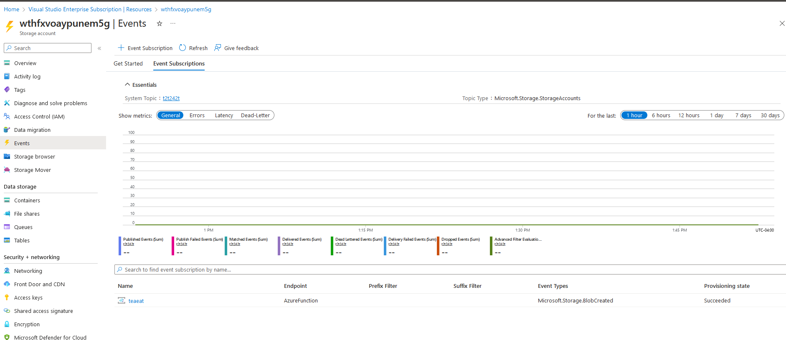

# Challenge 04 - Configuration - Coach's Guide 

[< Previous Solution](./Solution-03.md) - **[Home](./README.md)** - [Next Solution >](./Solution-05.md)

## Notes & Guidance

Even though the instructions on the Student guide should be sufficient for the Coaches to understand what to do, there's also a CLI script (`Coach/Solutions/deploySolutions.sh`) that has the instructions in detail, especially around the syntax to be used for the variables. 

Example:
| **Application Key** | **Value** |
| --- | --- |
| `computerVisionApiUrl` | `https://westus.api.cognitive.microsoft.com/vision/v3.2/ocr` |
| `computerVisionApiKey` | `@Microsoft.KeyVault(SecretUri=https://wth-serverless-kvx.vault.azure.net/secrets/computerVisionApiKey/)` |
| `eventGridTopicEndpoint` | `https://wth-serverless-topic.canadacentral-1.eventgrid.azure.net/api/events` |
| `eventGridTopicKey` | `@Microsoft.KeyVault(SecretUri=https://wth-serverless-kvx.vault.azure.net/secrets/eventGridTopicKey/)` |
| `cosmosDBEndPointUrl` | `https://wth-serverless-cosmosdbxx.documents.azure.com:443/` |
| `cosmosDBAuthorizationKey` | `@Microsoft.KeyVault(SecretUri=https://wth-serverless-kvx.vault.azure.net/secrets/cosmosDBAuthorizationKey/)` |
| `cosmosDBDatabaseId` | `LicensePlates` |
| `cosmosDBCollectionId` | `Processed` |
| `exportCsvContainerName` | `export` |
| `blobStorageConnection` | `@Microsoft.KeyVault(SecretUri=https://wth-serverless-kvx.vault.azure.net/secrets/blobStorageConnection/)` |

The end result for the Event Grid system topic subscription, from the Storage account to the App Function Process Images, looks like this

### Help references

- [Code and test Azure Functions locally](https://docs.microsoft.com/azure/azure-functions/functions-run-local)
