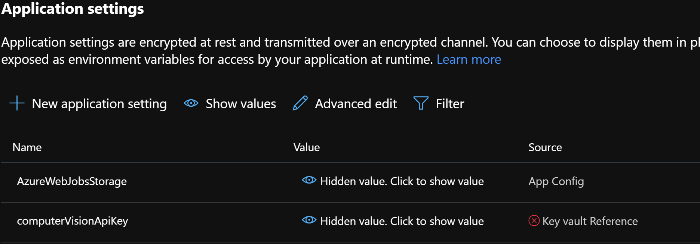

# Coach's notes for the Azure Serverless What The Hack


## Challenge 1 (Create Resources)
None

## Challenge 2 (Configuration)
None

## Challenge 3 (Deployment)
*As of May 2020, there is a new Portal view of the functions*
1) Those that are not familiar with Azure functions will not know about how the Applications Settings work with the Function Code
2) Key Vault reference in the Function App will require a reference __@Microsoft.KeyVault__ in the app setting value
3) __ERRORS on KEY VAULT__
You cannot see if there is an error in the new portal.  Navigate to the old portal and if you see this error, the reference to the key vault is bad: 

Participants may need to allow an identity access [Identity Access](https://docs.microsoft.com/en-us/azure/app-service/overview-managed-identity?context=azure%2Factive-directory%2Fmanaged-identities-azure-resources%2Fcontext%2Fmsi-context&tabs=dotnet)

Then add permissions in Key Vault to the Function
Success looks like this 


## Challenge 4 (Create Functions)
Integration has changed in the new functions portal.  Might have to go to the old portal to add the integration.

## Challenge 5 (Monitoring)
The App insights can be created in new or old functions portal.  In new, Instrumentation key is not needed.  In old, the key will need to be added to the app settings.

For edits to the App.config, the following will need to be added:
```javascript
  <appSettings>
    <add key ="blobStorageConnection" value="THEIR_BLOB_CONNECTION_STRING"></add>
  </appSettings>
```

If students still get a storage account error, then they need to add the connection string to the Debug tab in the Function's properties Command Line arguements

## Challenge 6 (Data Export Workflow)


## Optional Challenge 1 (Scale the Cognitive Service)

## Optional Challenge 2 (View Data in Cosmos DB)
