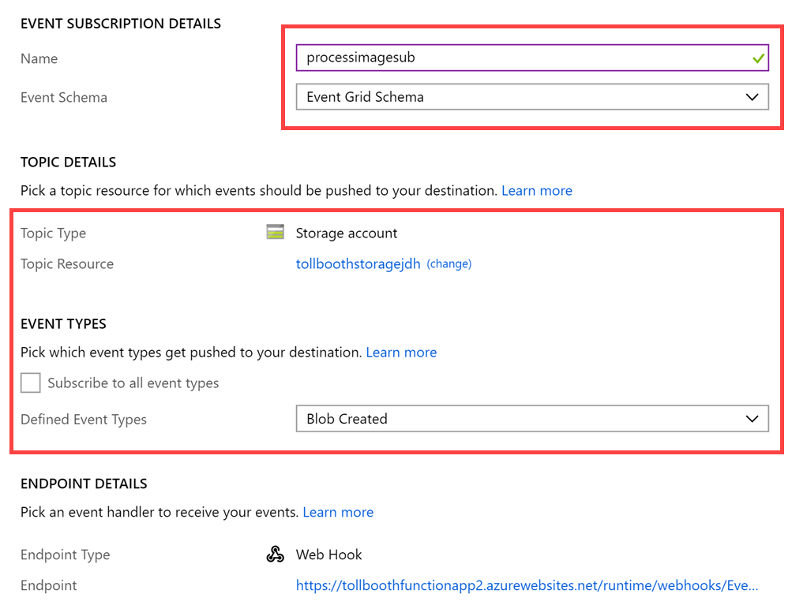

# Challenge 4 - Deployment

### Help references

|                                       |                                                                        |
| ------------------------------------- | :--------------------------------------------------------------------: |
| **Description**                       |                               **Links**                                |
| Deploy Functions to Azure | <https://blogs.msdn.microsoft.com/benjaminperkins/2018/04/05/deploy-an-azure-function-created-from-visual-studio/> |

1.  Navigate to the **TollBooth** project using the Solution Explorer of Visual Studio.

2.  Right-click the **TollBooth** project and select **Publish** from the context menu.

    

3.  In the Pick a Publish Target window that appears, make sure **Azure Function App** is selected, choose the **Select Existing** radio button, then select **Publish**.

    

> **Note**: If you do not see the ability to publish to an Azure Function, you may need to update your Visual Studio instance.

1.  In the App Service form, select your **Subscription**, select **Resource Group** under **View**, then expand your **ServerlessArchitecture** resource group and select the Function App whose name ends with **FunctionApp**.

2.  Whatever you named the Function App when you provisioned it is fine. Just make sure it is the same one to which you applied the Application Settings in Task 1 of this exercise.

    

3.  After you select the Function App, select **OK**.

    > **Note**: If prompted to update the functions version on Azure, click **Yes**.

4.  Watch the Output window in Visual Studio as the Function App publishes. When it is finished, you should see a message that says, "Publish Succeeded."

5.  Using a new tab or instance of your browser navigate to the Azure Management portal, <http://portal.azure.com>.

6.  Open the **ServerlessArchitecture** resource group, then select the Azure Function App to which you just published.

7.  Expand the functions underneath your Function App in the menu. You should see both functions you just published from the Visual Studio solution listed.

    

8.  Now we need to add an Event Grid subscription to the ProcessImage function so the function is triggered when new images are added to blob storage. Select the **ProcessImage** function, then select **Add Event Grid subscription**.

    

9.  On the **Create Event Subscription** blade, specify the following configuration options:

    a. **Name**: Unique value for the App name similar to **processimagesub** (ensure the green check mark appears).

    b. **Event Schema**: Select Event Grid Schema.

    c. For **Topic Type**, select **Storage Accounts**.

    d. Select your **subscription** and **ServerlessArchitecture** resource group.

    e. For resource, select your recently created Event Grid.

    f. _Uncheck_ **Subscribe to all event types**, then select **Blob Created** from the event types dropdown list.

    g. Leave Web Hook as the Endpoint Type.

10. Leave the remaining fields at their default values and select **Create**.

    

[Next challenge (Create Functions in the Portal) >](./Host-PortalFunctions.md)