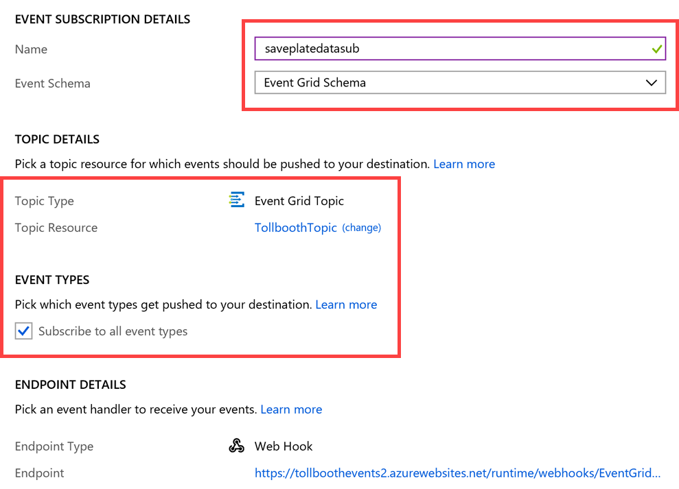
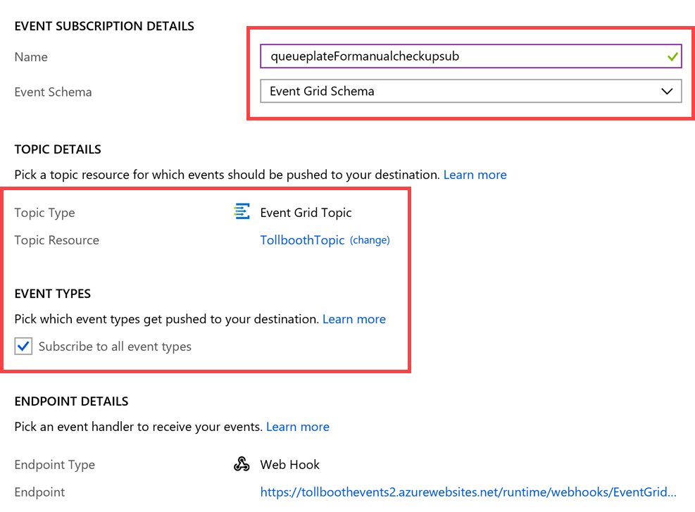
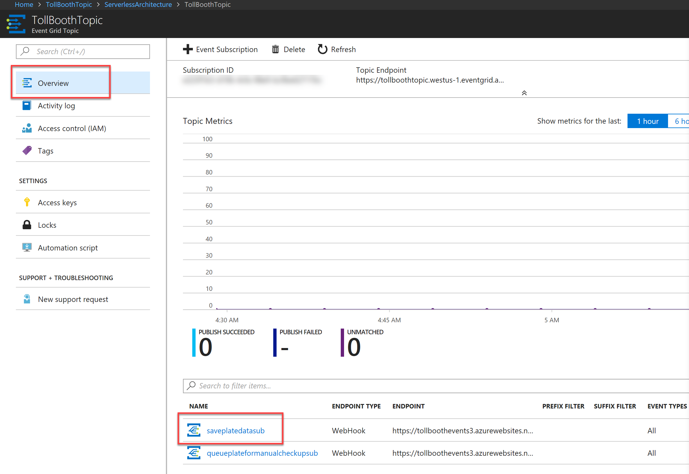
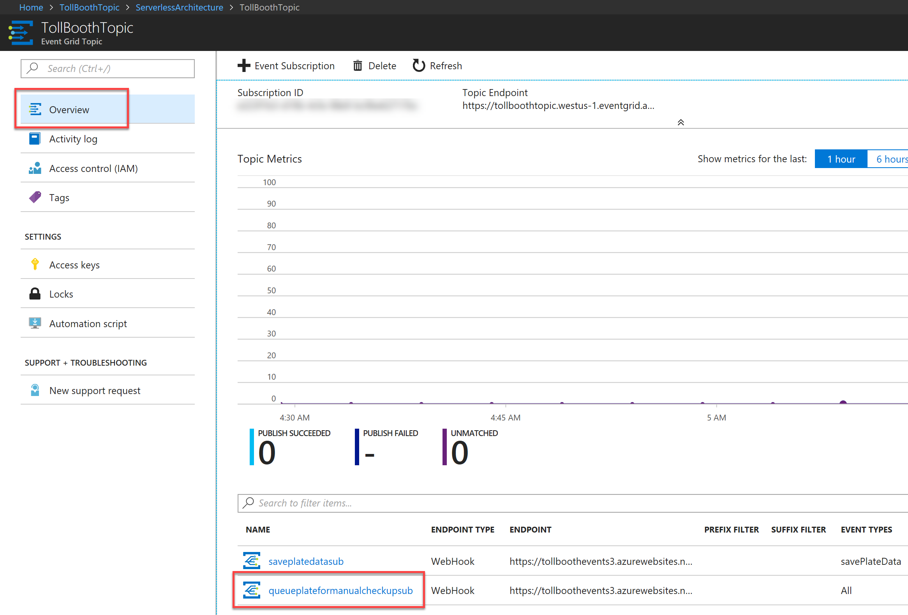

# Challenge 5 - Create Functions in the Portal

### Help references


|                                                                   |                                                                                                         |
| ----------------------------------------------------------------- | :-----------------------------------------------------------------------------------------------------: |
| **Description**                                                   |                                                **Links**                                                |
| Create your first function in the Azure portal                    |        <https://docs.microsoft.com/azure/azure-functions/functions-create-first-azure-function>         |
| Store unstructured data using Azure Functions and Azure Cosmos DB | <https://docs.microsoft.com/azure/azure-functions/functions-integrate-store-unstructured-data-cosmosdb> |


### Task 1: Create function to save license plate data to Azure Cosmos DB

In this task, you will create a new Node.js function triggered by Event Grid and that outputs successfully processed license plate data to Azure Cosmos DB.

1.  Using a new tab or instance of your browser navigate to the Azure Management portal, <http://portal.azure.com>.

2.  Open the **ServerlessArchitecture** resource group, then select the Azure Function App you created whose name ends with **Events**. If you did not use this naming convention, make sure you select the Function App that you _did not_ deploy to in the previous exercise.

3.  Select **Functions** in the menu. In the **Functions** blade, select **+ New Function**.

    

4.  Enter **event grid** into the template search form, then select the **Azure Event Grid trigger** template.

    a. If prompted, click **Install** and wait for the extension to install.

    b. Click **Continue**

    

5.  In the New Function form, fill out the following properties:

    a. For name, enter **SavePlateData**

    

    b. Select **Create**.

6)  Replace the code in the new SavePlateData function with the following:

```javascript
module.exports = function(context, eventGridEvent) {
  context.log(typeof eventGridEvent);
  context.log(eventGridEvent);

  context.bindings.outputDocument = {
    fileName: eventGridEvent.data['fileName'],
    licensePlateText: eventGridEvent.data['licensePlateText'],
    timeStamp: eventGridEvent.data['timeStamp'],
    exported: false
  };

  context.done();
};
```

8.  Select **Save**.

### Task 2: Add an Event Grid subscription to the SavePlateData function

In this task, you will add an Event Grid subscription to the SavePlateData function. This will ensure that the events sent to the Event Grid topic containing the savePlateData event type are routed to this function.

1.  With the SavePlateData function open, select **Add Event Grid subscription**.

    

2.  On the **Create Event Subscription** blade, specify the following configuration options:

    a. **Name**: Unique value for the App name similar to **saveplatedatasub** (ensure the green check mark appears).

    b. **Event Schema**: Select Event Grid Schema.

    c. For **Topic Type**, select **Event Grid Topics**.

    d. Select your **subscription** and **ServerlessArchitecture** resource group.

    e. For resource, select your recently created Event Grid.

    f. Ensure that **Subscribe to all event types** is checked. You will enter a custom event type later.

    g. Leave Web Hook as the Endpoint Type.

3.  Leave the remaining fields at their default values and select **Create**.

    

### Task 3: Add an Azure Cosmos DB output to the SavePlateData function

In this task, you will add an Azure Cosmos DB output binding to the SavePlateData function, enabling it to save its data to the Processed collection.

1.  Expand the **SavePlateData** function in the menu, then select **Integrate**.

2.  Under Outputs, select **+ New Output**, select **Azure Cosmos DB** from the list of outputs, then select **Select**.

    

3.  In the Azure Cosmos DB output form, select **new** next to the Azure Cosmos DB account connection field.

    

    > **Note**: If you see a notice for "Extensions not installed", click **Install**.

4.  Select your Cosmos DB account from the list that appears.

5.  Specify the following configuration options in the Azure Cosmos DB output form:

    a. For database name, type **LicensePlates**.

    b. For the collection name, type **Processed**.

    

6.  Select **Save**.

    > **Note**: you should wait for the template dependency to install if you were prompted earlier.

### Task 4: Create function to save manual verification info to Azure Cosmos DB

In this task, you will create a new function triggered by Event Grid and outputs information about photos that need to be manually verified to Azure Cosmos DB.

1.  Select **Functions** in the menu. In the **Functions** blade, select **+ New Function**.

    

2.  Enter **event grid** into the template search form, then select the **Azure Event Grid trigger** template.

    a. If prompted, click **Install** and wait for the extension to install.

    b. Click **Continue**.

    

3.  In the **New Function** form, fill out the following properties:

    a. For name, type **QueuePlateForManualCheckup**.

    

4.  Select **Create**.

5.  Replace the code in the new QueuePlateForManualCheckup function with the following:

```javascript
module.exports = async function(context, eventGridEvent) {
  context.log(typeof eventGridEvent);
  context.log(eventGridEvent);

  context.bindings.outputDocument = {
    fileName: eventGridEvent.data['fileName'],
    licensePlateText: '',
    timeStamp: eventGridEvent.data['timeStamp'],
    resolved: false
  };

  context.done();
};
```

6.  Select **Save**.

### Task 5: Add an Event Grid subscription to the QueuePlateForManualCheckup function

In this task, you will add an Event Grid subscription to the QueuePlateForManualCheckup function. This will ensure that the events sent to the Event Grid topic containing the queuePlateForManualCheckup event type are routed to this function.

1.  With the QueuePlateForManualCheckup function open, select **Add Event Grid subscription**.

    

2.  On the **Create Event Subscription** blade, specify the following configuration options:

    a. **Name**: Unique value for the App name similar to **queueplateFormanualcheckupsub** (ensure the green check mark appears).

    b. **Event Schema**: Select Event Grid Schema.

    c. For **Topic Type**, select **Event Grid Topics**.

    d. Select your **subscription** and **ServerlessArchitecture** resource group.

    e. For resource, select your recently created Event Grid.

    f. Ensure that **Subscribe to all event types** is checked. You will enter a custom event type later.

    g. Leave Web Hook as the Endpoint Type.

3.  Leave the remaining fields at their default values and select **Create**.

    

### Task 6: Add an Azure Cosmos DB output to the QueuePlateForManualCheckup function

In this task, you will add an Azure Cosmos DB output binding to the QueuePlateForManualCheckup function, enabling it to save its data to the NeedsManualReview collection.

1.  Expand the QueuePlateForManualCheckup function in the menu, the select **Integrate**.

2.  Under Outputs, select **+ New Output** then select **Azure Cosmos DB** from the list of outputs, then select **Select**.

    

3.  Specify the following configuration options in the Azure Cosmos DB output form:

    > **Note**: If you see a notice for "Extensions not installed", click **Install**.

    a. For database name, enter **LicensePlates**.

    b. For collection name, enter **NeedsManualReview**.

    c. Select the **Azure Cosmos DB account connection** you created earlier.

    

4.  Select **Save**.

### Task 7: Configure custom event types for the new Event Grid subscriptions

In this task, you will configure a custom event type for each new Event Grid subscription you created for your functions in the previous steps of this exercise. Currently the event types are set to All. We want to narrow this down to only the event types specified within the SendToEventGrid class in the TollBooth solution. This will ensure that all other event types are ignored by your functions.

1.  Using a new tab or instance of your browser navigate to the Azure Management portal, <http://portal.azure.com>.

2.  Open the **ServerlessArchitecture** resource group, then select your Event Grid Topic.

3.  At the bottom of the **Overview** blade, you will see both Event Grid subscriptions created from the functions. Select **saveplatedatasub**.

    

4.  Select the **Filters** tab, then _uncheck_ **Subscribe to all event types**.

5.  Select the **Delete** button (x inside of a circle) on the **All** event type to delete it.

    

6.  Select **Add Event Type**, then enter **savePlateData** into the event types field. If you specified a different name in the SendToEventGrid class in the TollBooth solution, use that instead.

    

7.  Select **Save**.

8.  Select the **queueplateformanualcheckupsub** Event Grid subscription at the bottom of the **Overview** blade.

    

9.  Select the **Filters** tab, then _uncheck_ **Subscribe to all event types**.

10. Select the **Delete** button (x inside of a circle) on the **All** event type to delete it.

    

11. Select **Add Event Type**, then enter **queuePlateForManualCheckup** into the event types field. If you specified a different name in the SendToEventGrid class in the TollBooth solution, use that instead.

    

12. Select **Save**.


[Next challenge (Monitoring) >](./Host-Monitoring.md)
