# LAB GUIDE
## Lab: Deploying a Docker based web application to Azure App Service
### Learning Objectives
- How to build custom Docker images using Azure DevOps Hosted Linux agent
- How to push and store the Docker images in a private repository
- How to Deploy and run the images inside the Docker Containers

### Pre-requisites
* Microsoft Azure Account: You'll need a valid and active Azure account for the Azure labs.
* You'll need an Azure DevOps account.

## Length
40 minutes

## Exercise 1: Create a new project in Azure DevOps
1. Enter in [Azure DevOps](http://dev.azure.com) and log in clicking in **Start free** button

2. Login with the same credentials you were given for Azure if you are not logged in already.
3. Press New Project
4. Set the **Project name** you want
5. In **visibility** select **Private**
6. Click on **Advanced**, in **Version control** select **GIT** and **Work item process** select Scrum then click on **+ Create project** 

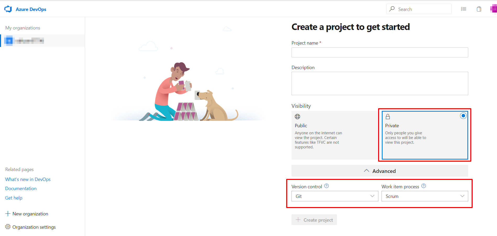

5. Once your project has been created click on **Repos** option
6. In Repos page you'll see many options to add some code, click on **Import** from **Or import a repository** option
7. in **Clone URL** option put this URL then click on import
``https://github.com/MSTecs/Azure-DevDay-lab4-demoProject.git``

8. Now if you click again on files you will see the code in your page

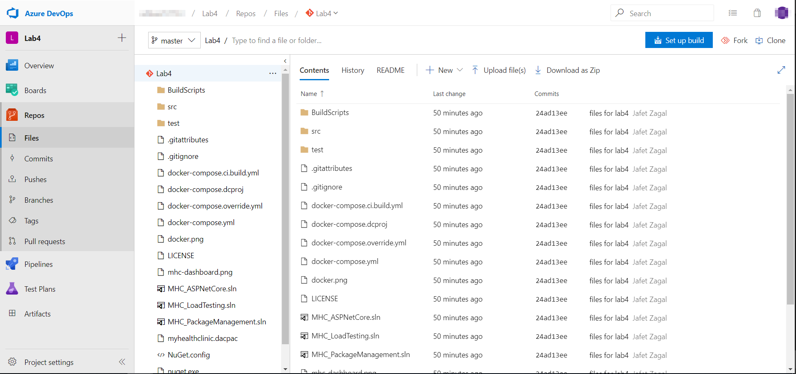

## Exercise 2: Configure Continuous Integration
### Task 1: Configure your basic Pipeline DevOps
1. Log in to your Azure portal lab subscription. 

- **Note** If you are using your own subscription, begin the deployment of Module 3 resources using this deployment script. Be sure to use lowercase letters with your initials Eg. - tjbmodule3.  Click the Deploy to Azure button to start 

2. Go to resources groups and select the resource group that begins with module-04-***.
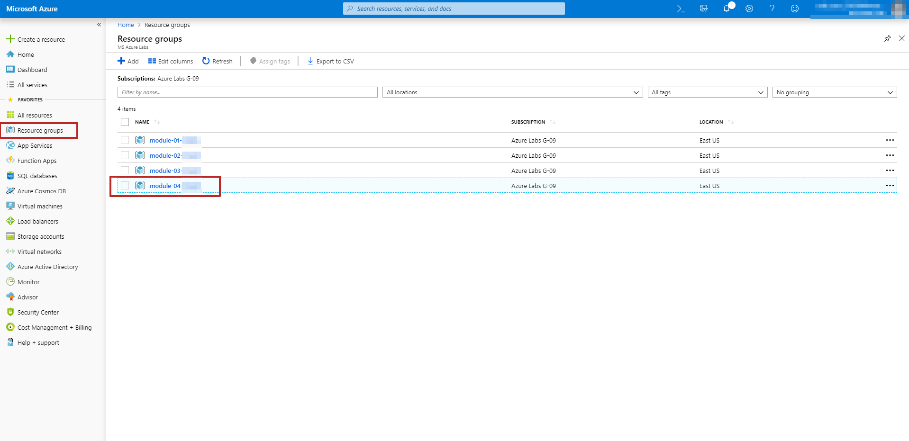

3. Open your **container registry** and take note of the **login server** - It's recommended to keep this browser tab open as you'll need these values later.

4. Go back to your resources open your **SQL database** and take note of the **Server name**

5. Return to [Azure DevOps](https://dev.azure.com)

6. Navigate to the **Builds** option under the **Pipelines** tab and select new pipeline

7. Select **Use the classic editor** option

8. Select **Azure Repos Git** and select your project and click on Continue

9. Select the **Empty job** option

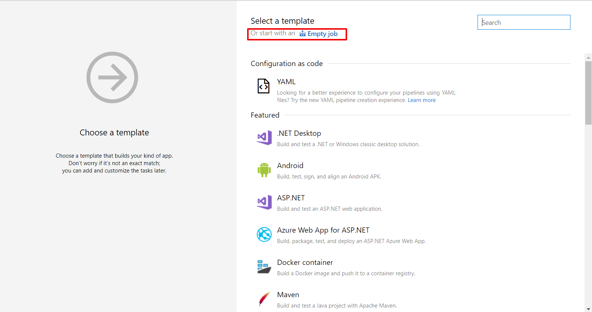

10. Click on the **Agent job 1** and change the **display name** to Docker
11. On **Execution Plan** Section set 1 on **Job cancel timeout** input

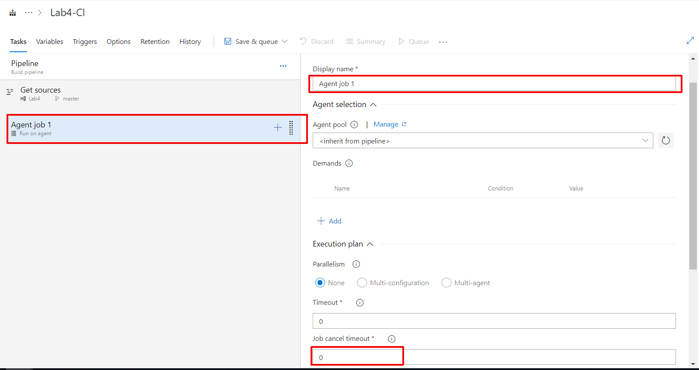
**Your configuration should look like this**

### Task 2: create your Run Services

1. Click on plus button **+** on your Docker agent

2. Search for **docker compose** and select the first option

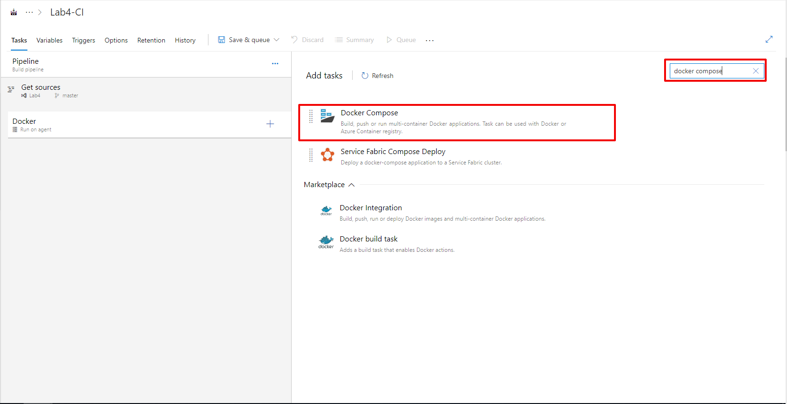

3. Set `Run services` on **Display name** input and select your azure subscription

4. You can use the authorize button to create a service connection to Azure.  If you receive an error, click **Advanced options** as the image shown

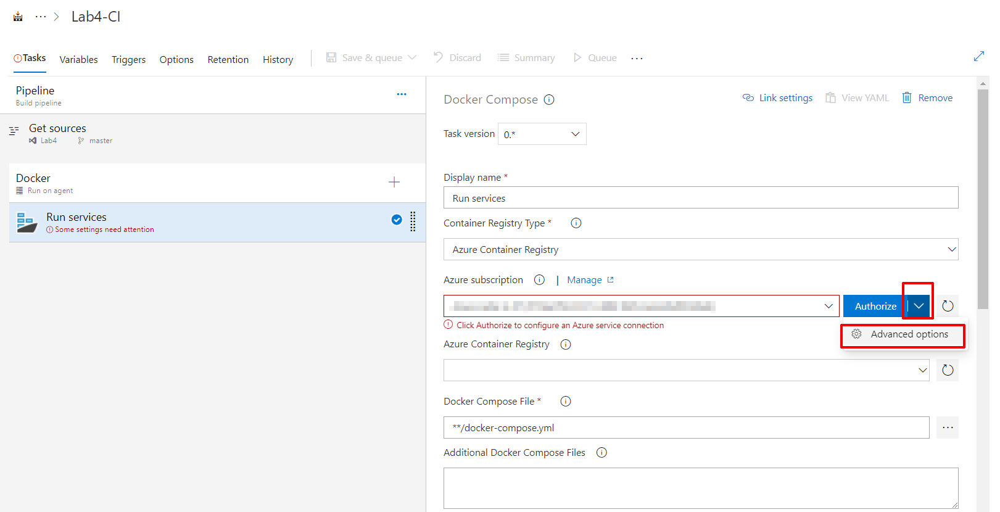

5. Click on **use the full version of the service connection dialog** option

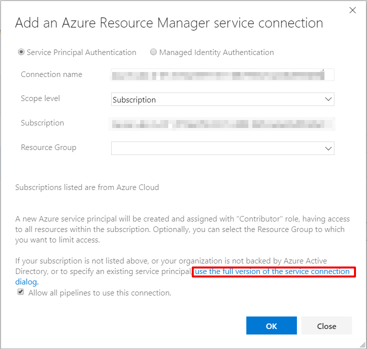

6. Set `serviceConnection` on **Connection name** input.

7. Put your **Service Principal Details** given at the beginning of the lab and click in **Ok**
- **Application/Client Id**
- **Application Secret Key**

8. Select your container registry

9. Click on ellipsis button (**...**) and search the file **docker-compose.ci.build.yml**

10. Go down in your **Run services** configuration and select **Run service images** on **Action** option
11. Uncheck the **Run in Background** option
12. In **Output Variables** set as **Task1** in **Reference name** input

### Task 3: create your Build services
1. Click on plus button (**+**) and search again for Docker compose

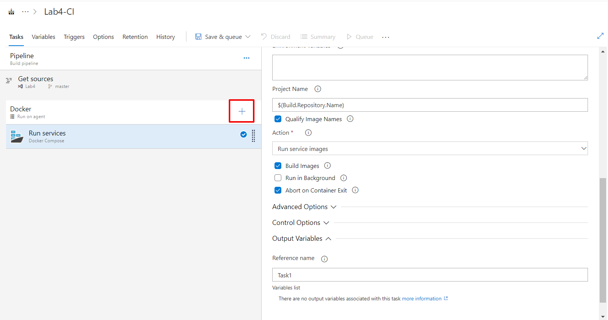

2. Set `Build services` on **Display name** input
3. Select your **ServiceConnection** _previously created_ on **Azure subscription**
4. Select your **Azure Container registry**
5. Search the **docker-compose.yml** file clicking on the Ellipsis button (**...**), selecting the file and clicking **Ok**
6. Put this line `DOCKER_BUILD_SOURCE=` on your **Environment Variables**

**Your config should look like this**

7. Go down and select **Build service images** on **Action** dropdown
8. Set as `Task2` on **Reference name** on **Output Variables** section

### Task 4: Create your Push services
1. Click on plus button (**+**) and search again for Docker compose

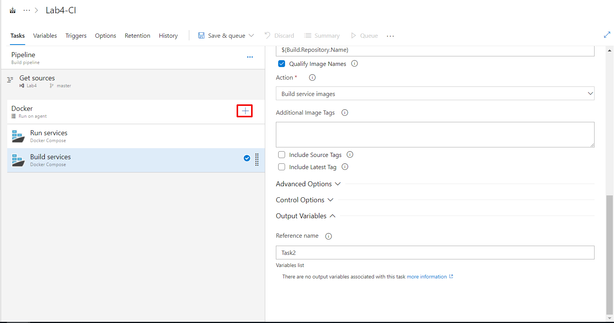

2. Set `Push services` on **Display name** input
3. Select your **ServiceConnection** _previously created_ on **Azure subscription**
4. Select your **Azure Container registry**
5. Search the **docker-compose.yml** file clicking on the Ellipsis button (**...**), selecting the file and clicking **Ok**
6. Put this line `DOCKER_BUILD_SOURCE=` on your **Environment Variables**

**Your config should look like this**

7. Go down and select **Push service images** on **Action** dropdown
8. Set as `Task3` on **Reference name** on **Output Variables** section

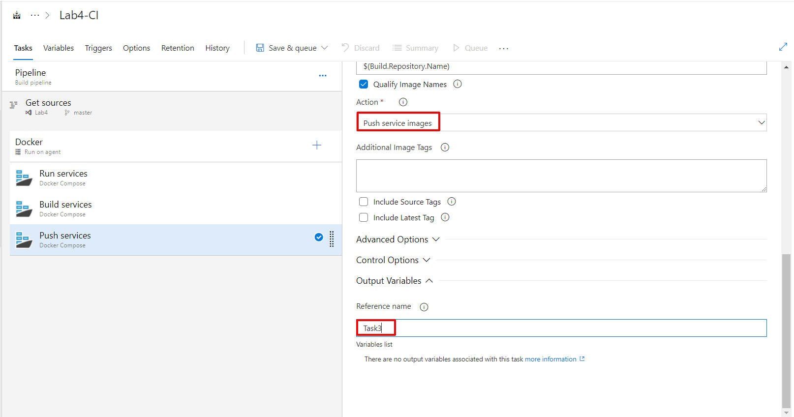

### Task 5: create your Publish Artifact
1. Click on plus button (**+**) and search for Publish build artifacts

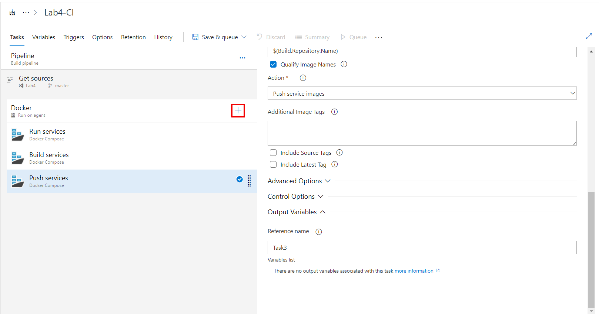
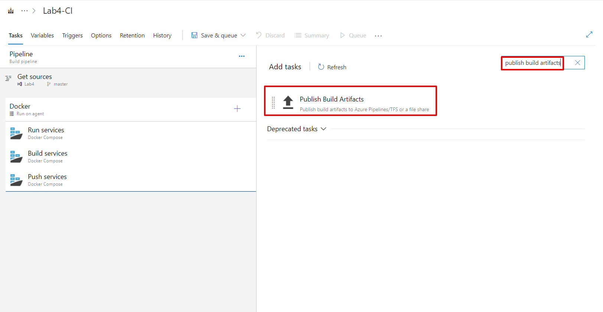

2. Set `Publish Artifact` on **Display name** input
3. Set `myhealthclinic.dacpac` on **Path to publish** input
4. Set `dacpac` on **Artifact name** input
5. Set `PublishBuildArtifacts2` as your **Reference name** in the **Output variables**

### Task 6: Set your variables
1. Click on **Variables** tab
2. Create these variables clicking on **+ Add** button

- Name: **BuildConfiguration** Value: **Release** check the _settable at queue time_
- Name: **BuildPlatform** Value: **Any CPU**

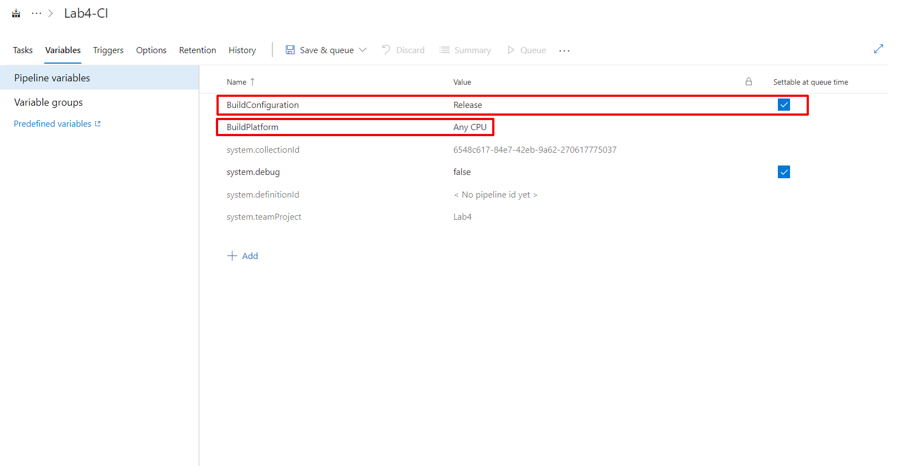

### Task 7: config your triggers
1. Click on **Triggers** tab
2. Check the **Enable continuous integration** option

### Task 8: config your options
1. Click on **Options** tab
2. Put this line `$(date:yyyyMMdd)$(rev:.r)` on **Build number format**
3. Set as `0` on **Build job timeout in minutes**

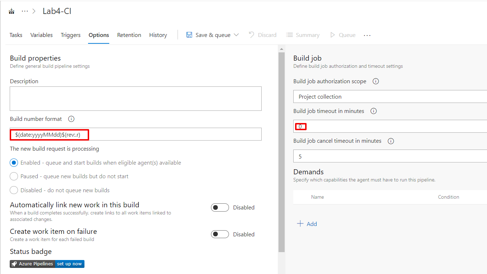

## Task 9: Set your host
1. Click on **Tasks** tab
2. Click on Pipelines
3. Select 
   1. Agent Pool: Azure Pipelines
   2. Agent Specification: **Ubuntu 16.04** 

4. Click on **Save & queue** dropdown and select the **save** option
5. Put any comment you want

## Exercise 3: configure your Continuous Delivery
### Task 1: create the pipeline
1. Navigate to the **Releases** section under the **Pipelines** tab and select **New pipeline** and select **Empty job**

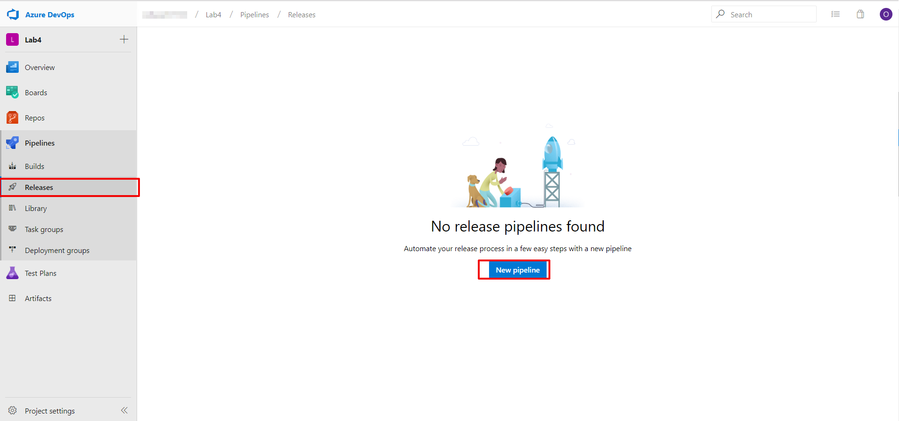
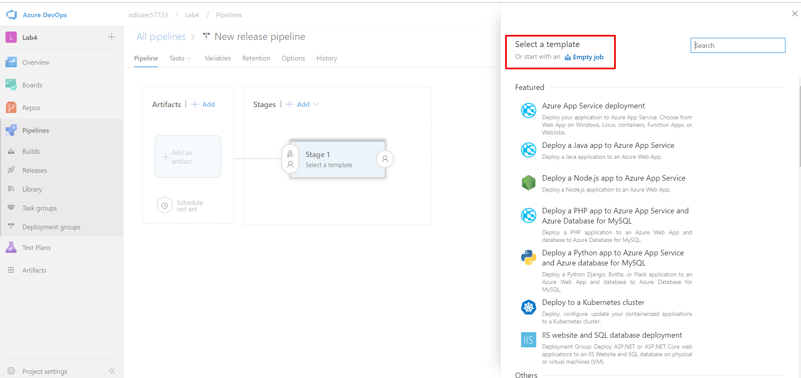

2. Set `Dev` on **Stage name** option

3. Click on **Add an artifact** and set the inputs as below

4. Set Continuous deployment trigger clicking on the ray icon and switching to enable the Continuous deployment trigger

### Task 2: Config your DB deployment
1. Click on **Tasks** tab 
2. Click on **Agent job**
3. set ``DB Deployment`` on **Display name** input
4. Create this variable clicking on **+ Add** button
**Name:** `sqlpackage` **Condition:** `exists`
5. Click on plus button (**+**) and search for `azure SQL database deployment`
6. Select the first option then add

7. Select your **Azure SQL Dacpac Task**
8. Put `Execute Azure SQL : DacpacTask` as the **Display name**
9. Select your **ServiceConnection** on **Azure Subscription**
10. Set `$(SQLserver)` on **Azure SQL Server** input
11. Set `$(DatabaseName)` on **Database** input
12. Set `` $(SQLadmin)`` (with a blank space at the beginning) on **Login** input
13. Set ``$(Password)`` on **Password** input

14. Go down and set `$(System.DefaultWorkingDirectory)/**/*.dacpac` as your **DACPAC File** on **Deployment Package** section
15. Set `SqlAzureDacpacDeployment1` as your **Reference name** on **Output Variables** section

## Task 3: Config your Web App deployment
1. Click on Ellipsis button (**...**) on **Dev** (Deployment process) and select **Add an Agent Job**

2. Click on your new **Agent job** 
3. Set `Web App deployment` as your **Display name**
4. Select the **Hosted Ubuntu 1604** option from **Agent pool** dropdown

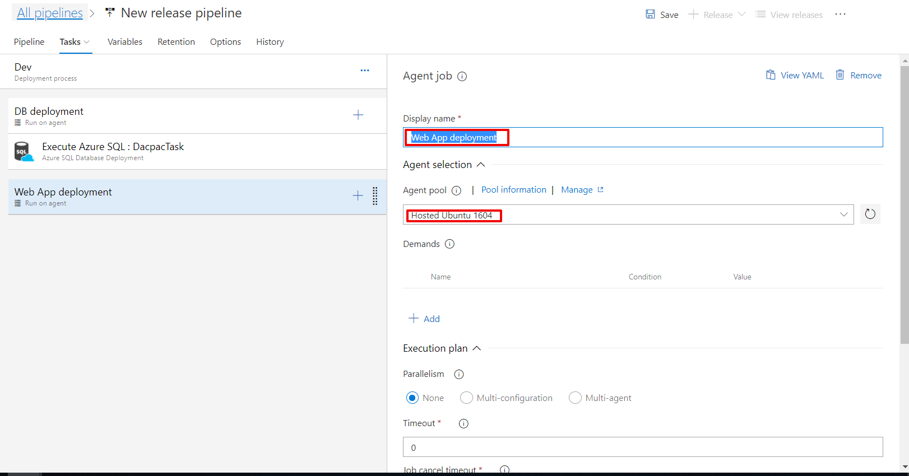

5. Click on plus button (**+**) and search for `Azure App Service Deploy`
6. Select the first one then click on **Add**

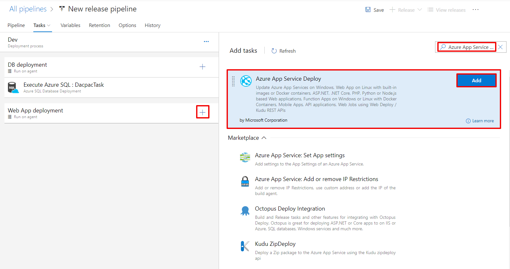

7. Click on your new **Azure App Service Deploy:**
8. Select __3.*__ option from **Task version** dropdown
9. Set `Azure App Service Deploy` as your **Display name**
10. Select **ServiceConnection** on **Azure subscription**
11. Select **Linux web App** on **App type**
12. Select your **webapp** on **App Service Name**
13. Set `$(ACR)` on **Registry or Namespace** input

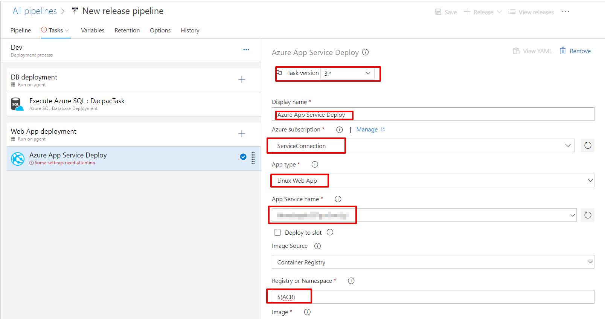

14. Put `myhealth.web` in the **Image** input
15. Put `$(BUILD.BUILDID)` in **Tag** input
16. Put `AzureRmWebAppDeployment1` in **Reference name** on **Output Variables** section

## Task 4: Config your variables
1. Click on **Variables** tab
2. Add these variables clicking on **+ Add** button

- **Name:** ``ACR`` **Value:** ``YOUR_ACR.azurecr.io`` **Scope:** `Release`
- **Name:** ``DatabaseName`` **Value:** ``mhcdb`` **Scope:** `Release`
- **Name:** ``Password`` **Value:** ``P2ssw0rd1234`` **Scope:** `Release`
- **Name:** ``SQLadmin`` **Value:** ``sqladmin`` **Scope:** `Release`
- **Name:** ``SQLserver`` **Value:** ``YOUR_DBSERVER.database.windows.net`` **Scope:** `Release`

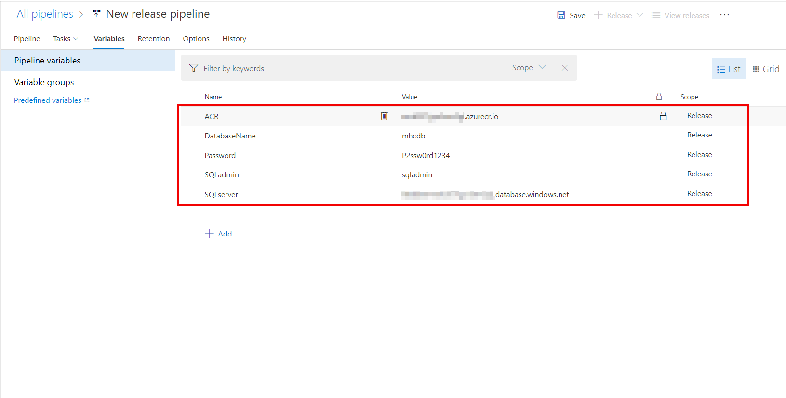

3. Click on **save** button

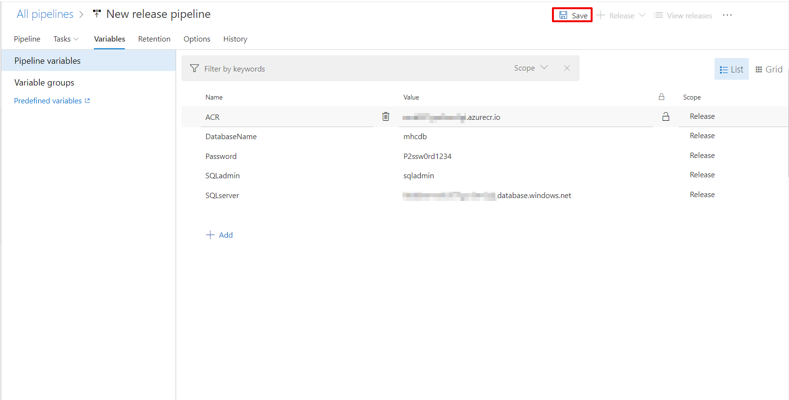

## Exercise 4: Initiate the CI Build and Deployment through code commit

1. Click on **Files** section under the **Repos** tab and navigate to the (ProjectName)/src/MyHealth.Web/Views/Home folder and open the Index.cshtml file for editing

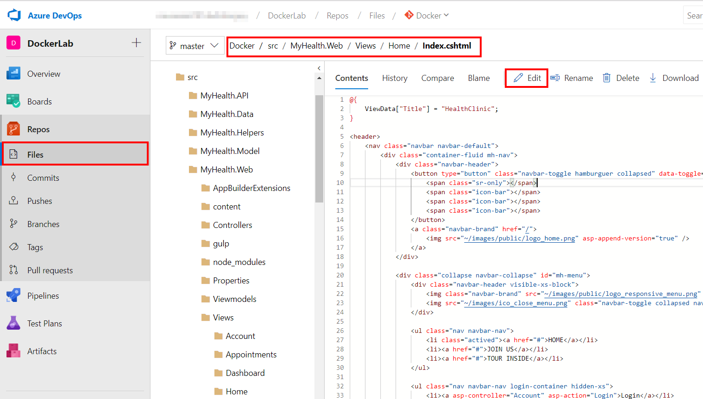

2. Modify the text **JOIN US** to **CONTACT US** on the line number 28 and then click on the **Commit** button.This action would initiate an automatic build for the source code

3. After clicking **Commit** button, add a comment and click on **Commit**

4. Click on **Builds** tab, and subsequently select the commit name

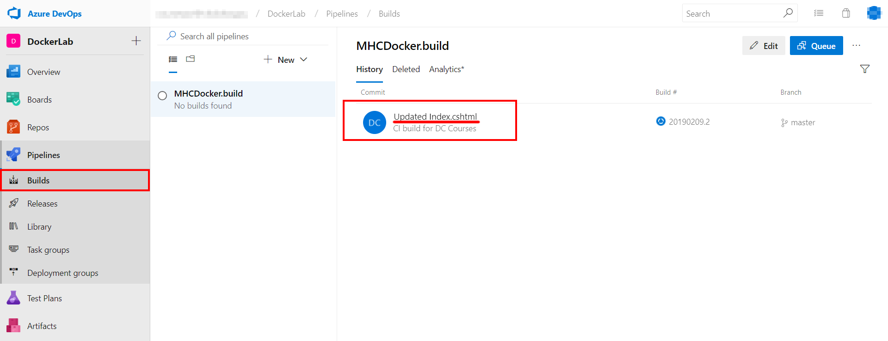

5. The Build will generate and push the docker image of the web application to the Azure Container Registry. Once the build is completed, the build summary will be displayed.

6. Navigate to the [Azure Portal](https://portal.azure.com) and click on the **App Service** that was created at the beginning of this lab. Select the **Container Settings** option and provide the information as suggested and then click the **Save** button

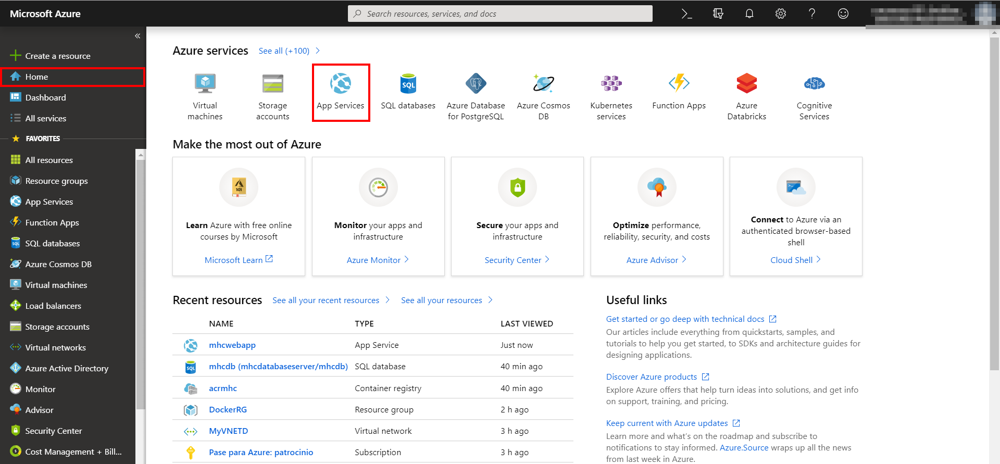

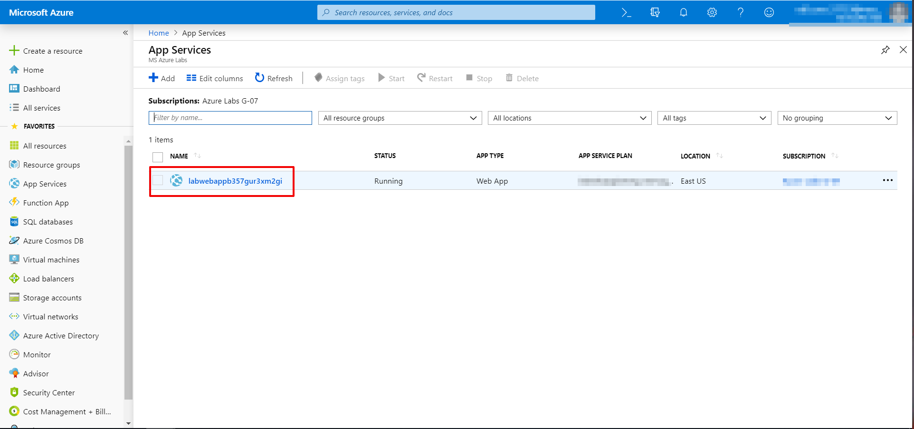

7. Navigate to the **Azure Container Registry** and then select the **Repositories** option to view the generated docker images

8. Navigate to the **Releases** section in **Azure DevOps** under **Pipelines** tab and double-click on the latest release displayed on the page. Click on Logs to view the details of the release in progress

**note** In case doesn´t exist any release you can create a new one clicking on **create a release** and selecting the **Dev** from the pipeline

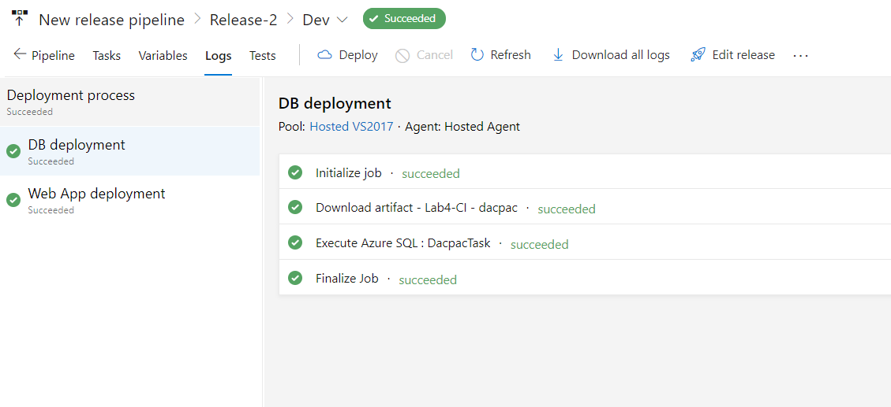

9. Navigate back to the [Azure Portal](https://portal.azure.com) and click on the **Overview** section of the **App Service**. Click on the link displayed under the **URL** field to browse the application and view the changes

10. Use the credentials **Username**: user and **Password**: P2ssw0rd@1 to login to the HealthClinic web application.

