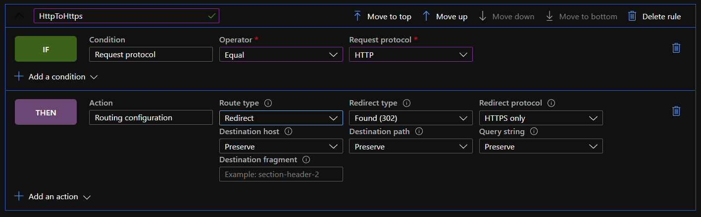

# Notes for Challenge 5 - Cache Static Assets

 [< Previous Challenge [4]](./Solution04.md) - **[Home](./README.md)**

This article [https://docs.microsoft.com/en-us/azure/frontdoor/front-door-tutorial-rules-engine](https://docs.microsoft.com/en-us/azure/frontdoor/front-door-tutorial-rules-engine) sums up this challenge.  

We are going to create a single rule that redirects anything that comes in via HTTP to HTTPs.  This is where we look at the "Request Protocol" of HTTP.

After the Rules engine is created it needs to be applied to each Backend.