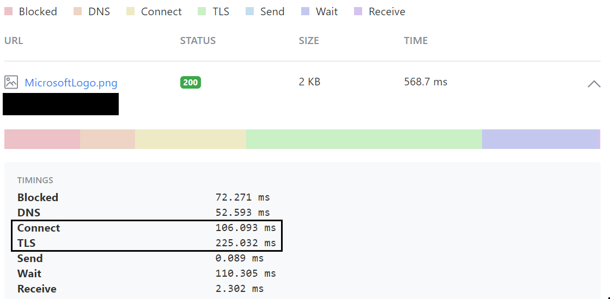
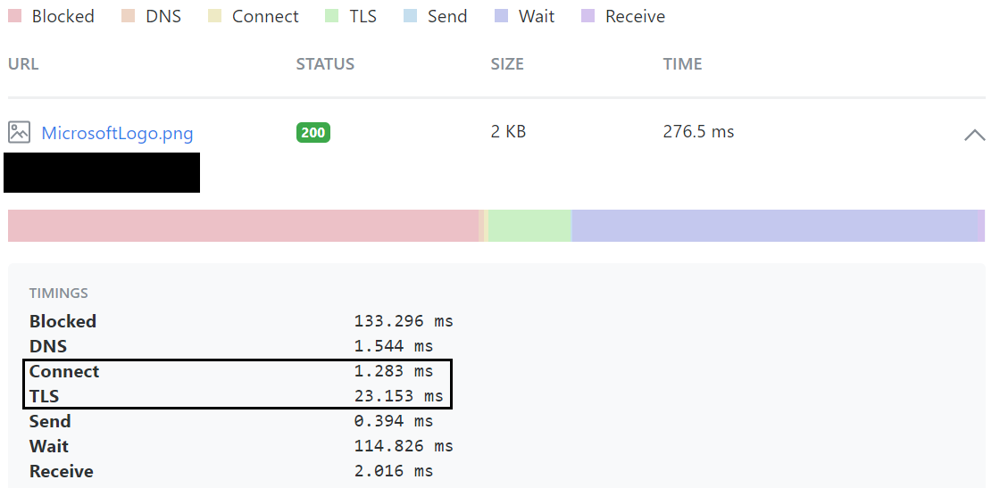

# Challenge 2 - Provision your Front Door

[< Previous Challenge [1]](./Challenge01.md)&nbsp;&nbsp;-&nbsp;&nbsp;**[Home](../README.md)**&nbsp;&nbsp;-&nbsp;&nbsp;[Next Challenge [3] >](./Challenge03.md)

## Introduction

Now that we have the site up and running, it's time to start addressing the situation.  Contoso Masks website has started to trend and LOTS of people are hitting the website from all over the world.  Users are complaining about either taking a really long time to load the website or not able to load at all.

Before we go any further, we are focusing on aspects of the experience that is controlled *"North"* or above the website itself. There are limits to what scaling the website with hardware will help, and we're going to focus on those aspects.  We also aren't focusing on regional data compliance issues (GDPR for example). 

### Handling a significant amount of users

When a website experience a significant amount of load, every aspect of that goes into handling a request gets stressed.  One thing in particular is how to handle the sheer number of users, or put another way, how to handle the sheer number of connections.  Unless there is specialized networking hardware in play, you can very quickly run into [Port Exhaustion](https://docs.microsoft.com/en-us/windows/client-management/troubleshoot-tcpip-port-exhaust).  This is where the physical number of connections can no longer be handled by your available infrastructure.  

Azure Front Door is considered a [Layer 7](https://en.wikipedia.org/wiki/OSI_model#Layer_7:_Application_Layer) - [Proxy Server](https://en.wikipedia.org/wiki/Proxy_server12) that implements [Split TCP](https://docs.microsoft.com/en-us/azure/frontdoor/front-door-routing-architecture#connecting-to-front-door-environment-split-tcp), a technique that lets the specialized hardware of the service to absorb all the connections while managing a small pool of persistent (relative to the load) to your website.  Not only does this prevent Port Exhaustion, it also reduces the CPU and Memory resources used to constantly establishing and finish connections for each client.

### Global Reach of a website

For the purpose of this description, lets pretend Contoso Masks' website is hosted in the Central US Azure Data Center only, somewhere the State of Iowa.  If a user is accessing the website in the middle of the United States, most likely has a descent experience.  But what happens when the website is accessed from Germany? 

When talking about the performance characteristic of a single resource request (a single GET/POST/etc...), there are 7 numbers that used to describe it:
1. **Blocked** - A Web Browser generally defaults the number of open connections to a given DNS Name to 2.  If 2 other resources are being requested for the same DNS Name, the Web Browser will "block" the request.
2. **DNS Lookup** - This is the time it takes the browser to perform a DNS lookup, or translating www.contosomasks.com to an IP Address.
3. **Connect** - How long does it take for the Web Browser to establish a connection to "server" for the request.  Server is the external ***thing*** that is responding to the request.   *HINT* - This isn't always your webserver.
4. **TLS Handshake** - How long does it take your Web Browser to safely establish a secure tunnel to the server.  The [Transport Layer Security (TLS) Handshake Protocol](https://docs.microsoft.com/en-us/windows/win32/secauthn/tls-handshake-protocol) is the established process to safely ensure when you go to www.contosomasks.com, you really are going to the real one.  (The internet can be a very dark place).  **The issue is, this is several round trips from Web Browser to server**
   1. [Man in the middle attack](https://en.wikipedia.org/wiki/Man-in-the-middle_attack) is one example of what this protects.
5. **Send Request** - Time to transmit the HTTP Request.
6. **Wait for Response** - Time for the First Byte of the response to be received.
   1. Sometimes referred to as Time to First Byte [TTFB]
7. **Receive Response** - Time for full payload to receive.
   1. Sometimes referred to as Time to Last Byte [TTLB]

#### Things you control with code of your website:
- You can somewhat control #1, its really how you structure you web pages and the child resources.  But in general, with the evolution of HTTP (HTTP/2 specifically) and modern web browsers, this is becoming less and less of an issue.
- #6 is basically what your web application is processing + transit time for the first byte of response.  Once you've optimized the application, we have 5 left.

#### Things you can't control
- #2 is primarily up to the Client operating system to interact with the DNS infrastructure of the network it's on.  You could play with things like TTL (Time to Live) of the DNS records to prevent full lookups, but in the end, you are at the mercy of the device and it's network.

#### Where Front Door helps

First, take a read of the [What is a CDN?](./whatiscdn.md) article, as Azure Front Door is a Dynamic Site Acceleration CDN Service.  And since Microsoft is the [2nd largest Telecommunications company](https://docs.microsoft.com/en-us/azure/networking/microsoft-global-network) by measure of the amount of [Dark Fibre](https://en.wikipedia.org/wiki/Dark_fibre) run around the planet, you can use this as your accelerated pathway to your website.

There are 2 primary benefits: 
1. By moving the *"Server"* closest to the user (the Point of Presence), the per user Connect (#2) and TLS Handshake (#3) happens closest to the user.  By using Split TCP and pools of persistent, secure connections to your website from the Points of Presence, you can normalize the aspects of each request by using Front Door.
  - Here are the before and after Front door implementations for a website, using a Germany => Central US test to illustrate:
    - Before Front Door: 
    - After Front Door: 
2. For global (and regional performance), taking advantage of the private pathing thru Microsoft's network provides a way to predictably accelerate requests to and from your website.  Public internet routing is reliable from the aspect of getting your requests back and forth, but unpredictable from a performance perspective.

#### The dangers of caching

You will notice we aren't talking about caching yet, which is the concept of storing a response from your website for a configured period of time, and using that for future requests.  Caching can also include the client, where it either uses a fixed time or a checksum like value, called an eTag, that can be verified for any changes. It can greatly increase the end client performance and website utilizations, but there are caveats.  CDN level Caching caches the ***entire*** HTTP request, including cookies and headers.  Front Door ***can*** cache, but if the website was designed for this kind of interaction, you have to be extremely thoughtful and deliberate about what you cache and what you don't.  

## Description

For this challenge we are going to:
1. Provision a new Front Door resource for your website
2. Create a Custom Domain in Front Door for you website with SSL, called frontdoor.***SITENAME***.contosomasks.com, where SITENAME is what you specified in Challenge 0.
   1. **IMPORTANT** - Normally you migrate a DNS Name, like www, to Front Door.  For comparison purposes, we are using a different name for the Front Door implementation.
  

## Success Criteria

- Demonstrate the website working thru Front Door via https://frontdoor.***SITENAME***.contosomasks.com 
  - ***HINT*** - You will see **x-azure-ref** in the Response Headers of each request to Front Door.
- Show requests that were logged thru Front Door's logs
- With 2 Browser windows open to [https://tools.keycdn.com/performance](https://tools.keycdn.com/performance), test the www.***SITENAME***.contosomasks.com vs frontdoor.***SITENAME***.contosomasks.com performance.
  - ***HINT*** - Make sure to run it 3 times prior to looking a final results.
  - Compare the Connect and TLS times

## Learning Resources

- [Azure Front Door](https://docs.microsoft.com/en-us/azure/frontdoor/front-door-overview)
- [Azure Front Door Diagnostic Logs](https://docs.microsoft.com/en-us/azure/frontdoor/front-door-diagnostics#diagnostic-logging)
- [Azure Logging](https://docs.microsoft.com/en-us/azure/azure-monitor/platform/platform-logs-overview)
- [What is a CDN?](./whatiscdn.md)

## Advanced Challenges

- Demonstrate that only the Azure Front Door service can access your website