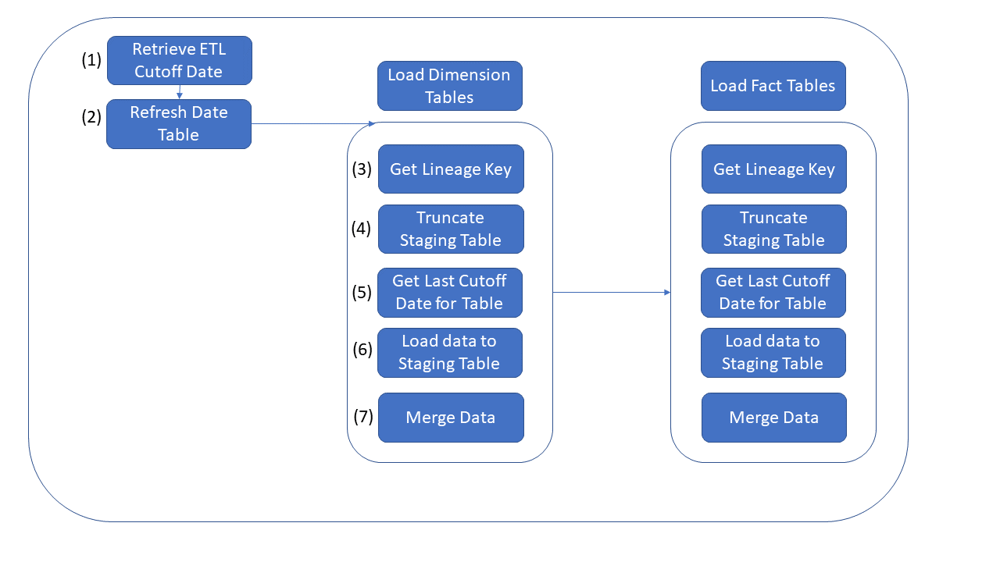

# Challenge 03 - Data Pipeline Migration - Coach's Guide 

[< Previous Solution](./Solution-02.md) - **[Home](./README.md)** - [Next Solution >](./Solution-04.md)

## Introduction
WW Importers keep missing the SLAs for their nightly data load process.  The loads take six hours to complete and start each evening at 1:00AM.  They must complete by 8:00AM but frequenly these jobs are taking longer than planned.  In addition a few critical stakeholders are asking to provide the data even more frequently.  Since these business units are the key stakeholders, they have the funding to help replatform the data pipelines.  WW Importers realizes they need to leverage their new Data Lake to scale and load this into their Data Warehouse for Stage 3.  These data pipelines must be ELT (Extract, Load & Transform) so they can quickly write the data to the cloud and scale out the compute to transform the data.

## Description
The objective of this lab is to modernize the ETL pipeline that was originally built in SSIS.  A detailed diagram of the current workflow is included below.  We need to rebuild this pipeline in Azure leveraging scale-out architecture to transform this data.  The data flow will include steps to extract the data from the OLTP platform, store it in the Azure Data Lake and bulk ingest it into Azure Synapase Analytics.  This will be run on a nightly basis, and will need to leverage Azure Synapse Analytics pipelines as a job orchestration and scheduling tool.

**Below is a summary of each of the tasks in the existing SSIS package.  Note that we will be able to re-use the existing scripts for all of these tasks except for step 6.**

1. The first step of the pipeline is to retrieve the “ETL Cutoff Date”. This date can be found in the [Integration].[Load_Control] in Azure Synapse SQL Pools and should have been created as part of challenge 1.
1. The next step ensures that the [Dimension].[Date] table is current by executing the [Integration].[PopulateDateDimensionForYear] in Azure Synapse SQL Pools
1. Next the [Integration].[GetLineageKey] procedure is executed to create a record for each activity in the [Integration].[Lineage Key] table
1. This step Truncates the [Integration].[[Table]_Staging] tables to prep them for new data
1. This step retrieves the cutoff date for the last successful load of each table from the [Integration].[ETL Cutoffs] Table
1. New data is now read from the OLTP source (using [Integration].[Get[Table]Updates] procedures) and copied into the [Integration].[[Table]_Staging] tables in the target DW
1. Finally the staged data is merged into the [Dimension] and [Fact] tables in the target DW by executing the [Integration].[MigrateStaged[Table]] stored procedures in the target DW
    - **NOTE: As part of this step, surrogate keys are generated for new attributes in Dimension tables (tables in the [Dimension] schema), so Dimenion tables must be loaded before FACT tables to maintain data integrity**

## Coach Notes

1. The challenge provided to students requires that a single pipeline be created to stage and refresh the [Dimension].[City] table.  The solution for this can be found in the [`/Challenge2/ARMTemplates/Basic` folder](./Solutions/Challenge3/ARMTemplates/Basic/) of the Solution Guide.

1. In order to make this pipeline more dynamic and scalable, this solution can be extended to use expressions and parameters (as called out in the additional challenges section of the Student guide).  The configuration for this "Advanced" solution is described below and can be found in the [`/Challenge2/ARMTemplates/Advanced` folder](./Solutions/Challenge3/ARMTemplates/Advanced/) of the Solution Guide.

## Environment Setup

1. Add a new activity to your Azure Synapse pipelines to load data from the Azure Data Lake Gen 2 into the _Staging tables in the Data Warehouse in Azure Synapse via Polybase
    - The primary benefit of using ELT loading pattern in Azure is to take advantage of the capabilities of scale out cloud technologies to load data as quickly as possible and then leverage the power of Azure Synapse Analytics to transform that data, and finally merge it into its final destination.  In order to ingest the data that was loaded into the data lake in the previous challenge, you should add a new activity to the existing Azure Synapse pipeline to load each table via Polybase.  A way to implement this dynamically would be to create parameterized stored procedures and call them using a Stored Procedure activity.  An example of how to load data via CTAS can be found [here](https://docs.microsoft.com/en-us/azure/synapse-analytics/sql-data-warehouse/load-data-from-azure-blob-storage-using-polybase).

    **NOTE:** This process leverages stored procedures to import the data via CTAS statements in Azure Synapse.  The scripts for those stored procedures can be found in the \Scripts folder of the solution guide. As mentioned, alternative approaches could be to execute Copy commands or leverage the Copy activity directly. 

1. Add an activity to execute the Get Lineage Key stored procedure so that the process can be logged (this will correlate to Step 3 in existing SSIS package described above)

1. Create another activity to merge the new data into the target Fact and Dimension tables in your DW from your _Staging tables
    - Now that your data has been loaded into the DW, you will need to merge the results into the Fact and Dimension schemas.  To accomplish this, you can use the Integration.Migrate... stored procedures that were created in Challenge 1.  In order to execute the queries via your Azure Synapse pipeline:
        - add a new Execute Stored Procedure Activity, and configure it to execute the Integration.MigrateStagedCityData stored procedure in your Synapse SQL Pool
        **Note:** As mentioned before, you should use expressions to call the stored procedure so that the activity can be reused for each table being merged
    **NOTE:** As stated in the Description above, Dimension tables will need to be fully loaded before Fact tables, so be sure to account for that when building this activity.  In the solution included, this is achieved by creating a concept of "SequenceId" in the [Integration].[ETL Cutoffs] table in the Azure Synapse DW.  The script to add the sequence id to the table, and populate correctly can be found (./Scripts/PopulateEtLCutoffs.sql).  

1. Add another new activity to your new pipeline to move the files to the \RAW\WWIDB\ [Table]\{YYYY}\{MM}\{DD} directory in your data lake once they have been loaded into your DW table
    - Now that you are able to load and merge the updated data, you will want to add a final activity to your pipeline that will copy the files from the \In\WWIDB\ [TABLE]\ directory in your data lake into the corresponding folder in your \RAW directory.  This will let any downstream process and/or client know that it no longer needs to be loaded.  Keeping it in the \RAW directory, however will allow the data to be persisted in your lake for future use.  You can refer back to challenge 2 for guidance on how to create a copy data activity inside Azure Data Factory
    **Note:** Depending on how dynamic you made the dataset for the Azure Data Lake store, you will likely need to create a 2nd dataset at this point for the archive directly.

1. Test your new Azure Synapse Pipeline by validating that data added to the source system will flow through to final target tables
    - In order to test your new pipeline, you can modify an existing record or add a new one in the source OLTP database, and execute your new Synapse pipeline to ensure the updated data is copied to your data lake, and ultimately updated in your data warehouse.  There are multiple ways to trigger your new pipeline, but the easiest is to just choose "Trigger Now" from within the Azure Synapse pipeline UI as described [here](https://docs.microsoft.com/en-us/azure/data-factory/quickstart-create-data-factory-portal#trigger-the-pipeline-manually).

## Solution Content Folders

### Scripts

These are supplemental scripts required to support ADF solution contained in this repository.  

1. [PopulateETLCutoffs.sql](../Student/Resources/Challenge3/PopulateEtLCutoffs.sql) - This adds additional columns and values to the existing Integration.[ETL Cutoff] table that faciliate dynamic execution of ADF pipelines
2. [PrepExternalDataSource.sql](../Student/Resources/Challenge3/prepExternalDataSource.sql) - This builds all of the objects necessary to support Polybase/External Tables in the Azure Synapse Analytics instance
3. [proc_Integration.CreateLineageKey](../Student/Resources/Challenge3/proc_Integration.CreateLineageKey.sql) - This contains a change to the existing procedure 
4. [proc_Integration.GetUpdates_wrapper](../Student/Resources/Challenge3/proc_Integration.GetUpdates_wrapper.sql) - this procedure should be compiled in the WideWorldImporters source database.  It will be used to dynamically call the table specific source queries that will be used as the source of the ADF copy pipelines.
5. [proc_Integration.Ingest@@@Data](../Student/Resources/Challenge3/) - The remaining procedures should be compiled in the new Synapse Analytics database.  They are used to dynamically create External tables and create and load into materialized tables in the sql pool

### ARM Templates

These templates can be used to deploy resources required to complete this solution.

**NOTE:** ARM templates are provided in the Solutions folder for Challenge 3.  These templates will build out recommended ADF pipelines

1. Basic -- Folder contains ARM Template for all objects included in Azure Data Factory including pipelines for one pipeline only.  Success Criteria for Challenge 3
1. Advanced -- Folder contains ARM Template for all object included in Azure Data Factory including pipeline to load all tables.  Solution for Additional Challenge
