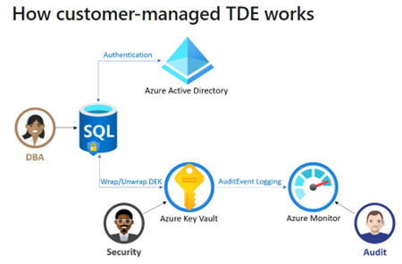

# Challenge 6: Enterprise Security - Coach's Guide 

[< Previous Solution](./Solution-05.md) - **[Home](./README.md)** - [Next Solution >](./Solution-07.md)

## Introduction
WWI leadership is happy with the progress of the migration thus far but wants to ensure that info security guard rails are implemented appropriately. Additionally, they want to further understand the art of possibility when it comes to enterprise data security involving the new Azure Synapse Analytics Platform. This will be done in the form of a stakeholder update at the end of the exercise.
## Description
The objective of this lab is to baseline an implementation of enterprise grade security controls and services for Azure Synapse SQL Pools.

Categories of security enablement are as follows:

- SQL Auditing
- Monitoring and alerting
- Vulnerability Assessment/Advanced Threat Protection
- Row/Column Level Security (i.e. Data Masking)
- Managed Identity
- Data Encryption

The intent is to not only to enable security features but also to understand what each layer of security provides to communicate this to WWI leadership.
## Coaches Notes
**SQL Auditing**

1. Using Azure Portal create a “Log Analytics Workspace” in the same resource group as previous challenges
1. Enable SQL Auditing via Azure Portal at the "Workspace" level and configure logs to be sent to the newly created Log Analytics Workspace. This ensures that all newly created and existing SQL Pools will inherit activation.
1. Verify Workspace Diagnostic Settings has been created and configured to send logs to the Log Analytics Workspace. You should see an auto generated diagnostic setting that was created by enabling SQL Auditing (SQLSecurityAuditEvents\_\*\*\*-\*\*\*-\*\*\*-\*\*\*\_\*).  Click on edit and take notice how there are multiple categories of logs available to send.  For this example, only “SQL Security Audit Event” needs to be enabled. 
1. Reference SQLAuditing.ksql script for the queries to run in the Log Analytics Kusto Query engine.  Please note that each student will need to manually generate these logs after SQL auditing is activated for queries to return results.  For example, for the SSMS query to return anything, a user must query the database from SSMS after SQL Auditing is activated.  Logging is usually propagated within 5 minutes of execution. 
1. Major benefits to discuss with students for SQL Auditing  
   1. **Retain** an audit trail of selected events. You can define categories of database actions to be audited.
   1. **Report** on database activity. You can use pre-configured reports and a dashboard to get started quickly with activity and event reporting.
   1. **Analyze** reports. You can find suspicious events, unusual activity, and trends.

**Monitoring and Alerting**

1. Using Azure Portal navigate to “Alerts” under Monitoring within the Synapse Workspace 
1. Create a new alert rule with the following settings 
   1. Scope – Synapse Workspace 
   1. Condition - Whenever the Total of Custom log search is greater than 5
      1. Search Query

        ``` //Count Failed logins by person 
            SQLSecurityAuditEvents 
            | where ActionName == 'DATABASE AUTHENTICATION FAILED'
            | where TimeGenerated >= ago(5m)
            | summarize failedlogin = count()
            by ServerPrincipalName 
        ```

   1. Measure – AggregatedValue 
   1. Aggregation Type – Average 
   1. Aggregation granularity – 5 minutes 
   1. Split by dimensions – ServerPrincipalName 
   1. Operator – Greater than
   1. Threshold Value – 5
   1. Frequency of evaluation – 5 minutes
1. Create Action Group
   1. Select appropriate Subscription, Resource Group and Region 
   1. Supply a unique name for Action Group 
   1. Supply a Display name for Action Group 
   1. Create a notification type “Email/SMS message/Push/Voice” with unique name and select both Email and SMS boxes.  Fill out desired email and phone number
1. Details 
   1. Severity - Critical 
   1. Alert rule name – unique name  
1. Review and Create 
1. After an alert has been created you can leverage SSMS to generate login failures to confirm email and text will be sent.  It may take 5-10 minutes before alerts will be sent after failures have been executed.  

**Vulnerability Assessment/Advanced Threat Protection**

1. Using Azure Portal navigate to “Microsoft Defender for Cloud” under Security pane within the Synapse Workspace SQL Pool 
1. Next to “Enablement Status” click the “Enabled at the workspace-level(Configure)” hyperlink 
1. Ensure Microsoft Defender for SQL is turned to On
1. Ensure Storage account is assigned for vulnerability assessment
1. Return to the Microsoft Defender for Cloud overview page for SQL Pool
1. Under “Security incidents and alerts” click on the hyper link “Check for alerts on this resource in Microsoft Defender for Cloud”
   1. Select “Sample Alerts” from the top 
   1. Select appropriate subscription 
   1. Select only “Azure SQL Databases” for Defender for Cloud plans 
   1. Create sample alerts
   1. Remove the filter for “Affected resource contains” and you should see the sample alerts
   1. Review and explore alerts 
   1. Change the status of each alert to “Resolved” 
1. This should generate a sample alert and email from Cloud Defender
1. Return to the Microsoft Defender for Cloud overview page for Dedicated SQL Pool
1. Under “Vulnerable assessment findings” click on the hyperlink “View additional findings in Vulnerability Assessment”
1. Execute initial scan to reveal potential findings (This may take a few minutes to complete)
1. Under “Findings” resolve all High severity entries 
   1. Add Principal “sqlauditadmin” to baseline and rerun scan to confirm resolution
1. Describe benefits of Vulnerability Assessment 
   1. SQL vulnerability assessment is a service that provides visibility into your security state. Vulnerability assessment includes actionable steps to resolve security issues and enhance your database security. It can help you to monitor a dynamic database environment where changes are difficult to track and improve your SQL security posture.  It highlights deviations from best practices, such as misconfigurations, excessive permissions, and unprotected sensitive data.
1. Describe benefits of Advanced Threat Protection 
   1. Advanced Threat Protection provides a new layer of security, which enables customers to detect and respond to potential threats as they occur by providing security alerts on anomalous activities. Users receive an alert upon suspicious database activities, potential vulnerabilities, and SQL injection attacks, as well as anomalous database access and queries patterns.  Advanced Threat Protection makes it simple to address potential threats to the database without the need to be a security expert or manage advanced security monitoring systems.

**Data masking and Row/Column Level Security** 

1. Row/Column Level Security 
   1. [SQL Reference Script](../Coach/Solutions/Challenge6/RowColumnSecurity.sql) 
1. Data Masking 
   1. Using Azure Portal navigate to “Dynamic Data Masking” under Security pane within the Synapse Workspace SQL Pool
   1. Click “Add mask”
      1. Schema – Fact 
      1. Table – Sale 
      1. Column – Tax Amount, Tax Rate, Total Excluding Tax and Total Including Tax 
      1. Masking field format – Default 
      1. Click Add and repeat for each of the columns 
   1. Verify users cannot see valid data for Tax related columns 

**Managed Identity** 

1. Using Azure Portal navigate to “Managed Identities” under Settings pane within the Azure Data Factory resource.
   1. Make note of Object ID and name of the ADF resource 
1. Create MSI user within the Synapse SQL Pool and apply appropriate permissions \
   ``` CREATE USER [“ADF Name”] FROM EXTERNAL PROVIDER; ```  
   ``` EXEC sp_addrolemember 'db_owner', 'ADF Name'; ```
  
1. New MSI user will need to be added to the row level security function in previous exercise or the row level security policy needs to be disabled for the MSI to see the data
   1. Turn off Policy \
     ```ALTER SECURITY POLICY GeoFilter WITH (STATE = OFF);```  

1. In Azure Data Factory create a new pipeline with a “Copy data” activity 
1. Configure Source to connect Azure Synapse SQL Pool table Fact.Sale 
   1. Create new Synapse Analytics Dataset for Fact.Sale
   1. Create Linked Service leveraging Authentication type “System Assigned Managed Identity”
      1. Ensure test connection is successful as expected 
   1. Verify Dataset is connected successfully by leveraging the “Preview data” option 
1. Configure Sink to connect to Azure Synapse SQL Pool and create a new table called Fact.SaleCopy 	
   1. Create new Synapse Analytics Dataset for Fact.SaleCopy
   1. Use the same Linked Service created for the Source configuration 
   1. Configure Sink Options
      1. Set “Table option” to “Auto create table”
      1. Set “Copy method” to “Bulk insert"
1. Execute ADF Pipeline
   1. Verify creation of Fact.SaleCopy and the corresponding data is available 

**Data Encryption**

1. Transparent Data Encryption Benefits 
   1. [Transparent data encryption (TDE)](https://docs.microsoft.com/en-us/sql/relational-databases/security/encryption/transparent-data-encryption) helps protect Azure SQL Database, Azure SQL Managed Instance, and Azure Synapse Analytics **against the threat of malicious offline activity by encrypting data at rest**. It performs **real-time encryption and decryption of the database**, associated backups, and transaction log files at rest without requiring changes to the application. By default, TDE is enabled for all newly deployed Azure SQL Databases and must be manually enabled for older databases of Azure SQL Database. 
1. Customer-managed transparent data encryption 
   1. Customer-managed TDE is also referred to as Bring Your Own Key (BYOK) support for TDE. In this scenario, the TDE Protector that encrypts the DEK is a customer-managed asymmetric key, which is stored in a customer-owned and managed Azure Key Vault (Azure's cloud-based external key management system) and never leaves the key vault. With TDE with Azure Key Vault integration, users can control key management tasks including key rotations, key vault permissions, key backups, and enable auditing/reporting on all TDE protectors using Azure Key Vault functionality. Key Vault provides central key management, leverages tightly monitored HSMs, and **enables separation of duties between management of keys and data to help meet compliance with security policies.**


