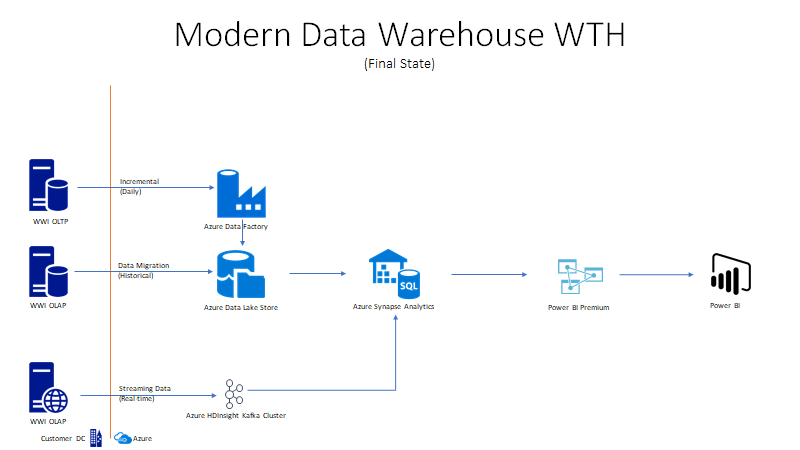

# What The Hack - This Old Data Warehouse  

## Introduction

Modern Data Warehouse is a key upgrade motion for organizations to scale out their on-premise analytical workloads to the cloud.  This hack will help data engineers and administrators upgrade their skills to migrate to Azure Synapse Analytics. The hack will be the sequential migration steps required to migrate from on-premise to Synapse Analytics and re-platform attached workloads like ETL and reporting.

The solution will require us to migrate the on-premise data warehouse to Azure Synapse Analytics.  In the first challenge, you will want to source data from the WWI OLTP sample database to **Azure Synapse Analytics**.  Data will be loaded from source to target thru the DailyETL packages (SSIS) found in the WWI importers sample database.  Secondly, a data lake  (**Azure Data Lake Store**) will be built out to be your staging area for future challenges to stage data prior to loading it into Azure Synapse. Third, the SSIS packages in Challenge 1 will be refactored into **Azure Data Factory** jobs to optimize the data loads and leverage the Data Lake as a staging area.  Next, clickstream data will be streamed into the Data Lake using **Azure Event Hub**.  This data will be stored in the lake and interactively queried via **Azure Databricks**.  Lastly, Power BI data model will be built out with a set of reports to streamline the performance.  You will work on how to optimize them via report design, data model tuning and Azure Synapse optimizaitons.

Below is a diagram of the solution architecture you will build in this hack. Please study this carefully, so you understand the whole of the solution as you are working on the various components.

## Learning Objectives

In this hack, data engineers will learn how to migrate their platform to the cloud (data, schema and code).  Additionally, they need to build out Data Warehouse architectures that can scale for large data volumes, different data structures and real-time ingestions.  Azure Synapse Analytics provides all these capabilities as an integrated platform and we'll help you better understand how to refactor your existing data warehouse to Azure.  
1. Modern Data Warehouse Architecture
1. Azure Synapse Decision Tree
1. Refactor T-SQL code to be compatible with Synapse
1. ETL/ELT design patterns and how to build them with ADF + ADLS
1. Setup a streaming data pipeline with Kafka
1. Tune Synapse for analytical workloads and design report for best performance
1. Setup Data Governance in Syanpase
1. Build Enterprise Security into your data warehouse

## Challenges

- Challenge 00: **[Setup](Student/Challenge-00.md)**
	 - Prepare your workstation to work with Azure.
- Challenge 01: **[Data Warehouse Migration](Student/Challenge-01.md)**
	 - Migrate EDW from SQL Server to Azure Synapse Analytics.  Lift & Shift ETL code to SSIS Runtime
- Challenge 02: **[Data Lake Integration](Student/Challenge-02.md)**
	 - Build out Staging tier in Azure Data Lake.  Architect Lake for different refinement layers (staging, cleansed and presentation tiers) with POSIX setup
- Challenge 03: **[Data Pipeline Migration](Student/Challenge-03.md)**
	 - Rewrite SSIS jobs from ETL data flow  to ADF as a ELT data flow.
- Challenge 04: **[Real-time Data pipeline](Student/Challenge-04.md)**
	 - Real-time data with Kafka and Databricks
- Challenge 05: **[Analytics Migration](Student/Challenge-05.md)**
	 - Migrate reporting into Azure
- Challenge 06: **[Enterprise Security](Student/Challenge-06.md)**
	 - Enterprise Security into Synapse Analytics
- Challenge 07: **[Unified Data Governance](Student/Challenge-07.md)**
	 - Data Governance integration into Synapse

## Prerequisites

- Your own Azure subscription with Owner access
- Visual Studio Code
- Azure CLI
- Download WorldWide Importers Database (OLTP & OLAP)

## Technologies

Azure services and related products
* Azure Synapse Analytics
* Azure Data Lake Storage Gen2 (ADLS)
* Azure Data Factory
* Azure Event Hubs
* Azure Databricks
* Power BI

## Learning Path for Modern Data Warehouse

- [Modern Data Warehouse](https://microsoft.github.io/PartnerResources/skilling/data-analytics-ai/modern-analytics-academy)

## Contributors

- Alex Karasek
- Jason Virtue
- Annie Xu
- Chris Mitchell
- Brian Hitney
- Israel Ekpo
- Osamu Hirayama
- Alan Kleinert
- Prashant Atri
