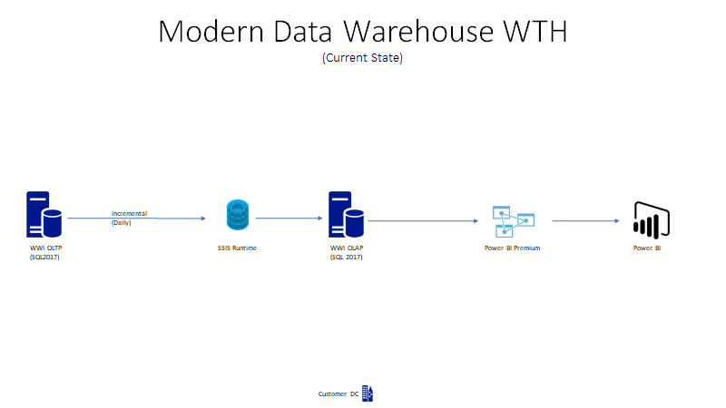

# Challenge 00 - Setup

**[Home](../README.md)** - [Next Challenge >](./Challenge-01.md)

## Introduction

The objective of this lab is to setup your on-premise data warehouse environment for the hack.  This will be your reference point for the migration.

## Common Prerequisites

We have compiled a list of common tools and software that will come in handy to complete most What The Hack Azure-based hacks!

You might not need all of them for the hack you are participating in. However, if you work with Azure on a regular basis, these are all things you should consider having in your toolbox.

- [Azure Subscription](../../000-HowToHack/WTH-Common-Prerequisites.md#azure-subscription)
- [Managing Cloud Resources](../../000-HowToHack/WTH-Common-Prerequisites.md#managing-cloud-resources)
  - [Azure Portal](../../000-HowToHack/WTH-Common-Prerequisites.md#azure-portal)
  - [Azure CLI](../../000-HowToHack/WTH-Common-Prerequisites.md#azure-cli)
  - [Azure Cloud Shell](../../000-HowToHack/WTH-Common-Prerequisites.md#azure-cloud-shell)
- [Visual Studio Code](../../000-HowToHack/WTH-Common-Prerequisites.md#visual-studio-code)
  - [VS Code plugin for ARM Templates](../../000-HowToHack/WTH-Common-Prerequisites.md#visual-studio-code-plugins-for-arm-templates)
- [Azure Storage Explorer](../../000-HowToHack/WTH-Common-Prerequisites.md#azure-storage-explorer)

## Student Resources
Your coach will provide you with a `Resources.zip` file that contains resource files you will use to complete some of the challenges for this hack.

You will use some of the files in this package on your local workstation. Other files will be used in the Azure Cloud Shell. We recommend you unpack a copy of the `Resources.zip` file in both locations.

The rest of the challenges will refer to the relative paths inside the `Resources.zip` file where you can find the various resources to complete the challenges.

## Description

### Setup your Development Environment on your Laptop

For your local PC, ensure the following tools are installed.
1. [SQL Server Management Studion (Version 18.x or higher)](https://docs.microsoft.com/en-us/sql/ssms/download-sql-server-management-studio-ssms?view=sql-server-ver15)
2. [Visual Studio Code](https://code.visualstudio.com/Download) 
3. [Power BI Desktop](https://www.microsoft.com/en-us/download/details.aspx?id=58494)

### Deploy Source Databases and Azure Resources

WWI runs their existing database platforms on-premise with SQL Server 2019.  There are two databases samples for WWI.  The first one is for their Line of Business application (OLTP) and the second is for their data warehouse (OLAP).  You will need to setup both environments as our starting point in the migration.

For this challenge, you will deploy the WWI databases and an initial set of Azure resources needed to complete the hack's challenges using a provided deployment script and ARM Template.  We **STRONGLY** recommend you complete this challenge using the Azure Cloud Shell.

You will find the provided deployment script (`hacksetup.sh`), ARM Template (`deployHack.json`), and parameters file (`deployHackParameters.json`) in the `/Challenge0/` folder of the `Resources.zip` file provided to your by your coach.

Navigate to wherever you have unpacked the `/Challenge0/` folder in your [Azure Cloud Shell](https://shell.azure.com) and complete the following steps:

1. Run the deployment script by running the following commands:
    ```bash
    # Make the file executable
    chmod +x hacksetup.sh
    # Run the script
    ./hacksetup.sh
    ```
    The script will prompt you for a resource name prefix, an Azure region location to deploy to, and a password value which will be used for the Azure SQL Database.  
    ```bash
    'Enter a resource name prefix:'
    'Enter an Azure region to deploy to (i.e. 'eastus','westus','northeurope'):'
    'Enter a password for the SQL Server:'
    ```
 
    - If using a shared subscription with other students, we recommend you include your initials in the resource name prefix to make it easy to identity in the Azure Portal.
    - For the Azure region location, you may use one of the defined locations such as: `'eastus'`, `'westus'`, `'northeurope'`, etc
    - The password should meet the [requirements for an Azure SQL Database password](https://learn.microsoft.com/en-us/sql/relational-databases/security/password-policy?view=azuresqldb-current).

    The script will deploy the following resources into Azure:
    - An Azure Container Instance with a SQL Server instance that has the WideWorldImporters and WideWorldImportersDW databases. 
      - These are the two LOB databases for this hack. Your coach will share the username and password for these databases at the start of Challenge 1.
    - Azure Data Factory
    - Azure SQL Database Instance & SSIS Runtime
    - SSIS environment in Azure Data Factory

1. Start your Azure Data Factory SSIS Runtime Service.  Go to [Connection pane](https://docs.microsoft.com/en-us/azure/data-factory/tutorial-deploy-ssis-packages-azure#connections-pane) in your Azure Data Factory service.  The startup time is approximately 5 minutes.

1. Review the database catalog on the data warehouse for familiarity of the schema [Reference document](https://docs.microsoft.com/en-us/sql/samples/wide-world-importers-dw-database-catalog?view=sql-server-ver15)

1. Review ETL workflow to understand the data flow and architecture [Reference document](https://docs.microsoft.com/en-us/sql/samples/wide-world-importers-perform-etl?view=sql-server-ver15)



## Success Criteria

- Confirm Azure Data Factory service started with no errors

## Learning Resources

- [Decision Tree for Analytics](../Coach/images/decisiontree.png)
- [DWU Units](https://docs.microsoft.com/en-us/azure/synapse-analytics/sql/resource-consumption-models)
- [Capacity Settings](https://docs.microsoft.com/en-us/azure/synapse-analytics/sql-data-warehouse/memory-concurrency-limits?context=%2Fazure%2Fsynapse-analytics%2Fcontext%2Fcontext#data-warehouse-capacity-settings)
- [Capacity Limits SQL Dedicated Pools](https://docs.microsoft.com/en-us/azure/synapse-analytics/sql-data-warehouse/sql-data-warehouse-service-capacity-limits?context=%2Fazure%2Fsynapse-analytics%2Fcontext%2Fcontext)
- [Synapse Analytics Best Practices & Field Guidance](https://github.com/microsoft/DataMigrationTeam/blob/master/Whitepapers/Azure%20Synapse%20DW%20%20Pool%20Best%20Practices%20%26%20Field%20Guidance.pdf)
- [Azure Synapse Analytics Migration Guides](https://docs.microsoft.com/en-us/azure/synapse-analytics/migration-guides/)
- [Reference Architecture for Lambda Big Data Platforms](https://github.com/microsoft/DataMigrationTeam/blob/master/Whitepapers/Reference%20Lambda%20Architecture%20for%20Big%20Data%20Platform%20in%20Azure.pdf)
