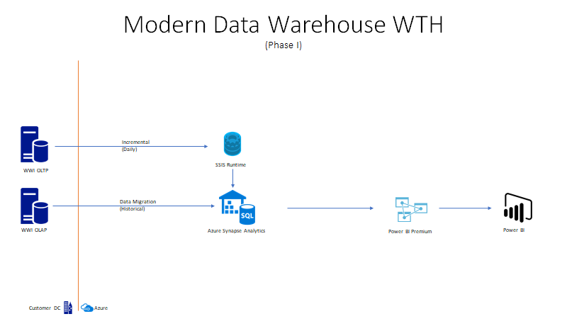

# Challenge 01 - Data Warehouse Migration

[< Previous Challenge](./Challenge-00.md) - **[Home](../README.md)** - [Next Challenge >](./Challenge-02.md)

## Introduction

WWI wants to modernize their data warehouse in phases.  The first stage will be to scale-out horizontally their existing data warehouse.  The data warehouse migration will be from their on-premise WWI Data Warehouse to Azure Synapse Analytics.  They like to reuse their existing ETL code and leave their source systems as-is (no migration).  This will require a hybrid architecture for on-premise OLTP and Azure Synapse Analytics as the end state.  This exercise will be showcasing how to migrate your traditional SQL Server (SMP) to Azure Synapse Analytics (MPP).

## Description

The objective of this challenge is to migrate the WWI DW (OLAP) to Azure Synapse Analytics.  Azure Synapse Analytics is a MPP (Massive Parallel Processing) platform that allows you to scale out your datawarehouse by adding new server nodes (compute) rather than adding more cores to the server.  

There will be four different object types we'll migrate:

* Database Schemas and Tables
* Database code (Stored Procedure, Function, Triggers, etc)
* SSIS code set refactor (Refactor has been done for you and not part of success criteria of this hack)
* Data migration (with SSIS)

Here are the steps to migrate from SQL Server to Synapse Analytics.
- Migrate all database schemas to Synapse
- Create one table per schema in Synapse
    - Tables to create are; Dimension.City, Fact.Order & Integration.Order_Staging
- Refactor one Stored Procedure per design pattern.  Parathensis contains recommended objects
    - Dimension Tables (Integration.MigratedCityData)
    - Fact Table (Appends Only; Integration.MigratedStagedSaleData)
    - Fact Table (Merge; Integration.MigratedStagedMovementData)
- Execute the T-SQL script, `Master Create.sql` in the `/Challenge01/` folder of the student `Resource.zip` package
    - This will create all remaining fact, dimension, integration tables and stored procedures
    - This will ensure you have the full enviornment setup and configured to peform a bulk load
- Run SSIS jobs based on new mappings
    - You can find the `Daily ETLMDWLC.ispac` SSIS package in the `/Challenge01/` folder of the student `Resource.zip` package
    - Review data setup instructions before you execute the SSIS jobs
    - Load data into Synapse Analytics
- Run Power BI Report (WWI_Sales.pbit)
    - You can find the `WWI_Sales.pbit` file in the `/Challenge01/` folder of the student `Resources.zip` package




## Success Criteria

- Compare your Power BI report results with the coach's screenshot to see if your results match.  This will confirm you completed the migration successfully.

## Learning Resources

### Overall Migration
- [SQL Server Database to Azure Synapse Analytics - Data Migration Guide](https://docs.microsoft.com/en-us/azure/synapse-analytics/migration-guides/migrate-to-synapse-analytics-guide)

### Database Schema Migration
- [Azure Synapse Analytics SQL Architecture](https://docs.microsoft.com/en-us/azure/synapse-analytics/sql/overview-architecture)
- [Distributed Tables](https://docs.microsoft.com/en-us/azure/synapse-analytics/sql-data-warehouse/sql-data-warehouse-tables-distribute?context=%2Fazure%2Fsynapse-analytics%2Fcontext%2Fcontext)
- [Distribution Keys](https://docs.microsoft.com/en-us/azure/synapse-analytics/sql/develop-tables-overview) 
- [Distribution Key Cheat Sheet](https://docs.microsoft.com/en-us/azure/synapse-analytics/sql-data-warehouse/cheat-sheet#distributed-or-replicated-tables)
- [Data Types](https://docs.microsoft.com/en-us/azure/synapse-analytics/sql/develop-tables-data-types#unsupported-data-types)  A list of unsupported data types at this link.
- [Table Constraints](https://docs.microsoft.com/en-us/azure/synapse-analytics/sql-data-warehouse/sql-data-warehouse-table-constraints?context=%2Fazure%2Fsynapse-analytics%2Fcontext%2Fcontext)
- [Unsupported Table Features](https://docs.microsoft.com/en-us/azure/synapse-analytics/sql/develop-tables-overview#unsupported-table-features)
- [Create Table Syntax](https://docs.microsoft.com/en-us/sql/t-sql/statements/create-table-azure-sql-data-warehouse?view%253Daps-pdw-2016-au7=&view=aps-pdw-2016-au7)
- [Identity Column](https://docs.microsoft.com/en-us/azure/synapse-analytics/sql-data-warehouse/sql-data-warehouse-tables-identity?context=%2Fazure%2Fsynapse-analytics%2Fcontext%2Fcontext)
- [Design Consideration for Synapse Analytics](https://medium.com/analytics-vidhya/azure-synapse-analytics-key-considerations-while-building-your-data-warehouse-a54ad1804139)

### Database code rewrite (T-SQL)
- [Common table Expression (WITH)](https://docs.microsoft.com/en-us/sql/t-sql/queries/with-common-table-expression-transact-sql?view=azure-sqldw-latest#features-and-limitations-of-common-table-expressions-in--and-9)
- [SQL Differences in T-SQL](https://docs.microsoft.com/en-us/azure/synapse-analytics/sql-data-warehouse/sql-data-warehouse-troubleshoot#differences-from-sql-database)
- [Merge Statement](https://docs.microsoft.com/en-us/sql/t-sql/statements/merge-transact-sql?view=azure-sqldw-latest)
- [T-SQL Reference Doc](https://docs.microsoft.com/en-us/azure/synapse-analytics/sql/overview-features)
- [T-SQL Supported in Synapse Analytics](https://docs.microsoft.com/en-us/azure/synapse-analytics/sql-data-warehouse/sql-data-warehouse-reference-tsql-statements?context=%2Fazure%2Fsynapse-analytics%2Fcontext%2Fcontext)

### SSIS Job
- [Provision SSIS Runtime in Azure Data Factory](https://docs.microsoft.com/en-us/azure/data-factory/tutorial-deploy-ssis-packages-azure)
- [Deploy SSIS Package into SSIS Catalog](https://docs.microsoft.com/en-us/sql/integration-services/lift-shift/ssis-azure-deploy-run-monitor-tutorial?view=sql-server-ver15)
- [Execute SSIS package in Azure Data Factory pipeline ](https://docs.microsoft.com/en-us/azure/data-factory/how-to-invoke-ssis-package-ssis-activity?tabs=data-factory)
- [Documentation to assess compatibility of SSIS packages developed on SQL Server and migrated to Azure Data Factory](https://docs.microsoft.com/en-us/azure/data-factory/scenario-ssis-migration-overview#assessment)

## Tips

- Connect to SQL Server 2019 databases in the containers with Azure Data Studio
- Determine your distribution column (HINT IDENTITY Column can not be your distribution key)
- Run this query to identify which columns are not supported by Azure Synapse Analytics
	```
	SELECT  t.[name], c.[name], c.[system_type_id], c.[user_type_id], y.[is_user_defined], y.[name]
		FROM sys.tables  t
		JOIN sys.columns c on t.[object_id]    = c.[object_id]
		JOIN sys.types   y on c.[user_type_id] = y.[user_type_id]
		WHERE y.[name] IN ('geography','geometry','hierarchyid','image','text','ntext','sql_variant','timestamp','xml')
		OR  y.[is_user_defined] = 1;
	```
- Review the SSIS jobs that are at this [Github repo](https://github.com/Microsoft/sql-server-samples/releases/tag/wide-world-importers-v1.0) (Daily.ETL.ispac)  This job leverages stored procedures in the Source and Target databases extensively.  This will require a refactoring of the Stored procedures for the OLAP database when you repoint the ETL target to Azure Synapse Analytics.
- Current package in repo is setup for SQL Server 2019 which means you can run it thru Azure Data Factory. Here are [instructions](https://docs.microsoft.com/en-us/sql/integration-services/lift-shift/ssis-azure-deploy-run-monitor-tutorial?view=sql-server-ver15#deploy-a-project-with-the-deployment-wizard) to deploy the SSIS pakcage on in the SSIS Catalog.
- Create ADF pipeline with Execute SSIS Package activity. [ADF Activity](https://docs.microsoft.com/en-us/azure/data-factory/how-to-invoke-ssis-package-ssis-activity?tabs=data-factory#create-a-pipeline-with-an-execute-ssis-package-activity)
- Update [connection settings](https://docs.microsoft.com/en-us/azure/data-factory/how-to-invoke-ssis-package-ssis-activity?tabs=data-factory#connection-managers-tab) in package.
- **For the first time setup only**, you will need to execute the "Master Create.sql" script to populate all control tables before you execute the SSIS job.  This is required and it is only done on the initial setup.  After this is complete, you can run the SSIS job.  **For all subsequent runs after the initial setup**, execute the Reseed ETL Stored Procedure only.  This stored procedure will rollback the database to it's original state.**
- Execute this package to load data into Azure Synapse Analytics. [SSIS Execution](https://docs.microsoft.com/en-us/azure/data-factory/how-to-invoke-ssis-package-ssis-activity?tabs=data-factory#run-the-pipeline)

## Advanced Challenges (Optional)

Too comfortable?  Eager to do more?  Try these additional challenges!

- Setup Virtual Machine to use Self-hosted runtime with proxy in SSIS job.  [Read instructions](https://docs.microsoft.com/en-us/azure/data-factory/self-hosted-integration-runtime-proxy-ssis)
- [Generate new data and load into Synapase](https://docs.microsoft.com/en-us/sql/samples/wide-world-importers-generate-data?view=sql-server-ver15)
