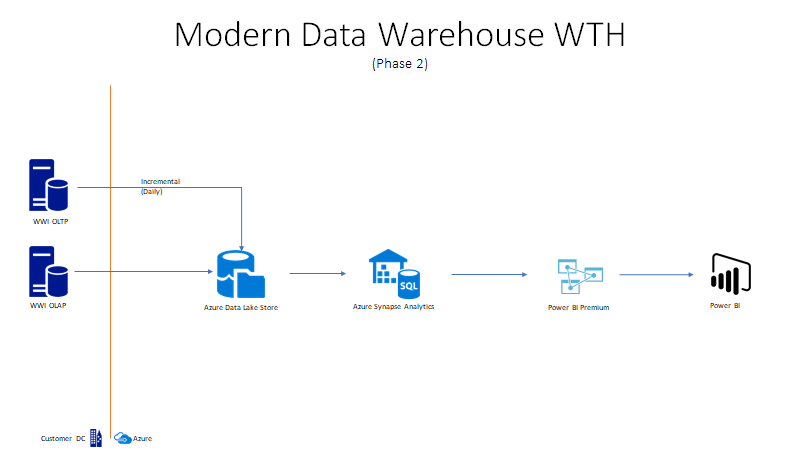

# Challenge 02 - Data Lake Integration

[< Previous Challenge](./Challenge-01.md) - **[Home](../README.md)** - [Next Challenge >](./Challenge-03.md)

## Introduction

WWI importers realize they need to further modernize their data warehouse and wants to proceed to the second stage.  They are starting to reach capacity constraints on their data warehouse and need to offload data files from the relational database.  Likewise, they are receiving more data in json and csv file formats.  They've been discussing re-engineering their data warehouse to accommodate larger data sets, semi-structured data and real-time ingestion of data.  They would like to conduct a POC on the Data Lake and see how to best to design it for integration into the Data Warehouse.  

For this challenge, WWI wants us to build out the data lake and show how to load data into the lake from an on-premise data source. 

## Description

The objective of this challenge is to build a Data Lake with Synapse Analytics or Azure Data Lake Store (ADLS) Gen 2.  The Data Lake will be a staging area where all our source system data files reside. We need to ensure this Data Lake is well organized and doesn't turn into a swamp. This challenge will help us organize the folder structure and setup security to prevent unauthorized access.  Lastly, we will extract data from the WWI OLTP platform and store it in the Data Lake.  

The OLTP platform is on-premise so you will need to build a hybrid architecture to integrate it into Azure.  Keep in mind that the pipeline that you build will become the EXTRACT portion of the new E-L-T process. The first requirement is to build a functional POC that is able to move a single dataset to the new ADLS Gen 2 data lake. Ideally, it would be nice to make the process table driven so that new pipelines do not need to be created for each additional table that needs to be copied. (Optional, sharing to give insights on end-state.)



### Setup Source Database for Incremental Load
Prior to starting this challenge, you should ensure that there are changes in the City data captured from Wide World Importers OLTP Database.  Execute the scripts below to insert/change data in the source, and update necessary configuration values.

- Execute queries below in the Wide World Importers Database to update 10 existing records and insert 1 new record. Go to the `Resource.zip` file and open the `/Challenge02/` folder and look for the T-SQL script `generateCityData.sql`.  The code snippet is for display purposes and recommend to use the T-SQL script for execution.

	```
		UPDATE T
		SET [LatestRecordedPopulation] = LatestRecordedPopulation + 1000
		FROM (SELECT TOP 10 * from [Application].[Cities]) T

		INSERT INTO [Application].[Cities]
		    (
		    [CityName]
		    ,[StateProvinceID]
		    ,[Location]
		    ,[LatestRecordedPopulation]
		    ,[LastEditedBy]
		    )
		VALUES
		(
			    'NewCity' + CONVERT(char(19), getdate(), 121)
		    ,1
		    ,NULL
		    , 1000
		    ,1
		    )
		;
	```


- Modify the [Integration].[GetCityUpdates] stored procedure in the same OLTP database to remove the Location field from the result set returned.  Go to the `Resource.zip` file and open the `/Challenge02/` folder and look for the T-SQL script `GetCityUpdates.sql`.  The code snippet is for display purposes and recommend to use the T-SQL script for execution.

	```
		SELECT [WWI City ID], City, [State Province], Country, Continent, [Sales Territory],
			   Region, Subregion,

				    -- [Location] geography,                       -->Remove due to data type compatibility issues

				[Latest Recorded Population], [Valid From],
			[Valid To]
		FROM #CityChanges
		ORDER BY [Valid From];
	```

- Here is the query you will execute in the Azure Synapse SQL Pool to update the parameter used as the upper bound for the ELT process.  Go to the `Resource.zip` file and open the `/Challenge02/` folder and look for the T-SQL script `UpdateLoadControl.sql`.  The code snippet is for display purposes and recommend to use the T-SQL script for execution.

	```
		UPDATE INTEGRATION.LOAD_CONTROL
		SET LOAD_DATE = getdate()
	```
- Review data pipeline and execute it after coach approves
    <br>**Note: you can execute your new pipeline by clicking the "Debug" button or adding a trigger from the UI designer.**


## Success Criteria

- Share screen shot of directory structure with coach from Synapse Analytics workspace
- Validate there are 11 updated records from the City table in the Incremental Landing folder of your data lake.
- Validate if you can not open the city text file as an unauthorized user to show proper security setup in your new data lake storage

## Learning Resources

- [Begin by creating a new Azure Storage account](https://docs.microsoft.com/en-us/azure/storage/common/storage-account-create?toc=%2Fazure%2Fstorage%2Fblobs%2Ftoc.json&tabs=azure-portal).
- [Data Lake Storage Best Practices](https://docs.microsoft.com/en-us/azure/storage/blobs/data-lake-storage-best-practices)
- [Azure Data Factory Copy Activity](https://docs.microsoft.com/en-us/azure/data-factory/copy-activity-overview)
- [Copy data from local on-premise SQL Server into cloud storage](https://docs.microsoft.com/en-us/azure/data-factory/tutorial-hybrid-copy-portal)
- [Incremental Loads Design Pattern in Azure Data Factory](https://docs.microsoft.com/en-us/azure/data-factory/tutorial-incremental-copy-multiple-tables-portal)
- [Service Principal in Data Factory](https://docs.microsoft.com/en-us/azure/data-factory/data-factory-service-identity)
- [Access Control in Azure Data Lake Storage](https://docs.microsoft.com/en-us/azure/storage/blobs/data-lake-storage-access-control)
- [Data Lake Planning](https://www.sqlchick.com/entries/2016/7/31/data-lake-use-cases-and-planning)
- [Naming Conventions](https://www.sqlchick.com/entries/2019/1/20/faqs-about-organizing-a-data-lake)

## Tips

- Things to consider when creating new data lake storage account:
    - What type of storage account should you leverage? (Gen 1 or Gen2)
    - How can you setup a hierarchical folder structure? Why?
    - What are your SLAs for data retrievals?  (Access Tier)
- Things to consider when creating new data lake folder structure:
    - What types of data will you need to be able to support?
    - What types of processes will you need to be able to support?
        - Incremental Landing zone for Source system extracts (Sinks)
        - Historical landing zone for raw data and ETL loads
        - Staged data for data cleansing and transformation before loads into DW
        - Curated Data for end-users to leverage for analysis
    - How will you secure access to directories?
        - ETL jobs should only have access to landing zone for incremental data from source system
        - Grant a data scientist (any user) access to query raw data thru AAD credentials
- In addition to using the azure portal directly, you can view and manage your new storage account using the [Azure Storage Explorer](https://azure.microsoft.com/en-us/features/storage-explorer/) 
- Be sure to review the [Integration].[ETL Cutoff] and [Integration].[Load Control] tables in your Synapse SQL Pool prior to executing this task.  If dates are not set correctly, the source stored procedure will not return any data.
- Create a pipeline to copy data into ADLS.  Your pipeline will need the following components:
    - Lookup Activity that queries the [Integration].[ETL Cutoff Table] in your Synapse DW to get the last refresh date for the City data. This result will be used as the @LastCutoff parameter in your copy activity.  The LastCutoff is similar to your Start Date in a range query.
    - Lookup activity that queries [Integration].[Load Control] table in your Synapse DW to get the current refresh date. This result will be used as the @NewCutoff parameter in your copy activity. The NewCutoff is similar to your End Date in a range query.
    - Copy Data activity that uses the [Integration].[GetCityUpdates] stored procedure in your WideWorldImporters OLTP database as your source, and the Incremental Landing Zone directory as the sink 
    <br>**Note: You will need to modify this stored procedure to ensure that the [Location] field is excluded from the results.  Otherwise this data will cause errors due to incompatibility with Azure Synapse Pipelines**
- Additional information on using Lookup Tasks and expressions in Azure Data Factory can be found [here](https://www.cathrinewilhelmsen.net/2019/12/23/lookups-azure-data-factory/)
- Synapse Analytics Workspace is available to leverage and might be a good way to simplify setup.

## Advanced Challenges (Optional)

Too comfortable?  Eager to do more?  Try these additional challenges!

- Parameterize the source and sink properties in your pipeline where possible so that you can re-use the same pipeline for all additional tables being copied
- Develop an incremental load pattern for each copy activity to extract the data from the source table.  This will prevent us from doing a full load each night and large load times.
- [Deploy Azure Databricks workspace, mount your new storage and enable interactive queries and analytics!](https://docs.microsoft.com/en-us/azure/azure-databricks/databricks-extract-load-sql-data-warehouse?toc=/azure/databricks/toc.json&bc=/azure/databricks/breadcrumb/toc.json)
