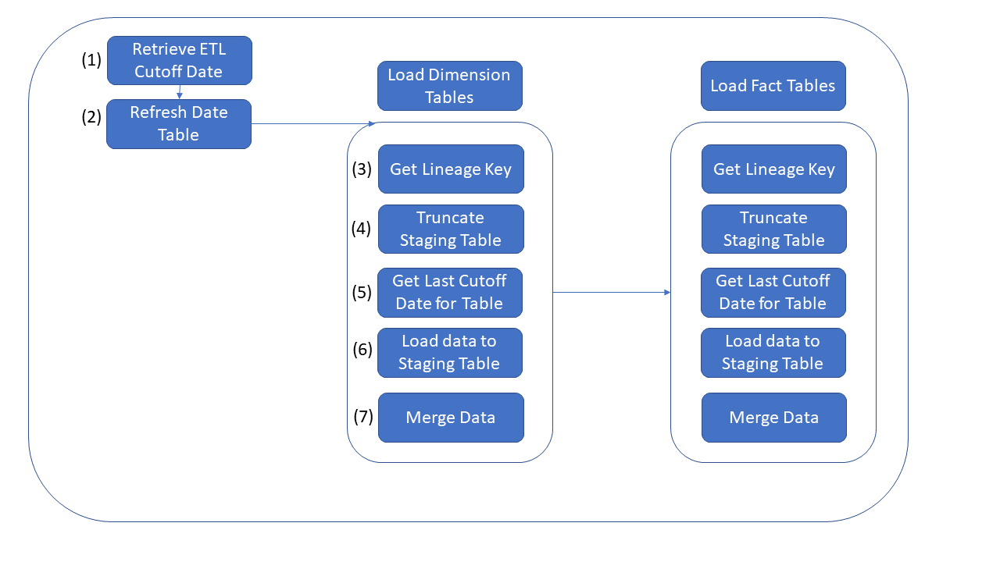

# Challenge 03 - Data Pipeline Migration

[< Previous Challenge](./Challenge-02.md) - **[Home](../README.md)** - [Next Challenge >](./Challenge-04.md)

## Introduction

WW Importers keep missing the SLAs for their nightly data load process.  The loads take six hours to complete and start each evening at 1:00AM.  They must complete by 8:00AM but frequenly these jobs are taking longer than planned.  In addition a few critical stakeholders are asking to provide the data even more frequently.  Since these business units are the key stakeholders, they have the funding to help replatform the data pipelines.  

WW Importers realizes they need to leverage their new Data Lake to scale and load this into their Data Warehouse for Stage 3.  These data pipelines must be ELT (Extract, Load & Transform) so they can quickly write the data to the cloud and scale out the compute to transform the data.

## Description

The objective of this lab is to modernize the ETL pipeline that was originally built in SSIS.  A detailed diagram of the current workflow is included below.  We need to rebuild this pipeline in Azure leveraging scale-out architecture to transform this data.  The data flow will include steps to extract the data from the OLTP platform, store it in the Azure Data Lake and bulk ingest it into Azure Synapase Analytics.  This will be run on a nightly basis, and will need to leverage Azure Data Factory or Synapse Pipelines as a job orchestration and scheduling tool.

**Below is a summary of each of the tasks in the existing SSIS package.  Note that we will be able to re-use the existing scripts for all of these tasks except for step 6.**

1. The first step of the pipeline is to retrieve the “ETL Cutoff Date”. This date can be found in the [Integration].[Load_Control] in Azure Synapse SQL Pool that should have been created as part of challenge 1 (This step should have already been recreated in Challenge 2)
1. The next step ensures that the [Dimension].[Date] table is current by executing the [Integration].[PopulateDateDimensionForYear] in Synapse SQL Pool
1. Next the [Integration].[GetLineageKey] procedure is executed to create a record for each activity in the [Integration].[Lineage Key] table
1. This step Truncates the [Integration].[[Table]_Staging] tables to prep them for new data
1. This step retrieves the cutoff date for the last successful load of each table from the [Integration].[ETL Cutoffs] Table
1. New data is now read from the OLTP source (using [Integration].[Get[Table]Updates] procedures) and copied into the [Integration].[[Table]_Staging] tables in the target DW
1. Finally the staged data is merged into the [Dimension] and [Fact] tables in the target DW by executing the [Integration].[MigrateStaged[Table]] stored procedures in the target DW
    - **NOTE: As part of this step, surrogate keys are generated for new attributes in Dimension tables (tables in the [Dimension] schema), so Dimenion tables must be loaded before FACT tables to maintain data integrity**

**NOTE:** This challenge is intended to build upon the previous 2 challenges, and you should try to reuse content wherever possible

**Create a data pipeline for the [Dimension].[City] table considering logic above.  See Tips for Hints**

## Success Criteria

- Confirm 11 new records loaded into the City data file have been loaded into the [Dimension].[City] table in the Azure Synapse Analytics.  

## Learning Resources

- [Load data into DW via Polybase](https://learn.microsoft.com/en-us/azure/synapse-analytics/sql-data-warehouse/load-data-from-azure-blob-storage-using-copy?context=%2Fazure%2Fsynapse-analytics%2Fcontext%2Fcontext)
- [Incrementally load multiple tables in Azure Data Factory](https://docs.microsoft.com/en-us/azure/data-factory/tutorial-incremental-copy-multiple-tables-portal)
- [Azure Data Factory Copy Activity](https://docs.microsoft.com/en-us/azure/data-factory/copy-activity-overview)

## Tips

- Optimize where possible by using dynamic code, and executing tasks in parallel.
- Additional information on using Lookup Tasks and expressions in Azure Data Factory can be found [here](https://www.cathrinewilhelmsen.net/2019/12/23/lookups-azure-data-factory/)
- There are multiple ways to load data via Polybase.  You could potentially use:
    - ["CTAS" with "External Tables"](https://docs.microsoft.com/en-us/sql/t-sql/statements/create-table-as-select-azure-sql-data-warehouse?toc=/azure/synapse-analytics/sql-data-warehouse/toc.json&bc=/azure/synapse-analytics/sql-data-warehouse/breadcrumb/toc.json&view=azure-sqldw-latest)
    - ["Copy Command"](https://docs.microsoft.com/en-us/sql/t-sql/statements/copy-into-transact-sql?view=azure-sqldw-latest) in Azure Synapse Analytics or 
    - [Copy Data task in Azure Data Factory](https://docs.microsoft.com/en-us/azure/data-factory/connector-azure-sql-data-warehouse)
    - Go to `Resources.zip` package and open the `Challenge03` folder and execute the T-SQL script `prepExternalDataSource.sql` for a sample to load data via Polybase.
- Add a new activity to your Synapse Pipeline to load data from the new Azure Data Lake into the [Integration].[City_Staging] in the Data Warehouse in Azure Synapse via Polybase (this will correlate to Step 6 in existing package described above). **Note: Be sure that table exists and is empty prior to loading**.  Review the sample T-SQL scripts `[proc_Integration.Ingest@@@Data]` in the `Resources.zip` package in the `Challenge03` folder . There is a script for each table and for this challenge only run City script.
- Add an activity to execute Create Lineage Key stored procedure so that the process can be logged (this will correlate to Step 3 in existing SSIS package described above).  Execute T-SQL script `proc_Integration.CreateLineageKey.sql` in the `Resources.zip` file provided by coach in the `Challenge03` folder.  This script will insert latest run times into load control table.
- Create another activity to merge the new data into the target table ([Dimension].[City]) from your staging table [Integration].[City_Staging] via existing stored procedure  (this correlates to Step 7 in existing SSIS package described above). For MERGE process, you should reuse or replicate logic found in the Integration.MigratedStaged____Data stored procedures
- Add another new activity to move the files to the .\RAW\WWIDB\[TABLE]\{YY}\{MM}\{DD}\ directory in your data lake once they have been loaded into your DW table (this is a new task that will allow your data to be persisted in your new data lake for further exploration and integration into downstream systems)

## Advanced Challenges (Optional)

Too comfortable?  Eager to do more?  Try these additional challenges!

- Enhance the pipeline so that it can be used to load all tables.  Steps required for this would include:
    - Update Azure Data Factory to use expressions and parameters wherever possible. Review. T-SQL script, `GetUpdates_wrapper.sql` in the `Resources.zip` file under the `Challenge03` folder for guidance.
    - Add a ForEach Loop to iterate through all tables and execute your pipeline for each one (note: Dimensions need to be loaded prior to Facts). Review T-SQL script, `PopulateETLCutoff.sql` in the `Resources.zip` file under folder `Challenge03` to learn the load dependencies in the ETL job.
- Leverage [partition switching](https://docs.microsoft.com/en-us/azure/synapse-analytics/sql-data-warehouse/sql-data-warehouse-tables-partition?toc=/azure/synapse-analytics/toc.json&bc=/azure/synapse-analytics/breadcrumb/toc.json#partition-switching) for tables with large-scale modifications (UPDATES)
- Refactor the T-SQL code in Polybase to leverage Python or Scala
- Build out these data pipelines using Azure Mapping Data Flows
