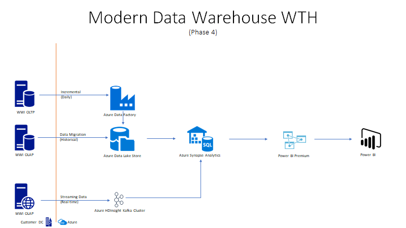

# Challenge 04 - Real-time Data Pipelines

[< Previous Challenge](./Challenge-03.md) - **[Home](../README.md)** - [Next Challenge >](./Challenge-05.md)

## Introduction

Worldwide importers wanted to build out their data warehouse to include clickstream data.  There are a number of online stores that the marketing department wants to track for campaign and online ads.  These marketing users want to monitor the clickstream data and have the ability to run exploratory data analysis to support ad-hoc research.  This data needs to be in real-time so the campaigns and ads are timely based on user activity in the online stores.

## Description

Build a streaming pipeline to ingest simulated click stream data into enterprise Delta Lake.



### Data Source: 
In order to generate the source data stream for this exercise, you will need to execute sample the .Net application ([Stream Generator](https://github.com/alexkarasek/ClickStreamGenerator)).  This code will randomly generate product related data, and write it to an Azure Event Hub.

**NOTE:** You can start the stream of data by executing script below in Azure Cloud Shell:

``` 
az container create -g [Resource Group Name] --name [container name] --image
whatthehackmsft/wwiclickstreamgenerator:1 --environment-variables 'hostName'='[EH Host Name]'
'sasKeyName'='RootManageSharedAccessKey' 'sasKeyValue'='[SAS Key]' 'eventHubName'='[Event Hub Name]' 
```

### Data Sink:
Azure Databricks will run a data pipeline from Event Hubs to Delta Lake tables stored in Azure Data Lake.  There is a Scala script to run in an Azure Databricks notebook that will stream data from source to sink.  Go to the `Resources.zip` file and open the `/Challenge04/` folder and import `StreamToDelta.dbc` script into Azure Databricks.  

## Success Criteria

- Validate notebook ran successfully by confirming no errors in any cells and query is polling data at regular intervals.

## Learning Resources

- [Event Hub Quickstart](https://docs.microsoft.com/en-us/azure/event-hubs/event-hubs-create)
- [Stream Generator](https://github.com/alexkarasek/ClickStreamGenerator)
- [Azure Databricks & Kafka Enabled Event Hubs](https://techblog.fexcofts.com/2019/01/17/azure-databricks-kafka-enabled-event-hubs/)
- [Ingest and process real-time data streams with Azure Synapse Analytics](https://www.mssqltips.com/sqlservertip/6748/real-time-data-streams-azure-synapse-analytics/)

## Tips

- In order to publish data to and consume data from Event Hubs, you will need to generate a shared access policy, and use this key and the host name of the namespace in your connection string.  These values will be needed on the consumer side of your Event hub.
- Deploy new Event Hub in Azure
- Setup and configure data source
- Start Data Stream
- Ingest data stream

## Advanced Challenges (Optional)

Too comfortable?  Eager to do more?  Try these additional challenges!

- Setup external table in Azure Synapse Analytics
- Create Power BI report to use clickstream data
- Create an Azure Stream Analytics job to process streaming data and write to Data Lake and/or Azure Synapse Analytics SQL Pool directly
