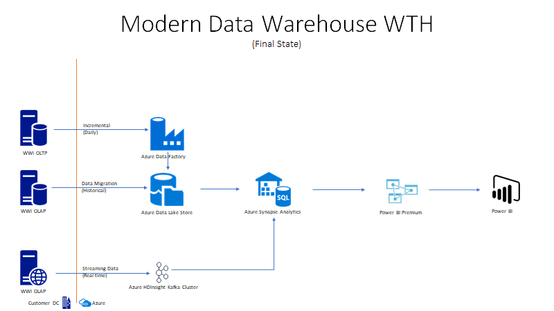

# Welcome to the Modern Data Warehouse WTH!

This is a challenge-based hack. It's NOT step-by-step. Don't worry, you will do great whatever your level of experience! Modern Data Warehouse is a key upgrade motion for organizations to scale out their on-premise analytical workloads to the cloud.  This hack will help data engineers and administrators upgrade their skills to migrate to Azure Synapse Analytics. The hack will be the sequential migration steps required to migrate from on-premise to Synapse Analytics and re-platform attached workloads like ETL and reporting.  The total duration time will be 3 days.

## **Introduction**

The solution will require us to migrate the on-premise data warehouse to Azure Synapse Analytics.  In the first challenge, you will want to source data from the WWI OLTP sample database to **Azure Synapse Analytics**.  Data will be loaded from source to target thru the DailyETL packages (SSIS) found in the WWI importers sample database.  Secondly, a data lake  (**Azure Data Lake Store**) will be built out to be your staging area for future challenges to stage data prior to loading it into Azure Synapse. Third, the SSIS packages in Challenge 1 will be refactored into **Azure Data Factory** jobs to optimize the data loads and leverage the Data Lake as a staging area.  Next, clickstream data will be streamed into the Data Lake using **Azure HDInsight Kafka Cluster**.  This data will be stored in the lake and interactively queried via **Azure Databricks**.  Lastly, Power BI data model will be built out with a set of reports to streamline the performance.  You will work on how to optimize them via report design, data model tuning and Azure Synapse optimizaitons.

## **Solution architecture**

Below is a diagram of the solution architecture you will build in this hack. Please study this carefully, so you understand the whole of the solution as you are working on the various components.

## Technologies

Azure services and related products
* Azure Synapse Analytics
* Azure Data Lake Storage Gen2 (ADLS)
* Azure Data Factory
* Azure HDInsight Kafka Cluster
* Azure Databricks
* Power BI

## Challenges
0.	[Setup](./Challenges/Challenge0/readme.md)
1.  [Data Warehouse Migration](./Challenges/Challenge1/readme.md)
2.  [Data Lake Integration](./Challenges/Challenge2/README.md)
3.  [Data Pipeline Migration](./Challenges/Challenge3/README.md)
4.  [Real-time Data pipeline](./Challenges/Challenge4/README.md)
5.  [Analytics migration](./Challenges/Challenge5/README.md)

## Optional Challenges
1. Setup incremental loads in SSIS jobs
1. Deploy job into ADF SSIS Runtime and Catalog
1. [Generate new data and load into Synapase](https://docs.microsoft.com/en-us/sql/samples/wide-world-importers-generate-data?view=sql-server-ver15)
1. [Deploy Azure Databricks workspace, mount your new storage and enable interactive queries and analytics!](https://docs.microsoft.com/en-us/azure/azure-databricks/databricks-extract-load-sql-data-warehouse?toc=/azure/databricks/toc.json&bc=/azure/databricks/breadcrumb/toc.json)
1. Refactor the T-SQL code in Polybase to leverage Python or Scala
1. Build out these data pipelines using Azure Mapping Data Flows
1. Setup external table in Azure Synapse Analytics
1. Create Power BI report to use clickstream data
1. Recreate this pipeline using Synapse Spark Pool