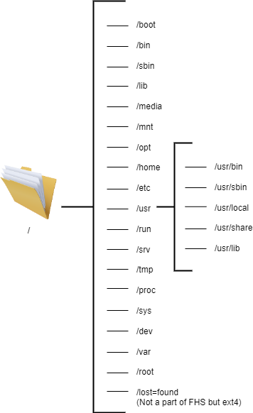

# The Filesystem Hierarchy Standard

Nearly all Linux distributions are compliant with a universal standard for filesystem directory structure known as the Filesystem Hierarchy Standard (FHS). The FHS defines a set of directories, each of which serve their own special function.

The forward slash (```/```) is used to indicate the root directory in the filesystem hierarchy defined by the FHS.

When a user logs in to the shell, they are brought to their own user directory, stored within ```/home/```. This is referred to as the user’s home directory. The FHS defines ```/home/``` as containing the home directories for regular users.

The root user has its own home directory specified by the FHS: ```/root/```. Note that ```/``` is referred to as the “root directory”, and that it is different from ```root/```, which is stored within ```/```.

Because the FHS is the default filesystem layout on Linux machines, and each directory within it is included to serve a specific purpose, it simplifies the process of organizing files by their function.

## FHS Structure



### **/ (root)**

* This is the beginning of the Linux filesystem hierarchy. All the file paths originate from root. The directories listed above or symbolic links to those directories are required in / otherwise, the file structure isn’t FSH compliant.

### **/boot**

* This directory contains all the files necessary for the system to boot up
* This includes the kernel files, initrd, initramfs, bootloader etc.

### **/bin**

 * Stores essential command binaries which can be used by both system administrator and user such as cat,ls,mv,ps,mount etc.
* These commands are used to boot up a system (access boot files, mount drives) and can be used while repairing a system when the binaries in /usr aren’t available

### **/sbin**

* Just like /bin, /sbin also contains essential system binaries. However these binaries are only meant to be used by a system administrator rather than a normal user.
* These binaries are mostly used for device management. For example, fdisk, fsck, mkfs, ifconfig, reboot.

### **/lib**

* Libraries are standard code files that define the commands used in a programming language. During compilation, a compiler looks up these libraries to make sense of the code just as we might look up a dictionary to understand the meaning of words while reading a book.
* This directory contains all the libraries needed to boot up the system and for commands in /bin and /sbin to run.
* This also contains kernel modules which control a lot of your hardware and device functioning
* A lot of times, there are different 32 bit and 64 bit libraries with the same name. To avoid any collusion, these binaries are kept in two separate directories accordingly named /lib32 and /lib64.

### **/media**

* This directory contains several sub-directories where the system mounts removable devices such as usb drives.

### **/mnt**

* This directory can be used by an user to manually mount a device. (as opposed to /media which is only used by the system)
* The current convention among users is making a separate subdirectory under /mnt and mounting the device in that subdirectory, while the older tradition is mounting the device directly in /mnt.

### **/opt**

* /opt contains libraries and binaries related to packages which are not installed by your system’s package managers but are installed through third party means like using Discord’s in-application update button.
* /opt is a less popular alternative of /usr/local . It is the vendor who decided where the libraries and binaries go but usually more monolithic and proprietary softwares like zoom use /opt.

### **/home**

* Home contains all the personal user specific files. It contains separate directories for each user which can be accessed by cd /home/username
* This is where you do most of your work. All the downloads, pictures, music etc on your system are in /home.
* The user specific configuration file for each application can be found in /home/[username]/.conf
* You can go to any users home directory by executing cd ~[username] . If there is only one user on system, just cd ~ works.

### **/etc**

* This directory contains configuration files of your system.
* The name of your device, your passwords, your network configuration, DNS, crontabs, date and time ..etc are stored here in configuration files.
* This directory cannot contain any binary executable files according to FHS.
* These configuration files affect all users on system. If you want to make config changes for a specific user, ~/.conf/ should be used instead of 
/etc/

### **/usr**

The /usr directory has very interesting origins. At the time of formation, it was supposed to act like the /home directory, but when people ran out of space on /bin, they started storing the non-essential binaries in /usr. You can read the whole story [here](https://mobile.twitter.com/foone/status/1059310938354987008).

Over time, this directory has been fashioned to store the binaries and libraries for the applications that are installed by the user. So for example, while bash is in /bin (since it can be used by all users) and fdisk is in /sbin (since it should only be used by administrators), user-installed applications like vlc are in /usr/bin.

This way /usr has its own hierarchy just like the / (root) did.

#### **/usr/bin**

* This is the primary directory of executable commands on the system.
* Contains all user installed command binaries 
* If you want to execute your scripts using a single command, you usually place them in /usr/bin/

#### **/usr/sbin**

* This contains user installed command binaries that can only be used by system administrators.

#### **/usr/lib**

* This contains the essential libraries for packages in /usr/bin and /usr/sbin just like /lib.

#### **/usr/local**

* This is used for all packages which are compiled manually from source by the system administrator.
* This directory has its own hierarchy with all the bin, sbin and lib folders which contain the binaries and applications of the compiled softwares.

#### **/usr/share**

* Contains several architecture-independent miscellaneous files
* Man files, word list(dictionaries) and defintion files are all included in this.

**The case for /usr merge – Is there really a difference between /bin and /usr/bin?**

The need for moving non-essential binaries to a different folder historically arose from a lack of space in the /bin hard disk. However, that was 1971. Today over 50 years later, we no longer face the same size problems. This has rendered two separate folders for default and user-installed binaries useless. Over time this has also caused a hodge-podge in the filesystems, with both the directory having redundant binaries which makes it confusing.

For this reason, over the years, many distributions (Debian, Fedora, Ubuntu, Arch etc.) have merged /usr/bin and /bin in the same directory.

Similarly /usr/sbin – /sbin and /usr/lib – /lib have been merged into the same directory to simplify the directory structure. Now the /bin folder is just a symlink to the /usr/bin directory and the same for other merges.

You can read more about the discussion regarding these merges [here](https://www.freedesktop.org/wiki/Software/systemd/TheCaseForTheUsrMerge/) and [here](https://www.linux-magazine.com/Issues/2019/228/Debian-usr-Merge).

### **/run**

* This directory contains the metadata of the device since the last boot.
* This includes data of all the system processes and daemons that were executed in the current session.
* Files under this directory are cleared (removed or truncated) at the beginning of the boot process.

### **/srv**

* You will only ever use this directory if your device is acting as a webserver, as this directory contains all the files regarding webservers.
* For example, if you host an FTP server, all the files that need to be shared should by default go in a /srv/ftp.

### **/tmp**

* Contains temporary files of the currently running processes.
* This data is also flushed after every boot.

### **/proc**

* Just like /dev which provides devices as files, this folder contains system information and kernel information as files.
* This includes information regarding memory, partitions, hardware (battery, temperature, etc.), all loaded kernel modules, etc.

### **/sys (distro specific)**

* It contains information similarly held in /proc/, but displays a hierarchical view of specific device information in regards to hot plug devices.

### **/dev**

* Contains device files for all the for all the physical and virtual devices mounted in the system.
* Device files aren't files in the traditional sense. They are a way for device drivers to access and interact with the said device
* Usually the primary storage is called sda (/dev/sda)

### **/var**

* Contains variable data regarding the running processes.
* This includes the logs, cache and spools for all applications.
* Spools are the data which are waiting for further processing. Examples are a document waiting in printer queue or an email header waiting to be sent.

### **/root (optional)**

* This is supposed to be the home directory for the root user, as opposed to /home which is the home directory for the non root users.

### **/lost+found (ext4 feature)**

* While not listed in the FHS, this directory is automatically generated by fsck.
* It stores all the orphaned and corrupted files in this folder.
* This includes the files you couldn't save becuase of a power cut, files corrupted due to a failed upgrade process etc.

## Conclusion

Since 1993, the Filesystem Hierarchy Standard has been the guideline for Unix-like directory structures. It requires the root directory partition to contain all the files the system needs for booting and mounting additional partitions.

In 2015, FHS was integrated into the Linux Standard Base (LSB) and is now maintained by the Linux Foundation. To read more about the current FHS standard, I highly recommend checking out the [full text](https://refspecs.linuxfoundation.org/FHS_3.0/fhs/index.html) of the last release in 2015. Keep exploring!
