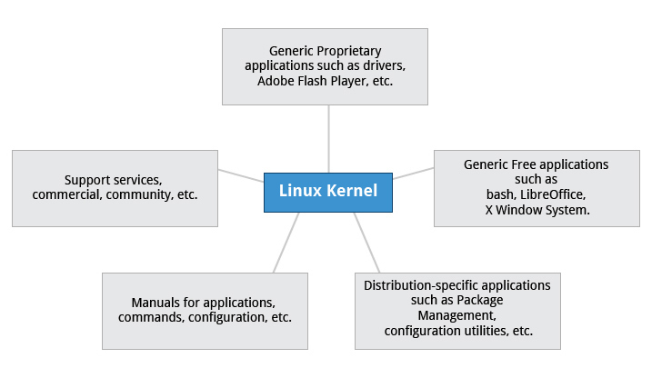
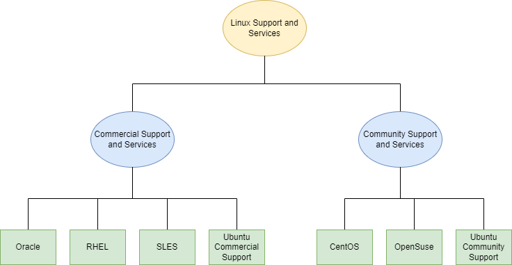
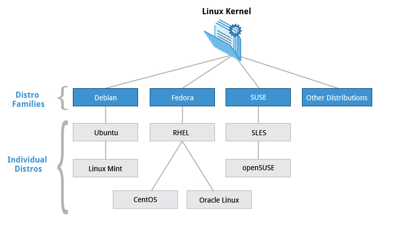

## Linux History

Linux borrows heavily from the UNIX operating system because it was written to be a free and open source version of UNIX. Files are stored in a hierarchical filesystem, with the top node of the system being root or simply "/". 

Whenever possible, Linux makes its components available via files or objects that look like files. Processes, devices, and network sockets are all represented by file-like objects, and can often be worked with using the same utilities used for regular files.

Linux is a fully multitasking (a method where multiple tasks are performed during the same period of time), multiuser operating system, with built-in networking and service processes known as daemons in the UNIX world. Linux was inspired by UNIX, but it is not UNIX.

**So, what is a Linux distribution and how does it relate to the Linux kernel?**

As illustrated below, the [Linux kernel](http://www.kernel.org) is the core of a computer operating system. A full **Linux distribution** consists of the kernel plus a number of other software tools for file-related operations, user management, and software package management. Each of these tools provides a small part of the complete system. Each tool is often its own separate project, with its own developers working to perfect that piece of the system.

A vast variety of Linux distributions cater to different audiences and organizations depending on their specific needs. Large commercial organizations tend to favor the commercially supported distributions from Red Hat, SUSE and Canonical (Ubuntu).

**Services associated with distributions**

CentOS is a popular free alternative to Red Hat Enterprise Linux (RHEL). Ubuntu and Fedora are popular in the educational realm. Scientific Linux is favored by the scientific research community for its compatibility with scientific and mathematical software packages. Both CentOS and Scientific Linux are binary-compatible with RHEL; i.e., binary software packages in most cases will install properly across the distributions.

Many commercial distributors, including Red Hat, Ubuntu, SUSE, and Oracle, provide long term fee-based support for their distributions, as well as hardware and software certification. All major distributors provide update services for keeping your system primed with the latest security and bug fixes, and performance enhancements, as well as provide online support resources.

**Distro Families**

**Debian Family**

The Debian distribution is upstream for several other distributions including Ubuntu, and Ubuntu is upstream for Linux Mint and others. It is commonly used on both servers and desktop computers. Debian is a pure open source project and focuses on one key aspect, that is, stability. It also provides the largest and most complete software repository to its users.

Ubuntu aims at providing a good compromise between long term stability and ease of use. Since Ubuntu gets most of its packages from Debian’s stable branch, Ubuntu also has access to a very large software repository. 

_Key Facts About the Debian Family:_

* The Debian family is upstream for Ubuntu, and Ubuntu is upstream for Linux Mint and others.
* It uses the DPKG-based apt-get package manager (we cover in more detail later) to install, update, and remove packages in the system.
* Ubuntu has been widely used for cloud deployments.
	
**Fedora Family**

Fedora is the community distribution that forms the basis of Red Hat Enterprise Linux (RHEL), CentOS, Scientific Linux, and Oracle Linux. Fedora contains significantly more software than Red Hat’s enterprise version. One reason for this is that a diverse community is involved in building Fedora; it is not just a company.

_Key Facts About the Fedora Family:_

* The Fedora family is upstream for CentOS, RHEL, and Oracle Linux.
* It supports hardware platforms such as x86, x86-64, Itanium, PowerPC, and IBM System z.
* It uses the RPM-based yum package manager (we cover in more detail later) to install, update, and remove packages in the system.
* RHEL is widely used by enterprises which host their own systems.

**SUSE Family**

The relationship between SUSE, SUSE Linux Enterprise Server (SLES), and openSUSE is similar to the one described between Fedora, Red Hat Enterprise Linux, and CentOS. 

_Key Facts About the SUSE Family:_

* SUSE Linux Enterprise Server (SLES) is upstream for openSUSE.
* It uses the RPM-based zypper package manager (we cover in more detail later) to install, update, and remove packages in the system.
* It includes the YaST (Yet another System Tool) application for system administration purposes.
	
As said, the biggest differences between the distros are their package management systems and tools.
Debian (and derived distros) use the Debian (.deb) package format, Red-hat (and derived distros) use the RPM (.rpm) package format. And distros like Arch and Slackware use their own packaging formats and tools.

Packaging differences aside, some distros - like Debian Testing, Fedora (Red-hat based) and Arch tend to use newer versions of the Linux kernel and other software packages. But this comes at the cost of potential instability and breakage - which can happen from time to time after updates on these systems - albeit rarely.

Whereas distros like Debian Stable and RHEL use older, better tested versions of software. Although they use slightly dated, older software - they are considered to be much more stable. Also the package maintainers always keep the software patched with the latest security updates.
