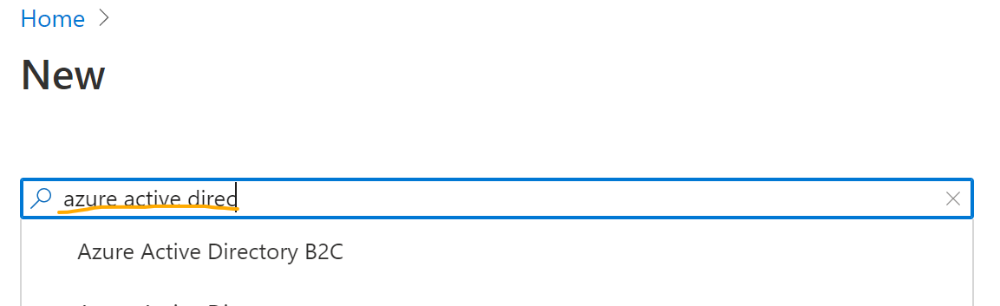

# Challenge \#1 - Getting Started with B2C

[< Previous Challenge](./00-pre-reqs.md) - **[Home](./README.md)** - [Next Challenge>](./02-susi.md)

## Introduction 

In this first hack, your attendees will be provisioning their B2C tenants. This is well documented here: https://docs.microsoft.com/en-us/azure/active-directory-b2c/tutorial-create-tenant, but this guide should help with some pitfalls.

## Hackflow

Provided your attendees do not have an existing B2C tenant, they can follow the guide linked in the [introduction](#Introduction). The steps are as follows:
1. Go to the Azure Portal
2. Ensure you are in the correct directory with the subsription picker. 
3. Click create a resource.
4. Search for "Azure Active Directory B2C". See [hints](#Hints) if your attendees have trouble.  
5. Click create.  
6. On the create screen, select "Create a new Azure AD B2C Tenant"  
7. On the "Create a directory page", your attendees will need the following information.
    - Organization Name - any value is accepted here
    - Tenant name - alphanumeric, globally unique value for the B2C tenant (something.onmicrosoft.com)
    - Country or region
    - Subscription - make sure they pick the subscription they created for this hack
    - Resource group - this resource group must exist before getting to this screen.  
8. Click "Review & Create"
9. After validation, click "Create". This process will take a few minutes. 

## Hints

- It is not possible today to provision a B2C tenant via automation.
- Searching for "Azure AD" will not yield positive results.

